

  <h1 class="!text-white !text-5xl !mb-2 drop-shadow-lg !font-normal">Backup slides</h1>
  
One deck for the week &mdash; cut for room, not for being wrong

  

    Matias Zaldarriaga &nbsp;·&nbsp; <em>Ondas Gravitacionales e Investigación Asistida por IA</em>
  

<!--
Not part of any hour. One divider per day, and under it the slides that came out of that day's lecture because the lecture was too long — every one still true, and worth having on hand if the question comes from the floor. A slide cut because it was wrong or misleading is not here; it is in git history, which is where a deleted slide belongs.
-->

---
layout: default
---

  
DAY 1

  <h1 class="!text-white !text-5xl !mb-0 drop-shadow-lg !font-normal">Fundamentals</h1>

---

# Peters, in *one slide.*

For a Keplerian binary of semi-major axis $a$ and eccentricity $e$, averaged over one orbit:

$$\left\langle\frac{da}{dt}\right\rangle = -\frac{64}{5}\,\frac{G^{3}m_1m_2(m_1+m_2)}{c^{5}a^{3}}\,
\frac{1 + \frac{73}{24}e^{2} + \frac{37}{96}e^{4}}{(1-e^{2})^{7/2}}$$

$$\left\langle\frac{de}{dt}\right\rangle = -\frac{304}{15}\,e\,\frac{G^{3}m_1m_2(m_1+m_2)}{c^{5}a^{4}}\,
\frac{1 + \frac{121}{304}e^{2}}{(1-e^{2})^{5/2}}$$

  

    
Circular case

    

$$t_{\rm merge} = \frac{5}{256}\frac{c^{5}a^{4}}{G^{3}m_1m_2M}$$

The $a^{4}$ is why separation matters so violently.

  

  

    
Circularisation

    

Dividing the two gives $a(e)$ with the exponent $\tfrac{12}{19}$ and the famous
$\tfrac{121}{304}$. Orbits circularise long before merger.

  

Peters, Phys. Rev. 136, B1224 (1964)

<!--
Keep this in reserve. If the room wants the exact coefficients before day 1's session, this is the slide — but resist showing it, because part of that session's exercise is finding out whether an agent produces these coefficients correctly without being told them.
-->

---

# Eccentricity *enhancement.*

An eccentric orbit spends almost all its time out near apoapsis, moving slowly &mdash; but the
emission goes as $v^{10}$, so the brief periastron passage dominates the radiated power and
wins. At fixed semi-major axis the merger time collapses:

$$\frac{t_{\rm merge}(e)}{t_{\rm merge}(0)} \;\approx\; \left(1-e^{2}\right)^{7/2}
\quad\text{for }e\to1$$

| $e$ | 0 | 0.6 | 0.9 | 0.99 |
|---|:---:|:---:|:---:|:---:|
| $t_{\rm merge}$ relative (exact Peters) | 1 | 0.21 | $3.4\times10^{-3}$ | $1.7\times10^{-6}$ |

This is why dynamical formation channels &mdash; which produce eccentric binaries &mdash; can
merge systems that circular decay would never bring in.

Hulse–Taylor has $e = 0.617$: its decay **rate** is enhanced by
$F(e) = \bigl(1+\tfrac{73}{24}e^{2}+\tfrac{37}{96}e^{4}\bigr)/(1-e^{2})^{7/2} \approx 12$.

<!--
Backup for day 1's homework question about eccentricity. The (1-e^2)^{7/2} is the asymptotic form; the table row is the EXACT Peters (5.14) ratio, computed and stamped in the envelope-numbers reproduction — the row this slide used to carry (0.11 / 2.8e-3 / 1.2e-5) matched neither the exact ratio nor the asymptote and was corrected on 2026-08-05.
src: tmerge_ratio_e06  src: tmerge_ratio_e09  src: tmerge_ratio_e099  src: F_ht_e0617
src: borrowed — e = 0.617 is the published Hulse-Taylor eccentricity.
-->

---

# The *quantum* limit.

Two noise sources fight each other as you turn up the laser power:

  

    
Shot noise

    

Photon counting statistics. $\mathrm{PSD}_{\rm shot} \propto 1/(P_{\rm in}G^{2})$ &mdash; more power is better.

  

  

    
Radiation pressure

    

Fluctuating force on the mirrors. $\mathrm{PSD}_{\rm RP}\propto P_{\rm in}G^{2}$ &mdash; more power is worse.

  

$$L^{4}\,\mathrm{PSD}_{\rm RP}\,\mathrm{PSD}_{\rm shot} \;=\; \frac{\hbar^{2}}{M^{2}(2\pi f)^{4}}
\qquad\Longrightarrow\qquad
P^{\rm min}_{\rm total} = \frac{2\hbar}{M(2\pi f)^{2}}$$

The product is independent of power &mdash; there is an optimum, and it is the *standard quantum
limit.* Note it is not fundamental: it arises because we choose to measure **position**
repeatedly, and the induced momentum uncertainty feeds back through the equations of motion.
Measure something else and the limit changes. Squeezing beats it, and LIGO now uses squeezed
light routinely.

<!--
Day 1 backup, and a preview of day 2. The subtlety at the end is worth making: the SQL is a property of the measurement strategy, not of nature.
-->

---

# Questions day 1 leaves *open.*

Two of day 1's reproductions have a question hung on them that we are not going to answer.
Both are an evening's work, and the machinery is already on the machine in front of you.

- **the eccentric-decay question** &mdash; Peters gives the whole evolution with eccentricity and we
  used only the circular decay time. How much faster does a binary merge at high
  eccentricity, and which term in the evolution of $e$ drives it?
- **the two source classes the week never returns to** &mdash; the landscape names four classes of source and this week
  follows two of them. Put a continuous wave and a stochastic background on the same axes,
  with the integration time each one needs.

Each is an open question the course leaves you with.
A row says what to start from and what an answer looks like, and that is all it says.

<!--
Thirty seconds, if there is a reason to spend them. The register is deliberate: these are not things we ran out of time for, they are the first two problems they can attack with what they have after day 1. The catalogue on day 5 carries both rows, so nothing here is the only copy.
-->

---
layout: default
---

  
DAY 2

  <h1 class="!text-white !text-5xl !mb-0 drop-shadow-lg !font-normal">Ground-based detection</h1>

---

# The inspiral *ends* where the band begins.

  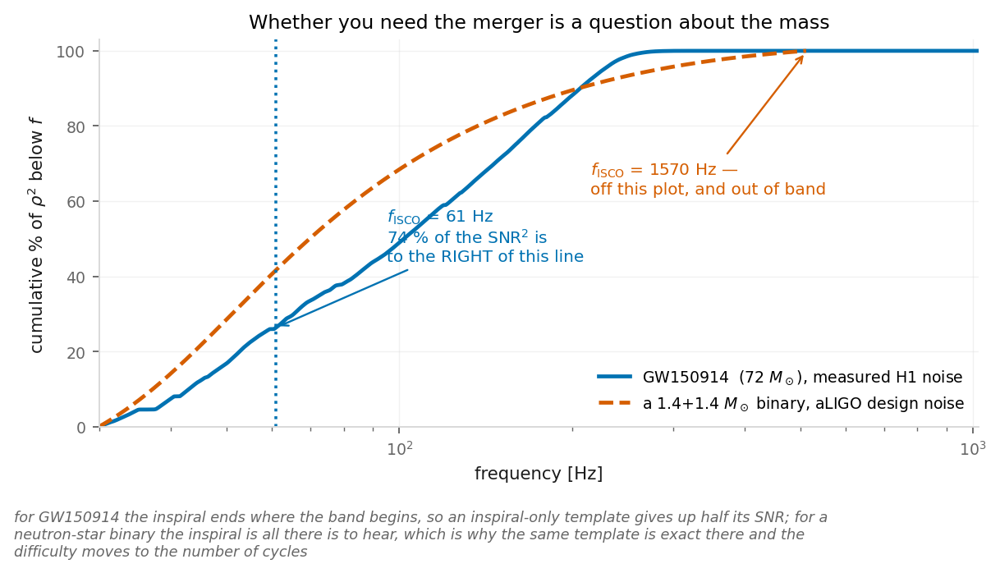
    
Cumulative SNR-squared with frequency; the inspiral ends where the band begins.

  

For GW150914 the inspiral ends at $f_{\rm ISCO} = 61$ Hz &mdash; where the band *begins*.
**74 % of the signal-to-noise is above it.** Stop your template there and you throw away
half your SNR; run it past there and you are filtering with a shape you cannot justify.

  

  

Which post-Newtonian order you kept barely matters: cut two of them at the same frequency
and they differ by less than a tenth of a percent. What matters is where you stop, and no inspiral model tells
you how to go further.

For a neutron-star binary $f_{\rm ISCO}$ is 1570 Hz. The merger is inaudible, and an
inspiral template is not an approximation &mdash; it is the whole signal.

  

<!--
Figure: figures/merger_fraction.png. This was the conclusion of day 2's template section and the only part of it worth their time; the domain-of-validity sentence it earned now lives on 'write the template yourself' and the picture is here. Matias's judgement, and he is right: nobody searches with an inspiral-only template at these masses — you add a merger-ringdown piece, unless it falls outside the band. Everything else the audits turned up (which PN truncation happens to score best, where each order's t(f) folds) is a symptom of the model being used past its domain, and the fact that it breaks in a different place at each order is exactly what you would expect. It is in figures/pn_order.png and figures/pn_phase.png in the notebook for anyone who wants it, and it is NOT on a slide. The 0.9995 is the number that makes the point: at a common cutoff, 0PN and 3.5PN are the same filter. Note the pairing with day 2's bank slide — these two events are opposites twice over: 8 cycles and the merger in band, against 2600 cycles and the merger out of it.
-->

---

# The chirp mass it gives you is *wrong.*

  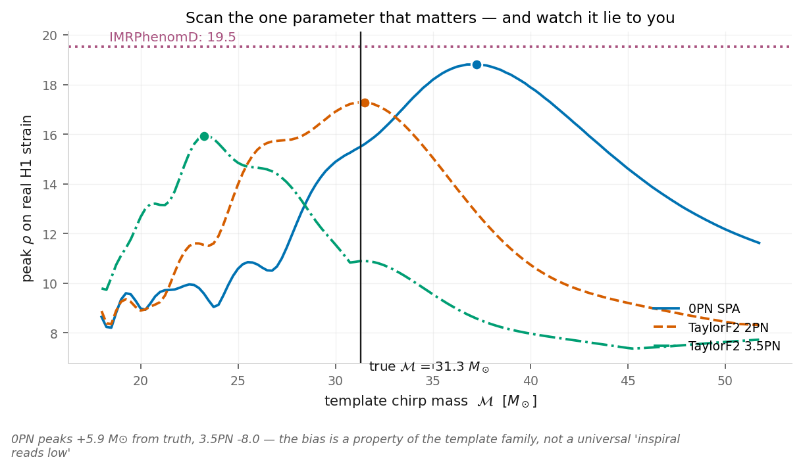
    
Peak SNR against template chirp mass, per family.

0PN peaks **5.9 $M_\odot$ above** the truth; 3.5PN peaks **8.0 $M_\odot$ below** it. The
inspiral-only template fakes missing merger power by pretending the binary is lighter; the
0PN template, run past ISCO, does the opposite.

<!--
Figure: figures/snr_vs_mchirp.png. A wrong parameter estimate with a visible mechanism, which is the best kind. Important: the bias direction is a property of the template family, not a general fact — "inspiral templates read low" is what I would have said before day 2 was built and it is only true of one of these rows. Detection and measurement are different jobs; a filter that finds the event does not give you its parameters.
src: mchirp_bias_spa0  src: mchirp_bias_taylorf2
-->

---

# One fix, as an *example* &mdash; the $\chi^2$ veto.

  

Ask whether the signal-to-noise arrived in the proportions the template predicts across the
frequency band. A real signal does; a glitch dumps everything in one place.

| | $\rho$ | $\chi^2/\mathrm{dof}$ |
|---|---|---|
| signal-free background | &mdash; | 1.00 |
| GW150914, H1 / L1 | 19.5 / 13.4 | 0.87 / 0.24 |
| **the real L1 glitch** | **15.8** | **26.8** |

  

    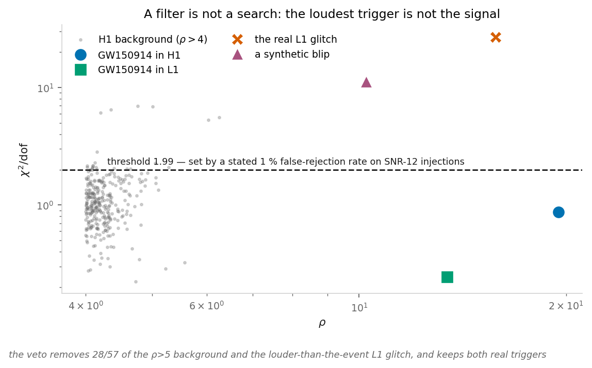
    
Triggers in the SNR / reduced-chi-squared plane, with the calibrated threshold.

One example from a whole toolbox &mdash; data-quality flags, coherence tests, time slides (shifting one detector's clock to manufacture signal-free background).
The sense to keep is only this: **real data is more complicated than the Gaussian story**,
and every fix is calibrated against a stated error rate, not by taste.

<!--
Compressed per the review (M24): the veto is an example, not a subject. Cut from day 2 entirely in review 2 (C7), which left one clause on the glitch slide — 'one may try to throw glitches away if they do not look like gravitational waves' — and put the rest here. Construction: split the template into 8 sub-bands of equal <h|h>, chi2 = (p/sigma^2) sum_i |z_i - z/p|^2. The threshold on the plot is 1.99, calibrated to keep 99 % of SNR-12 injections into real noise — that stated false-rejection rate is the only sense in which a threshold is "right". It removes 28 of the 57 background samples above rho = 5, removes the glitch that out-shouted the event, and keeps both real triggers.
src: l1_loudest_snr  src: l1_event_snr  src: h1_peak_snr  src: chi2_reduced_at_event  src: l1_event_chi2red  src: l1_glitch_chi2red  src: chi2_reduced_background_mean
-->

---
layout: default
---

  
DAY 3

  <h1 class="!text-white !text-5xl !mb-0 drop-shadow-lg !font-normal">From observations to astrophysics</h1>

---

# Where the 0.5 went

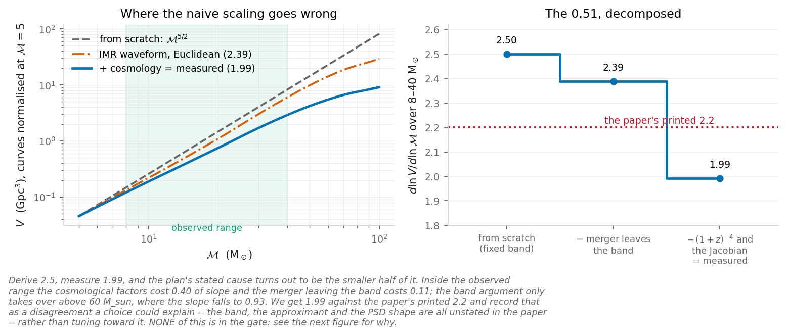

The sensitive-volume slope: derived, measured, and decomposed.

**Derive 2.5, measure 2.0, decompose the difference.** Inside the observed range
the cosmological factors cost **0.40** of slope and the merger walking out of the
band costs **0.11** &mdash; the band argument only takes over above 60
M&#8857;, where the slope falls to 0.93.

<!--
Derive 2.5, measure 2.0, decompose: cosmology 0.40, band 0.11 — all stamped by the selection-volume exercise.
src: scaling_volume_exponent  src: slope_cost_of_cosmology  src: slope_cost_of_band  src: fig_selection_volume_slope
-->

---

# The erratum this calculation carries

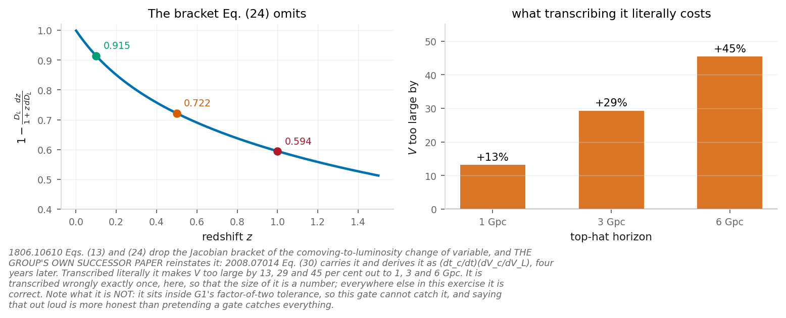

The dropped Jacobian, and what it costs with distance.

Eqs. (13) and (24) drop the Jacobian of the comoving-to-luminosity change of
variable. **The group's own successor paper reinstates it** &mdash; Roulet et al.
2020 Eq. (30) carries the bracket and derives it, four years later.

That is a story about how correction actually happens, not a gotcha.

<!--
The Jacobian bracket: dropped in Eqs. (13)/(24), reinstated by the successor paper; the size is measured by the exercise.
src: fig_selection_jacobian_erratum
src: borrowed — Roulet et al. 2020 Eq. (30) is the reinstating reference.
-->

---

# The information in a *trigger.*

$$ I(R)=\frac{1}{R^2}\Big\langle\sum_i p_{ {\rm astro},i}^2\Big\rangle $$

Each trigger carries information with weight $p_{\rm astro}^2$.

One expression, and it justifies **both** including marginal events **and** not
going arbitrarily deep.

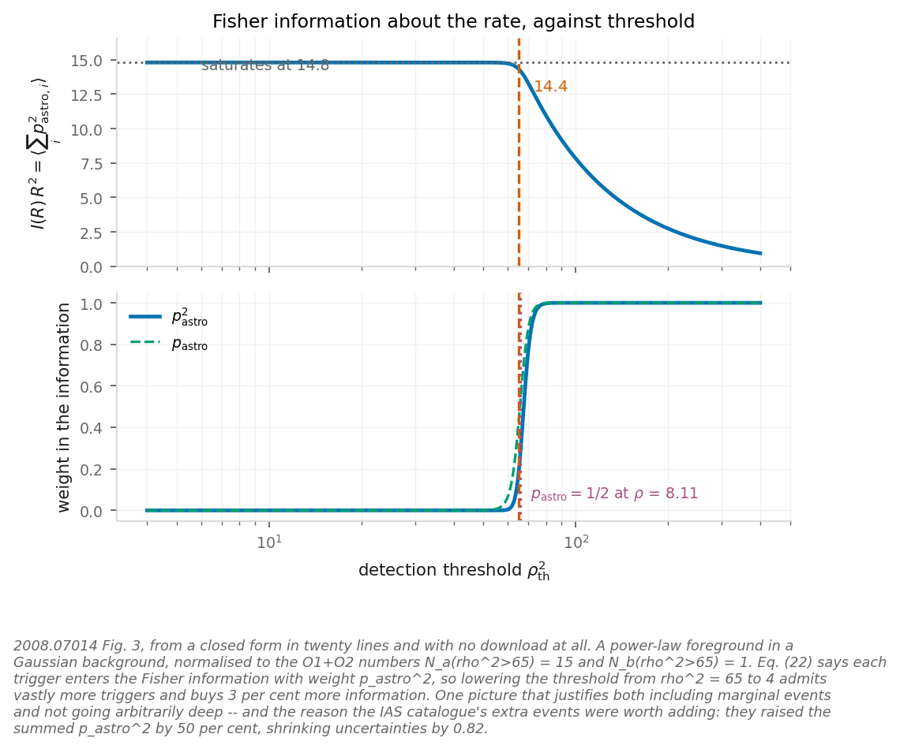

The information in a trigger, weighted by p-astro squared.

<!--
The p_astro^2 weight: one expression justifying both keeping marginal events and not dredging deep.
src: fig_poplike_fisher_toy  src: fisher_weight_exponent  src: ias_information_increment
-->

---

# Both integrals are somebody else's samples

The numerator is an average over **posterior samples**. The denominator is a sum
over **found injections**. Neither is an integral you did.

$$ N_{\rm eff}=\frac{\big(\sum_i w_i\big)^2}{\sum_i w_i^2},\qquad \text{require } N_{\rm eff}>4N_{\rm det} $$

And there is an identity worth seeing once:

$$ \frac{\hat\sigma}{\hat\xi}=\frac{\sqrt{\sum w^2}}{\sum w}=\frac{1}{\sqrt{N_{\rm eff}}} $$

Quoting an error bar and quoting $N_{\rm eff}$ are **the same statement**. The
difference is that $N_{\rm eff}$ gets compared against $4N_{\rm det}$, and a
$\sigma$ gets compared against nothing.

<!--
The N_eff identity makes the error bar and the diagnostic the same number.
-->

---

# The estimator, *starved.*

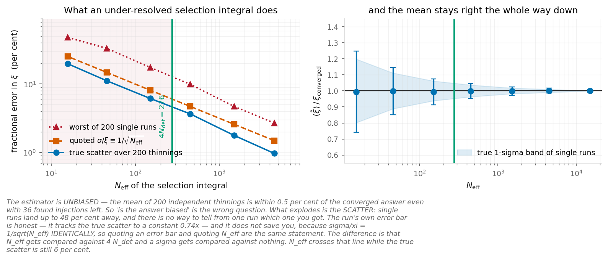

Thinning the injection set: unbiased mean, exploding scatter.

The estimator is **unbiased** all the way down &mdash; the mean of 200 thinnings
is within 0.5 % with 36 injections left. What explodes is the **scatter**: single
runs land up to **48 %** away, and nothing in one run tells you which you got.

<!--
The second run-of-show item lives here. Show the answer before showing N_eff: the point is that the
answer looks fine.
src: fig_poplike_neff_control  src: control_n_realisations
-->

---

# The collaboration ships its own guard

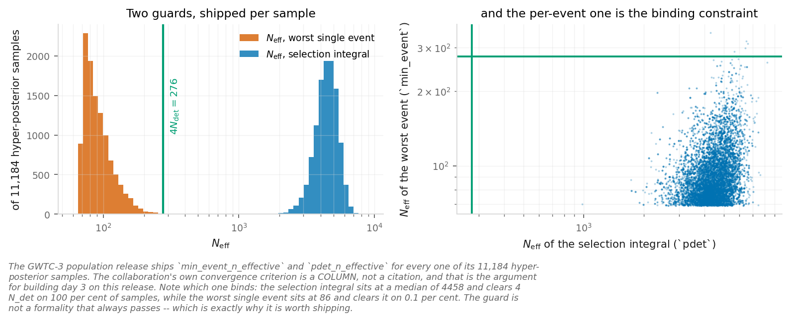

The shipped convergence columns, per hyper-posterior sample.

`min_event_n_effective` and `pdet_n_effective`, **per hyper-posterior sample**,
11,184 of them. The convergence criterion is a **column**, not a citation
&mdash; and the per-event guard is the binding one.

<!--
The shipped guard columns, counted per hyper-posterior sample.
src: hyper_n_samples  src: fig_poplike_shipped_neff
-->

---

# Spins &mdash; and now the answer depends on the model

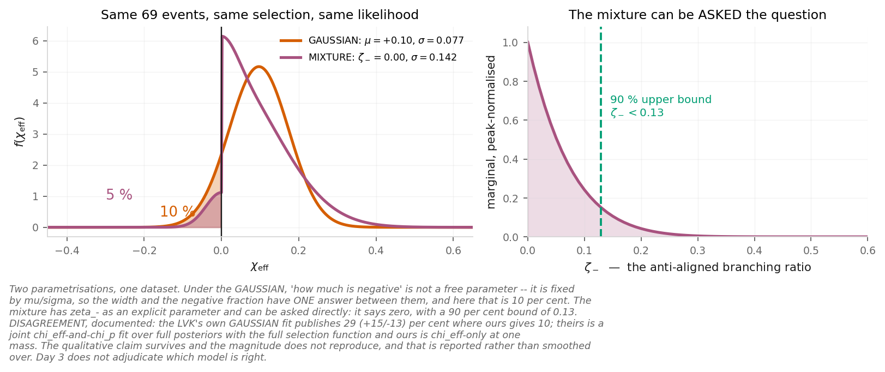

The same events under two spin parametrisations.

Same 69 events, same selection function, same likelihood. Under the GAUSSIAN,
"how much is negative" is **not a free parameter** &mdash; it is fixed by
$\mu/\sigma$. The mixture has $\zeta_-$ explicitly and can be **asked**: it says
zero, bound $<0.13$.

<!--
Same data, two parametrisations: the Gaussian ties the negative fraction to mu/sigma; the mixture frees it and it goes to zero.
src: mixture_zeta_zero  src: mixture_zeta_minus_90pc_upper  src: fig_chieff_two_models
-->

---

# The same width, two *readings.*

LVK's GAUSSIAN model publishes **29+15&minus;13 %** of
binaries at $\chi_{\rm eff}<0$. Roulet et al. 2021 gets $\zeta_-\approx0$ from
the same data &mdash; and reproduces the LVK number exactly when it adopts the
LVK model.

**Both agree on the width** ($\sigma_{\chi_{\rm eff}}\approx0.11$ implied against
$0.13^{+0.12}_{-0.07}$) **and disagree on what it means.**

That is a sharper framing than "they disagree about negative spins". We are not
adjudicating it. Attribute it and move on.

**Our own version gets 10 % rather than 29 %** &mdash; a $\chi_{\rm eff}$-only
fit at one mass against their joint fit over full posteriors. The qualitative
claim survives, the magnitude does not, and the exercise says so.

<!--
Attribute and move on — we are not adjudicating. The 29% and the widths are published; our 10% is the exercise's own chi_eff-only fit.
src: borrowed — the 29+15-13 % and sigma=0.13+0.12-0.07 are LVK GWTC-3; zeta_- ~ 0 is Roulet et al. 2021.
src: alpha_width_ours  src: alpha_width_published  src: mixture_zeta_zero
-->

---

# If it comes down to one item, make it this one

GW170817A's $p_{\rm astro}$ moved from **0.07** to **0.22&ndash;0.26**

purely because the favoured **mass model** changed.

A number that is supposed to answer *"is this real"* turns out to depend on the
population you assumed &mdash; which is the day's own lesson turned on the day's
own machinery.

Thirty seconds, and it needs no position taken.

<!--
The best 30-second exhibit of the day's lesson: p_astro depends on the population you assumed.
src: borrowed — the 0.07 and 0.22-0.26 p_astro values for GW170817A are the published ones (IAS O2 catalogue vs the mass-model update).
-->

---
layout: default
---

  
DAY 4

  <h1 class="!text-white !text-5xl !mb-0 drop-shadow-lg !font-normal">Pulsar timing arrays</h1>

---

# What a departure would have to *beat.*

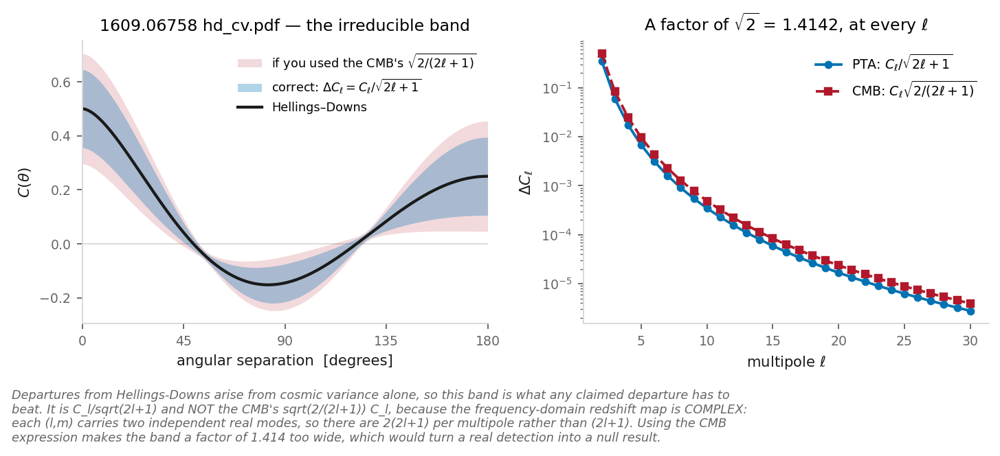

The band is C&#8467;/&radic;(2&#8467;+1), <b>not</b> the CMB's &radic;(2/(2&#8467;+1)) — the frequency-domain map is complex and carries twice the modes.

<!--
A factor of sqrt(2). Use the CMB expression and the band is 1.41x too wide, which would turn a real detection into a null result.
src: cv_ratio_to_cmb
-->

---
layout: default
---

  
DAY 5

  <h1 class="!text-white !text-5xl !mb-0 drop-shadow-lg !font-normal">Open problems</h1>

---

# The speed of *propagation*, as a picture.

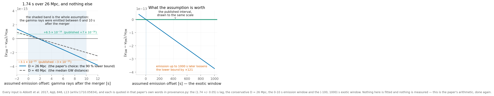

Left: the two published limits, reproduced from the lag, the distance and the emission window. Right: the paper's own caveat &mdash; exotic scenarios widen the window to (&minus;100, 1000) s &mdash; drawn to the same scale.

<!--
Cut from day 5's lecture in review 2 (C34) because the formula and the bound are the slide and this adds two bars to them. Kept here because the right-hand panel is the honest one: it is the picture of how much of that bound is an assumption about when the gamma rays were emitted. The caveat itself survives as a paragraph on the lecture slide, so this is not the only copy of the statement.
src: observed_lag_s  src: bound_upper  src: bound_lower
-->
