

  <h1 class="!text-white !text-5xl !mb-2 drop-shadow-lg !font-normal">Gravitational Waves</h1>
  
Day 1 &mdash; Fundamentals

  

    Matias Zaldarriaga &nbsp;·&nbsp; <em>Ondas Gravitacionales e Investigación Asistida por IA</em>
  

<!--
Welcome. Over five days we are going to do two things at once: learn how gravitational-wave astronomy works, and learn how to do research with AI agents. Today is the foundation for both. This first block is pure physics — by the end of it you should be able to estimate, on the back of an envelope, essentially every number in the field.
-->

---

# What this *week* is.

  

    
The science

    

- **Day 1** &mdash; Fundamentals. Where the waves come from.
- **Day 2** &mdash; Ground-based detection. How we hear them.
- **Day 3** &mdash; From observations to astrophysics.
- **Day 4** &mdash; Pulsar timing arrays. The nanohertz sky.
- **Day 5** &mdash; Open problems.

  

  

    
The way of working

    

- **Day 1** &mdash; What an agent *is*.
- **Day 2** &mdash; Navigating code nobody in the room knows.
- **Day 3** &mdash; Scaling out: jobs, remote, parallel.
- **Day 4** &mdash; More than one of them. Roles, and an independent check.
- **Day 5** &mdash; Turning a result into an output.

  

Each day's practical half is built around <strong>papers</strong>. We read them, and then we make an agent
reproduce them &mdash; which is a far more demanding test of understanding than reading.

This is <strong>not</strong> a course on the right way to use AI. Nobody knows the right way; the field
moves faster than any syllabus. It is a catalogue of things one person actually does, offered
as an entry point.

<!--
Two axes running in parallel all week. The science spine is standard. The second axis is the way of working, and it is deliberately arranged as an arc rather than a grab bag. Set expectations honestly: this is a catalogue of practice, not a set of rules.
-->

---

# In *two halves.*

  

    
This session

    

Where gravitational waves come from, what they do, how loud they are, and how far the
quadrupole formula carries you across ten decades of mass.

Almost everything will be an estimate. Factors of two are beneath us today.

  

  

    
The session after it

    

You point an agent at a real paper and try to reproduce it. Then we compare what
everyone got.

Bring the laptop you ran <code>doctor.py</code> on.

  

The two papers you will meet next are Peters (1964) and *The basic physics of the
binary black hole merger GW150914* (2016). Everything in this lecture is chosen to make
those two papers reproducible.

<!--
Tell them what the shape of the day is. The lecture is deliberately aimed at the two papers they will attack in the session that follows.
-->

---
layout: default
---

  
SECTION I

  <h1 class="!text-white !text-5xl !mb-0 drop-shadow-lg !font-normal">Spacetime is dynamical</h1>

<!--
Start from the beginning. What is a gravitational wave, and why must one exist.
-->

---

# Gravity is *geometry.*

Newton: gravity is a force acting instantaneously at a distance. Einstein: there is no force.
Free particles move on straight lines &mdash; geodesics &mdash; in a spacetime whose geometry is
itself determined by the matter in it.

$$G_{\mu\nu} \;=\; \frac{8\pi G}{c^{4}}\, T_{\mu\nu}$$

The left-hand side is built from second derivatives of the metric $g_{\mu\nu}$. That is the
crucial structural fact: **the field equations are second order in time.** A theory whose
fundamental field obeys a second-order equation of motion has *waves.*

Newtonian gravity has no waves because it has no dynamics &mdash; $\nabla^{2}\Phi = 4\pi G\rho$
is an instantaneous constraint. The moment you make gravity consistent with a finite speed of
propagation, you are forced into a wave equation.

<!--
The single most important conceptual point so far: gravitational waves are not an exotic add-on to GR, they are forced on you the moment gravity becomes a dynamical field with a finite propagation speed. Contrast with Newton, where the Poisson equation is a constraint — change the source and the potential changes everywhere at once.
-->

---

# Linearise.

Far from any source, spacetime is nearly flat. Write

$$g_{\mu\nu} \;=\; \eta_{\mu\nu} + h_{\mu\nu}, \qquad |h_{\mu\nu}| \ll 1$$

and keep only terms linear in $h$. In a convenient gauge, Einstein's equations collapse to
the flat-space wave equation:

$$\Box\, \bar h_{\mu\nu} \;=\; -\frac{16\pi G}{c^{4}}\,T_{\mu\nu}
\qquad\Longrightarrow\qquad
\Box\, \bar h_{\mu\nu} = 0 \;\;\text{in vacuum}$$

Ripples in the geometry, propagating at $c$. Two independent polarisations survive after all
the gauge freedom is used up &mdash; the *transverse-traceless* components.

Ten components in $h_{\mu\nu}$; four coordinate freedoms, four residual gauge freedoms &mdash;
two left. A massless spin-2 field has two helicity states, exactly as a photon has two.

<!--
Standard linearisation. Emphasise the counting at the end: 10 minus 4 minus 4 equals 2. It is the same counting that gives a photon two polarisations, and it is why gravitational waves have exactly two.
-->

---

# The wave, *written down.*

For a wave travelling along $\hat z$:

$$h_{\mu\nu}(t,z) \;=\; \begin{pmatrix} 0 & 0 & 0 & 0 \\ 0 & h_{+} & h_{\times} & 0 \\ 0 & h_{\times} & -h_{+} & 0 \\ 0 & 0 & 0 & 0 \end{pmatrix} \cos\!\left(\omega t - k z\right)$$

**Transverse** &mdash; nothing in the $z$ row or column. **Traceless** &mdash; the $xx$ and $yy$
entries are equal and opposite. Two amplitudes, $h_{+}$ and $h_{\times}$, rotated $45^{\circ}$
from one another. They are called the **strain**, and they are dimensionless.

  

    
Electromagnetism

    

Spin 1. Polarisation basis rotates back into itself under $360^{\circ}/1$. Dipole radiation dominates.

  

  

    
Gravity

    

Spin 2. Rotate by $180^{\circ}$ and you are back where you started. Quadrupole radiation dominates.

  

<!--
The matrix is worth writing on the board slowly. Transverse and traceless is not a convention, it is what survives. The spin-2 nature is the origin of everything that follows: the 180-degree symmetry, the quadrupolar antenna pattern, the quadrupole formula, and later the Hellings–Downs curve.
-->

---

# What a wave *does.*

  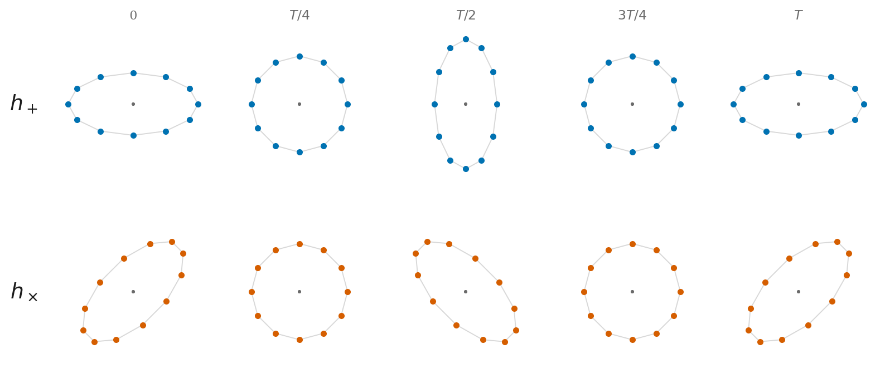
  
A ring of free test masses under a passing wave, over one period.

  

A single free particle does nothing interesting &mdash; you can always choose coordinates in
which it stays put.

  

Gravity is detectable only as a **tidal** effect: the change in the separation of *two* free
particles, $\;\Delta L/L = \tfrac{1}{2}h$.

  

Squeezed along one axis, stretched along the other, then the reverse. The two polarisations
are the same pattern rotated by $45^{\circ}$.

<!--
Emphasise the tidal point: you cannot detect a gravitational wave with one mass, because the equivalence principle lets you transform it away. You need two, and you measure the change in the distance between them. Everything about detector design follows from this: LIGO measures the separation of mirrors, PTAs measure the separation between Earth and a pulsar.
-->

---

# How *small* is $h$?

For the events LIGO detects, $h \sim 10^{-21}$. Over a 4 km arm:

$$\Delta L \;\sim\; h\,L \;\sim\; 10^{-18}\,\mathrm{m}
\;\left(\frac{L}{\mathrm{km}}\right)\!\left(\frac{h}{10^{-21}}\right)$$

That is ${\sim}10^{-3}$ of the diameter of a proton. Some comparisons worth carrying around:

| Quantity | Precision achieved |
|---|:---:|
| Electron magnetic moment | $10^{-13}$ |
| Best atomic clocks (fractional frequency) | $10^{-19}$ |
| **LIGO strain** | $\mathbf{10^{-21}}$ |

And yet the *phase* shift on the laser is what is actually measured &mdash;

$$\frac{\Delta L}{\lambda_{\rm laser}} \;\sim\; 10^{-12}\,
\left(\frac{L}{\mathrm{km}}\right)\!\left(\frac{h}{10^{-21}}\right)\!\left(\frac{1064\,\mathrm{nm}}{\lambda_{\rm laser}}\right)$$

The Fabry–Pérot cavities buy a factor of ${\sim}250$ in effective arm length. The rest is
photon statistics: with $\dot N \sim 4\times10^{21}$ photons per second, $\sqrt{N}$ is a
large number. (All of this is day 2.)

<!--
Give them the sense of scale, and then immediately deflate it: the reason this is possible at all is that the laser has an enormous number of photons and you are doing an interference measurement. The details are day 2.
src: borrowed — the precision comparisons (electron magnetic moment 1e-13, atomic clocks 1e-19) are the standing comparisons from GW_lectures.pdf §2; h ~ 1e-21 is the LIGO order of magnitude.
-->

---

# Weak coupling is a *feature.*

The same weakness that makes gravitational waves nearly impossible to detect makes them
uniquely valuable: **the Universe is transparent to them.**

  

    
Photons

    

Scatter, absorb, get reprocessed. Before recombination the Universe is opaque. We see the
surface of things.

  

  

    
Gravitational waves

    

Propagate essentially unimpeded from the source to us. We see the *dynamics* of the mass
itself, from inside the horizon of a merging black hole to the first second of the Universe.

  

A gravitational-wave detector is not a telescope. It has almost no angular resolution and it
is sensitive to the whole sky at once. It is much closer to a microphone.

<!--
This is the standard and correct sales pitch, but the last line matters pedagogically — students arrive imagining a telescope and it distorts everything they then think about localisation, antenna patterns and searches.
-->

---
layout: default
---

  
SECTION II

  <h1 class="!text-white !text-5xl !mb-0 drop-shadow-lg !font-normal">Making gravitational waves</h1>

<!--
Now the source side. This section is the heart of the lecture and the direct preparation for Peters 1964.
-->

---

# Why *quadrupole?*

In electromagnetism the leading radiation is **dipole**, $\ddot{\vec d}$ with
$\vec d = \sum q_i \vec r_i$. In gravity the analogous quantities are conserved:

  

    
Mass monopole

    

$\sum m_i$ = total mass. Conserved &rArr; no monopole radiation.

  

  

    
Mass dipole

    

$\sum m_i \vec r_i$ = centre of mass. Its second derivative is $\dot{\vec P} = 0$ &rArr; no dipole radiation.

  

The first non-vanishing term is the **quadrupole**. This is not an accident of the equations:
it is momentum conservation, and it is the field-theory statement that the graviton has spin 2.

$$h_{ij}^{\rm TT} \;\simeq\; \frac{2G}{c^{4}\,d}\,\ddot{Q}_{ij},
\qquad Q_{ij} = \int \rho\left(x_i x_j - \tfrac{1}{3}\delta_{ij} r^{2}\right)d^3x$$

Consequence: a spherically symmetric collapse radiates **nothing**, however violent. A
supernova is a poor gravitational-wave source unless it is asymmetric.

<!--
Make the counting argument explicitly — conservation of mass kills the monopole, conservation of momentum kills the dipole. Then the Birkhoff-flavoured punchline: perfect spherical collapse radiates nothing at all.
-->

---

# Units: set $G = c = 1$.

Every estimate today is easier in geometrised units. Masses become lengths, velocities become
dimensionless:

$$r_s \;=\; \frac{2GM}{c^{2}} \;=\; 2M$$

| Object | Mass | As a length | As a time |
|---|:---:|:---:|:---:|
| Sun | $1\,M_{\odot}$ | 1.5 km | 5 μs |
| GW150914 | $65\,M_{\odot}$ | 96 km | 0.32 ms |
| Sgr A* | $4\times10^{6}\,M_{\odot}$ | 0.04 AU | 20 s |
| M87* | $6.5\times10^{9}\,M_{\odot}$ | 64 AU | 9 hr |

Read the last column as *"the shortest timescale on which this object can do anything."* It is
already, to a factor of a few, the gravitational-wave period at merger.

<!--
This slide pays for itself for the whole week. A solar mass is 5 microseconds. A billion solar masses is most of a day. That single conversion tells you why LIGO works at hundreds of Hz and PTAs at nanohertz, before any detector physics.
src: sun_as_length_km  src: sun_as_time_us  src: gw150914_as_length_km  src: gw150914_as_time_ms  src: sgra_as_length_au  src: sgra_as_time_s  src: m87_as_length_au  src: m87_as_time_hr
src: borrowed — the Sgr A* (4e6 Msun) and M87* (6.5e9 Msun) masses are the published EHT-era values; the rest of the table is computed in the envelope-numbers reproduction, which is in the repository and not in the copy students receive.
-->

---

# The Newtonian *binary.*

  

    
Definitions

$$M_T = m_1 + m_2, \qquad \eta = \frac{m_1 m_2}{M_T^{2}}, \qquad \mu = \eta M_T$$

$\eta \le 1/4$, with equality for equal masses. This bound does more work than you would
expect.

  

  

    

Circular orbit, separation $a$

$$\Omega^{2} = \frac{M_T}{a^{3}}, \qquad v = (M_T\Omega)^{1/3}, \qquad |E| = \tfrac{1}{2}M_T\eta v^{2}$$

Kepler, in geometrised units. $v$ is the relative orbital velocity.

  

The gravitational-wave frequency is **twice** the orbital frequency &mdash; the mass
distribution of a binary returns to itself after half a turn:

$$f_{\rm GW} \;=\; 2\,\frac{\Omega}{2\pi}$$

That factor of two is spin-2 again, and it is one of the most common places to lose a factor
of 2. Watch for it later.

<!--
Everything from here is built on this slide. Flag the factor of two loudly — it is exactly the kind of thing an agent gets wrong confidently, and they will see it this afternoon.
-->

---

# The amplitude, and the *chirp mass.*

Put the binary into the quadrupole formula. $Q \sim \mu a^{2}$, and each time derivative brings
down $\Omega$:

$$h \;\sim\; \frac{\ddot Q}{d} \;\sim\; \frac{M_T \eta\, v^{2}}{d}
\;\sim\; \frac{M_T\eta\,(\Omega M_T)^{2/3}}{d}
\;\sim\; \frac{\mathcal{M}_c^{5/3}\,\Omega^{2/3}}{d}$$

The two masses enter **only** through one combination:

$$\mathcal{M}_c \;\equiv\; \eta^{3/5} M_T \;=\; \frac{(m_1 m_2)^{3/5}}{(m_1+m_2)^{1/5}}$$

the **chirp mass**. It is the best-measured parameter of almost every event, and the reason
individual masses are so much harder to pin down than you would guess from how loud the
events are.

With all the constant factors: $\;h = \dfrac{4}{d}\,\mathcal{M}_c^{5/3}(\pi f)^{2/3}$, angle-averaged.

<!--
This is the single most useful formula in the field. Derive it on the board by scaling rather than by grinding through the integral — Q ~ mu a^2, two time derivatives, use Kepler. The emergence of the chirp mass as the only combination that appears is the punchline, and it explains the shape of every posterior they will ever see.
-->

---

# The *luminosity.*

The energy flux in a wave goes like $\dot h^{2}$, integrated over a sphere of radius $d$:

$$P_{\rm GW} \;\sim\; \dot h^{2} d^{2} \;\sim\; \left(\Omega\, M_T\eta\, v^{2}\right)^{2} \;\sim\; \eta^{2} v^{10}$$

In geometrised units $P$ is **dimensionless** &mdash; the mass has cancelled completely. Restoring
units, the natural scale is

$$L_{\rm P} \;=\; \frac{c^{5}}{G} \;\approx\; 3.6\times10^{52}\;\mathrm{W}$$

set by $G$ and $c$ alone. No mass, no length, no size of anything. A merging binary radiates a
fixed *fraction* of this, determined only by the dimensionless numbers $\eta$ and $v/c$.

For comparison: the entire electromagnetic output of the observable Universe is
${\sim}10^{49}\,\mathrm{W}$. A binary black hole merger briefly outshines it by a factor of a
thousand &mdash; in gravitational waves.

<!--
The dimensionless luminosity is the deepest fact on this slide. There is no mass in the answer; the only scale is c^5/G. That is why black hole mergers are the most luminous events in the Universe and why they all radiate a few percent of their rest mass regardless of how big they are.
-->

---

# Why *compact* objects.

  

$P_{\rm GW}\propto v^{10}$ is a brutal scaling. To radiate anything at all you need
$v/c$ of order one, and for a bound orbit

$$\frac{v^{2}}{c^{2}} \sim \frac{GM}{c^{2}a} \sim \frac{r_s}{a}$$

so **$v/c \sim 1$ means the objects are nearly touching their own Schwarzschild radii.** Only
white dwarfs, neutron stars and black holes qualify.

The Earth–Sun system: $v/c \sim 10^{-4}$, so $P_{\rm GW}\sim 200\,$W. It will never be measured,
and the orbit decays in ${\sim}10^{23}$ years.

  

  

    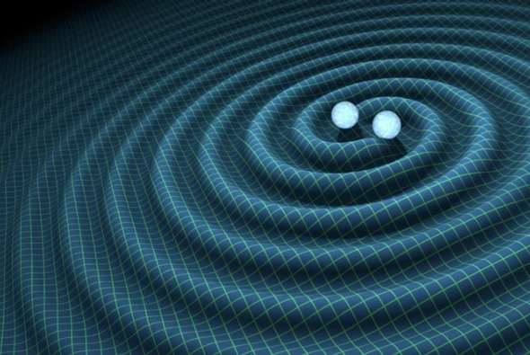
    
Spacetime ripples from an inspiralling binary &mdash; T. Pyle / Caltech / MIT / LIGO Lab

  

<!--
The v^10 scaling is why the field is about compact objects and nothing else. Two hundred watts for the Earth-Sun system is a nice number to have in your pocket — it is about three light bulbs.
-->

---

# The orbit *decays.*

Energy is leaving, so the orbit shrinks. The timescale:

$$t_{\rm GW} \;\sim\; \frac{E}{P_{\rm GW}} \;\sim\; \frac{M_T\eta v^{2}}{\eta^{2}v^{10}}
\;\sim\; M_T\,\eta^{-1} v^{-8} \;\sim\; \mathcal{M}_c^{-5/3}\Omega^{-8/3}$$

A more useful dimensionless statement &mdash; how much does the system change in **one orbit**?

$$\frac{\dot E}{E}\times P \;\sim\; \frac{P_{\rm GW}}{\Omega E} \;\sim\; \eta\, v^{5}
\qquad\Longrightarrow\qquad
\dot P \;=\; -\,2\pi\,\frac{96}{5}\,\left(\mathcal{M}_c\Omega\right)^{5/3}$$

$\dot P \sim 1$ means the period changes by order itself in one period. That *is* the merger.
Everything before it is a slow, adiabatic inspiral &mdash; which is why a
**post-Newtonian expansion in $v/c$ works at all.**

Peters (1964) is precisely the calculation of $\dot a$ and $\dot e$ from this argument, done
properly, including eccentricity. That is your first paper.

<!--
Point out that eta v^5 is the small parameter controlling the whole post-Newtonian programme. And flag that this slide is exactly Peters 1964 — they are about to reproduce it.
-->

---

# The *chirp.*

  

    
Frequency evolution

$$\frac{\dot\Omega}{\Omega} \sim \frac{P_{\rm GW}}{E} \sim \frac{\eta v^{8}}{M_T}
\;\;\Longrightarrow\;\; \Omega \sim \mathcal{M}_c^{-5/8}\,\tau^{-3/8}$$

with $\tau$ the time to merger. The frequency sweeps upward, ever faster &mdash; the *chirp.*

Cycles left

$$N = \int f\,d\tau \;\sim\; \left(\mathcal{M}_c f\right)^{-5/3}$$

GW150914 spent ${\sim}10$ cycles in band. A neutron-star binary spends ${\sim}10^{4}$.

  

  

    
In the frequency domain

Stationary phase: the Fourier integral $\int h_0\,e^{i\Phi(t)}e^{-2\pi i f t}dt$ is
dominated by the moment when the instantaneous frequency equals $f$, and the window
around it has width $\sim 1/\sqrt{\dot f}$ — that is what the time integration leaves
behind. So

$$|h(f)| \;\sim\; \frac{h_0}{\sqrt{\dot f}} \;\sim\; \frac{\mathcal{M}_c^{5/6}}{d}\,f^{-7/6}$$

Check it by units: $h(t)$ is dimensionless, so $\tilde h(f)$ carries seconds — and
$h_0/\sqrt{\dot f}$ is exactly dimensionless over $\sqrt{\mathrm{Hz\,s^{-1}}}$, i.e. seconds.
With $h_0 \propto f^{2/3}$ and $\dot f \propto f^{11/3}$, the exponent is
$2/3 - 11/6 = -7/6$. Day 2 plots $\sqrt{f}\,|\tilde h(f)| \propto f^{-2/3}$ against
detector noise in the same units.

Later you will read $f$ and $\dot f$ straight off a strain plot and get
$\mathcal{M}_c$ to 20% with a ruler.

  

<!--
The stationary-phase argument is worth doing slowly: the stationary-phase window at frequency f has width 1/sqrt(fdot) — not 1/fdot, which has the wrong units (s^2) — so the amplitude picks up h0/sqrt(fdot) and the power h0^2/fdot. It gives the -7/6 without doing any integral honestly, and the units check is the fastest way to see it. It also sets up the afternoon's exercise, where they measure fdot from a figure.
-->

---

# What comes out at *merger.*

  

    
Energy radiated

    

$$\frac{\Delta M_{\rm rad}}{M} \;\sim\; 3\text{–}10\%$$

    
Few percent for asymmetric or low spin; up to ∼10% for equal-mass, aligned spins.

  

  

    
Recoil of the remnant

    

$$\frac{v_{\rm kick}}{c} \;\sim\; 10^{-4}\text{–}10^{-2}$$

    
Hundreds to a few thousand km/s for precessing-spin "superkicks".

  

Both are functions of dimensionless numbers only &mdash; $q = m_2/m_1$ and the spins
$\chi_1,\chi_2$. Not of the total mass. Scale invariance is the organising principle of the
whole subject: **a binary black hole merger looks the same at every mass**, only faster or
slower.

Which is why the same waveform models serve LIGO at ${\sim}10\,M_{\odot}$ and LISA at
${\sim}10^{6}\,M_{\odot}$, and why a PTA source and a LIGO source are the same physics separated
by nine orders of magnitude in mass.

<!--
Scale invariance is the bridge to the next section. Vacuum GR has no scale; the only thing that changes between a stellar-mass and a supermassive binary is the clock rate.
-->

---
layout: default
---

  
SECTION III

  <h1 class="!text-white !text-5xl !mb-0 drop-shadow-lg !font-normal">The spectrum</h1>

<!--
Now organise the sources. The analogy with the electromagnetic spectrum is the right frame.
-->

---

# Frequency is set by *mass.*

A binary cannot orbit faster than roughly the light-crossing time of its own Schwarzschild
radius. That puts a hard ceiling on the emitted frequency:

$$f_{\rm max} \;\sim\; \frac{c^{3}}{G M_T} \;\approx\; 2\;\mathrm{kHz}\;\left(\frac{10\,M_{\odot}}{M_T}\right)$$

**One number determines the band.** Read it backwards and a detector's frequency range tells
you what masses it can possibly see:

| Band | Frequency | $M_{\rm max}$ | What lives there |
|---|:---:|:---:|---|
| Audio | 10 Hz – 10 kHz | ${\sim}10^{3}\,M_{\odot}$ | NS and stellar-mass BH mergers |
| Millihertz | $10^{-4}$ – 1 Hz | ${\sim}10^{7}\,M_{\odot}$ | massive BH mergers, Galactic white dwarfs, EMRIs |
| Nanohertz | $10^{-9}$ – $10^{-7}$ Hz | ${\sim}10^{10}\,M_{\odot}$ | supermassive BH binaries |

Ten decades in frequency, ten decades in mass, one formula. This is the closest thing
gravitational-wave astronomy has to the electromagnetic spectrum &mdash; but where the EM
spectrum sorts sources by *temperature*, this one sorts them by **mass**.

<!--
This is the organising slide of the section. Make the analogy explicit and then break it: the EM spectrum is a temperature axis, the GW spectrum is a mass axis. That is a genuinely different way of slicing the Universe.
-->

---

# The *landscape.*

Three experiments, one formula. Sensitivity quoted two ways: the amplitude spectral density
$\sqrt{S_n}$ that instrument papers plot, and $h_c = \sqrt{f S_n}$, which is what compares
directly against a source.

| | Band | Most sensitive at | $\sqrt{S_n}$ there | $h_c$ there | Built to see |
|---|:---:|:---:|:---:|:---:|---|
| **PTA** (15 yr) | $10^{-9}$ – $10^{-6}$ Hz | ${\sim}1/T \approx 2$ nHz | — | ${\sim}2{\times}10^{-15}$ | SMBH binaries, $10^{8}$–$10^{10}\,M_\odot$ |
| **LISA** | $10^{-4}$ – 1 Hz | ${\sim}7$ mHz | $1.2{\times}10^{-20}$ | $1.0{\times}10^{-21}$ | massive BH mergers $10^{3}$–$10^{7}\,M_\odot$, Galactic white dwarfs, EMRIs |
| **LIGO** (design) | 10 Hz – few kHz | ${\sim}230$ Hz | $1.8{\times}10^{-24}$ | $2.7{\times}10^{-23}$ | NS and stellar-mass BH mergers, $\lesssim10^{3}\,M_\odot$ |

Compare against the source table you just saw. GW150914: $h \sim 9\times10^{-22}$ against a
detector at $2.7\times10^{-23}$. The PTA source: $h \sim 3\times10^{-15}$ against
$2\times10^{-15}$ &mdash; enormously stronger in absolute terms, and barely detectable.

The reconciliation is $h_c$. It folds in **how many cycles you get to watch**, and that is where
the orders of magnitude are: a LIGO chirp delivers tens of cycles in a fraction of a second, a
PTA source delivers a handful over fifteen years. A source can sit far below the noise
amplitude and still be found &mdash; that is what matched filtering buys, and it is day 2.

LIGO: analytic fit to ZERO_DET_high_P · LISA: Robson, Cornish &amp; Liu 2019 · PTA: NANOGrav 15 yr

<!--
Walk down the table, then land the last box: absolute strain is not what decides detectability, and the PTA row is the clean demonstration — six orders of magnitude louder than GW150914 and still a 3-sigma result after fifteen years. The h_c conversions are stamped in the envelope-numbers reproduction, which stays in the repository.
src: hc_ligo_design  src: hc_lisa  src: h_gw150914  src: h_smbh
src: borrowed — the sensitivity anchors are the published curves the footer cites (ZERO_DET_high_P fit; Robson, Cornish & Liu 2019; NANOGrav 15 yr), and the PTA h_c ~ 2e-15 is the NANOGrav amplitude directly.
-->

---

# Selected *sources.*

Everything on this table follows from three formulas you now have:

$$h = \frac{2(G\mathcal{M}_c)^{5/3}(\pi f)^{2/3}}{c^{4}\,d}\,,
\quad \frac{v}{c} = \!\left(\frac{GM\pi f}{c^{3}}\right)^{\!1/3}\!,
\quad \dot P = -\frac{192}{5}\pi\!\left(\frac{G\mathcal{M}_c\pi f}{c^{3}}\right)^{\!5/3}$$

| Source | GW150914 | WD binary | SMBH (PTA) | H–T pulsar |
|---|:---:|:---:|:---:|:---:|
| $\mathcal{M}\,[M_{\odot}]$ | 30 | 0.3 | $10^{9}$ | 1.23 |
| $d$ | 400 Mpc | 2 kpc | 100 Mpc | 6.4 kpc |
| $f\,$[Hz] | $10^{2}$ | $10^{-3}$ | $10^{-8}$ | $7.17{\times}10^{-5}$ |
| $h$ | $9{\times}10^{-22}$ | $4{\times}10^{-23}$ | $3{\times}10^{-15}$ | $2{\times}10^{-23}$ |
| $v/c$ | 0.5 | $2{\times}10^{-3}$ | 0.07 | $1.5{\times}10^{-3}$ |
| $\dot P\,$[s/s] | 0.7 | $2{\times}10^{-12}$ | $5{\times}10^{-5}$ | $2{\times}10^{-13}$ |

Note the PTA column: $h\sim10^{-15}$, six orders of magnitude larger than GW150914 &mdash; and
still far harder to detect, because you have to wait years per cycle.

<!--
Have them check one column with you on the board. The PTA point at the bottom is a good one to dwell on: the strain is enormous by LIGO standards but the observation takes a decade.
src: h_gw150914  src: h_wd  src: h_smbh  src: h_ht  src: voc_gw150914  src: voc_wd  src: voc_smbh  src: voc_ht  src: pdot_gw150914  src: pdot_wd  src: pdot_smbh  src: pdot_ht
src: borrowed — the input rows (Mc, d, f) are published source parameters, recorded as choices in the envelope-numbers reproduction; the h, v/c, Pdot rows are computed there from the three displayed formulas. The v/c row was CORRECTED by that computation (GW150914: 0.5, not the 0.8 this slide used to say).
-->

---

# Two detectors, same *principle.*

  

    
LIGO &mdash; interferometer

    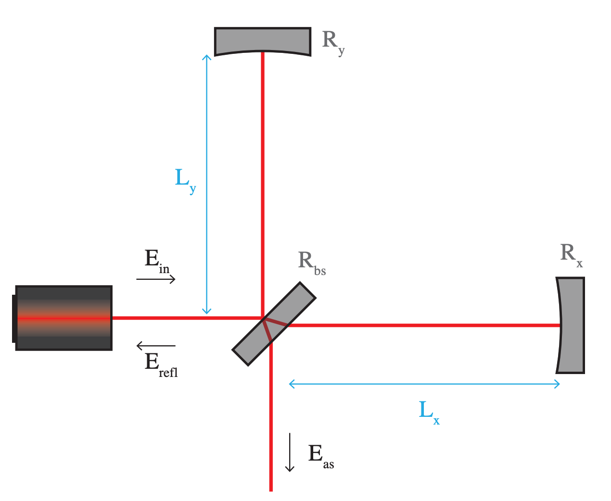
    

Differential light-travel time between two perpendicular 4 km arms. 
$\Delta L \sim 10^{-18}\,\mathrm{m}$, over ${\sim}0.1\,$s.

  

  

    
PTA &mdash; precise clocks

    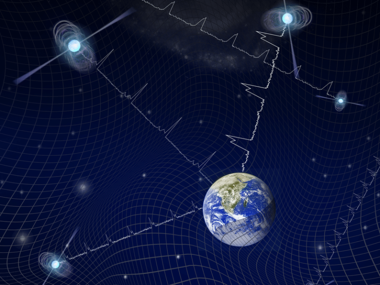
    

Light-travel time from a millisecond pulsar to Earth. 
${\sim}100\,$ns, over ${\sim}15\,$years.

  

Both measure the **same quantity** &mdash; the fractional change in light-travel time between two
points when a wave passes:

$$\frac{\delta T}{T} \;\sim\; \frac{1}{2}\,\hat p^{i}\hat p^{j}\,\Delta h_{ij}$$

One uses a laser and a 4 km baseline; the other uses a pulsar and a kiloparsec.

<!--
This is one of the most useful unifications to give students early. LIGO and PTAs feel like different subjects taught by different people. They are the same measurement — a light-travel-time perturbation — with the baseline changed by nineteen orders of magnitude.
-->

---

# How loud is loud? &mdash; *SNR.*

You do not see the wave; you see it buried in noise with power spectral density $S(f)$. The
optimal statistic is the matched filter, and its signal-to-noise is

$$\mathrm{SNR}^{2} \;=\; 4\int \frac{|h(f)|^{2}}{S(f)}\,df
\;=\; 4\int \frac{h_c^{2}(f)}{f\,S(f)}\,\frac{df}{f},
\qquad h_c \equiv f\,|h(f)|$$

Stationarity is doing the work: for stationary noise the covariance
$\langle \tilde n(f)\tilde n^*(f')\rangle$ is **diagonal in frequency**, so each band is an
independent measurement and $\mathrm{SNR}^{2}$ is simply the sum of their contributions —
that is the whole reason it is an integral over $f$. Writing it per logarithmic interval
is what makes the plot two slides ago readable: the source curve sits above the detector
curve exactly where the signal accumulates.

  

    
Monochromatic source

    

$$\mathrm{SNR}^{2}\sim \frac{|h_0|^{2} f\,T}{f S(f)}$$

Grows as $\sqrt{T}$. This is the PTA and white-dwarf regime.

  

  

    
Chirping source

    

$$\frac{d\,\mathrm{SNR}^{2}}{d\ln f}\sim \frac{|h_0|^{2} f\,t_{\rm GW}}{f S(f)}$$

The signal supplies its own integration time. This is LIGO.

  

<!--
Day 2 does matched filtering properly. Today just give them the formula and the reading of the sensitivity plot, plus the sqrt(T) versus chirping distinction — it is what makes PTA and LIGO analysis feel so different in practice.
-->

---
layout: default
---

  
SECTION IV

  <h1 class="!text-white !text-5xl !mb-0 drop-shadow-lg !font-normal">A hundred years, and then ten</h1>

<!--
Some history, and then what we have actually found.
-->

---

# Some *history.*

1916Einstein writes down GR; GWs predicted, then doubted.

1936Einstein submits <em>"Do Gravitational Waves Exist?"</em> Answer: <em>no.</em> Referee disagrees. Answer later flipped.

1957Chapel Hill: Feynman's sticky-bead argument settles that GWs carry energy.

1963–64Peters &amp; Mathews compute the radiation from a Keplerian binary.

1970sInterferometers and pulsar timing proposed.

1974Hulse–Taylor binary pulsar discovered.

1980sFirst ms pulsar; Hellings &amp; Downs correlation.

1990NSF funds LIGO. <em>Advanced LIGO comes online 2008.</em>

1993Nobel — Hulse &amp; Taylor.

2015GW150914 — first direct detection.

2017Nobel — Weiss, Thorne &amp; Barish. GW170817 multi-messenger.

2023PTAs announce evidence of a nHz background.

2025LVK passes 200+ merger events.

Note 1936 and 1957. Whether gravitational waves were even physical &mdash; as opposed to a
coordinate artefact &mdash; was genuinely unsettled for decades.

<!--
The 1936 story is worth telling: Einstein and Rosen submitted a paper to Physical Review concluding that gravitational waves do not exist, the anonymous referee (Robertson) found the error, Einstein was furious at the very idea of anonymous refereeing and withdrew the paper, published it elsewhere — with the conclusion reversed. Feynman's sticky bead at Chapel Hill in 1957 finally made it obvious that the waves do work.
-->

---

# The *Hulse–Taylor* pulsar.

  

A binary pulsar discovered in 1974, with

$$P_{\rm orb} = 7.75\;\mathrm{hr}, \quad e = 0.617, \quad t_{\rm merge} \approx 300\;\mathrm{Myr}$$

Separation about 1% of an AU &mdash; roughly the diameter of the Sun; $v \sim 10^{-3}c$.

Over decades it accumulated tens of thousands of orbits, decaying at exactly the rate
predicted for energy loss to gravitational radiation. Agreement now better than 0.2%.

The first, indirect, proof &mdash; and a direct application of the $\dot P$ formula you derived
earlier, with Peters' eccentricity correction.

Nobel &nbsp;Hulse &amp; Taylor, 1993

  

  

    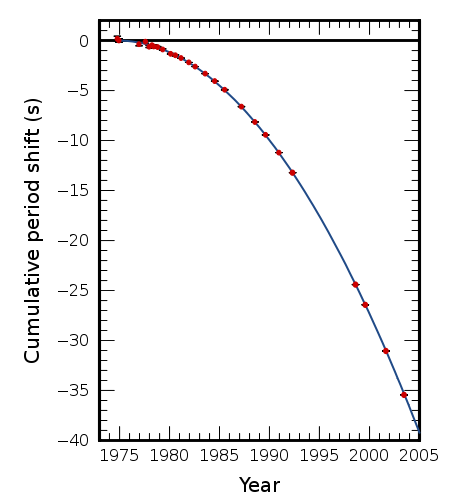
    
Cumulative period shift vs. year &mdash; data (points) vs. GR (line)

  

<!--
This is the moment to point out that the parabola in that figure is the cumulative shift — the integral of Pdot — which is why it is so much more striking than plotting Pdot itself. And that the e = 0.617 means the Peters eccentricity enhancement factor matters by a factor of about 12 in the decay rate. That factor is one of the things they can check this afternoon.
src: ht_lifetime_myr  src: F_ht_e0617
src: borrowed — P_orb = 7.75 hr, e = 0.617 and the 0.2% agreement are the published Hulse-Taylor / Weisberg-Taylor measurements; the 300 Myr lifetime is stamped in the peters reproduction, which stays in the repository.
-->

---

# Ten years of *noise reduction.*

  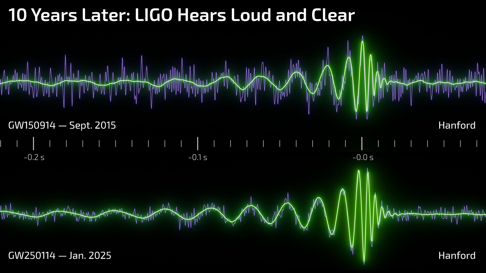

Same kind of event, ten years apart. The strain is the same; the noise around it has been beaten down. &mdash; LIGO Lab

<!--
A useful way to see what has happened to the instrument. The astrophysics did not change; the detector did.
-->

---

# A growing *catalogue.*

  

    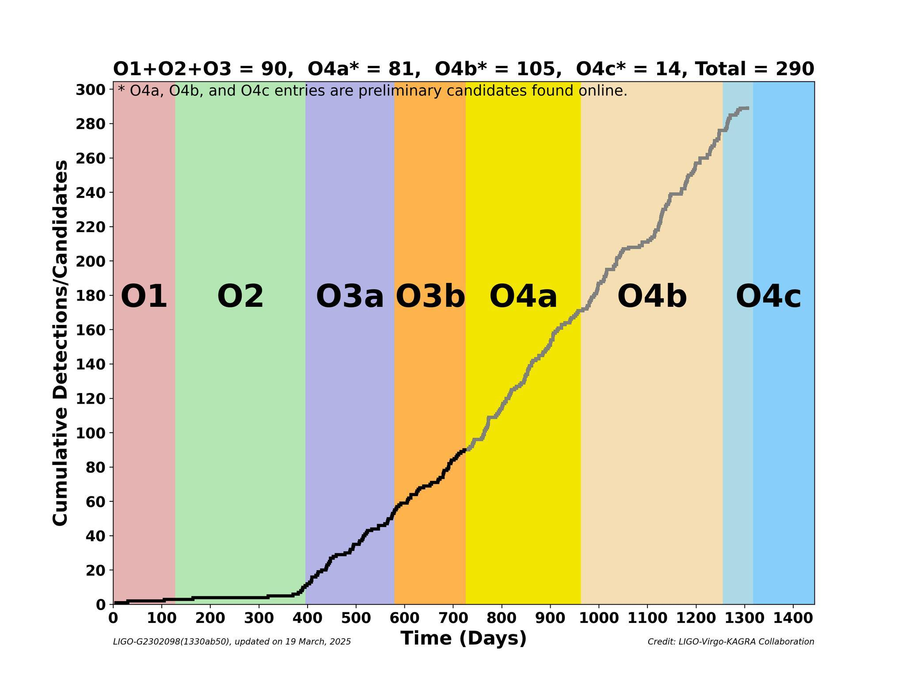
    
Cumulative LVK detections / candidates &mdash; LVK Collaboration, March 2025

  

  

By the end of O4 the catalogue is approaching **300 events.**

- The rate has gone up by an order of magnitude since O3.
- Each chirp lasts a fraction of a second to a few seconds.
- The strongest have SNR &gt; 50.

The waveform is computed from GR — post-Newtonian in the inspiral, numerical relativity through merger and ringdown.

  

<!--
The transition from "we detected one" to "we have a population" is what makes day 3 possible at all.
-->

---

# Masses in the *Stellar Graveyard.*

  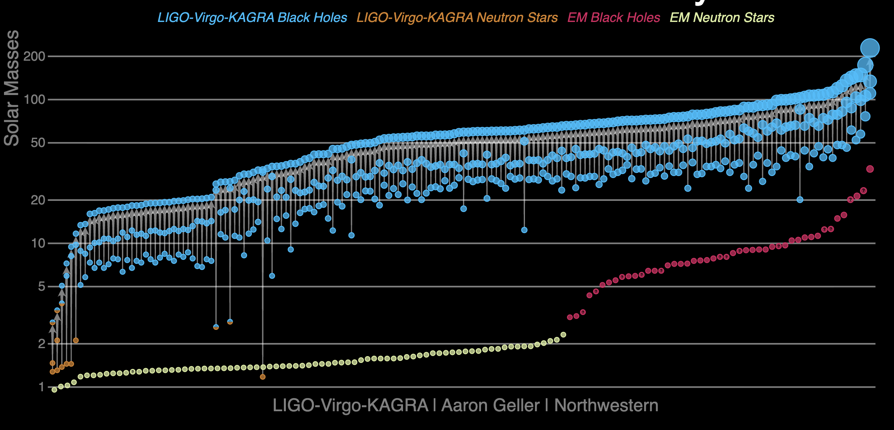

Compact remnants observed via gravitational waves and through light. &mdash; LVK / A. Geller, Northwestern

<!--
The single most informative plot in the field. Blue: black holes from X-ray binaries, seen in light. Orange: black holes from gravitational waves. They do not overlap the way anybody expected — the GW black holes are systematically heavier. This is puzzle number one, and we come back to it on day 3.
-->

---

# GW170817 &mdash; a *multi-messenger* event.

  

    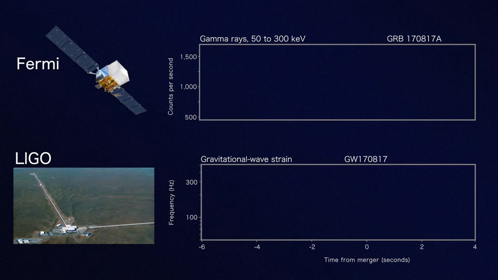
    
Fermi gamma-rays &amp; LIGO strain, GW170817 / GRB 170817A.

  

  

    

      
What was seen

      A 1.74-second delay between the gravitational-wave merger and the gamma-ray burst, over a 130-million-light-year baseline.
    

    

$$\frac{\Delta v}{c} \;\lesssim\; 3\times10^{-15}$$

    

      
What it bought

      The speed of gravitational waves equals the speed of light to <strong>a part in 1015</strong> &mdash; with no waveform calculation at all, just two arrival times.
    

    

      Whole classes of modified-gravity theories died that day. Also: a kilonova, r-process nucleosynthesis, and an independent measurement of $H_0$.
    

  

<!--
The best example in the field of a result that required essentially no theory — just timing. Worth stressing to students who assume all GW science is waveform modelling.
src: borrowed — the 1.74 s delay, the 130 Mly distance and the derived speed bound are the published GW170817 / GRB 170817A measurements (Abbott et al. 2017).
-->

---

# The nanohertz *hum.*

  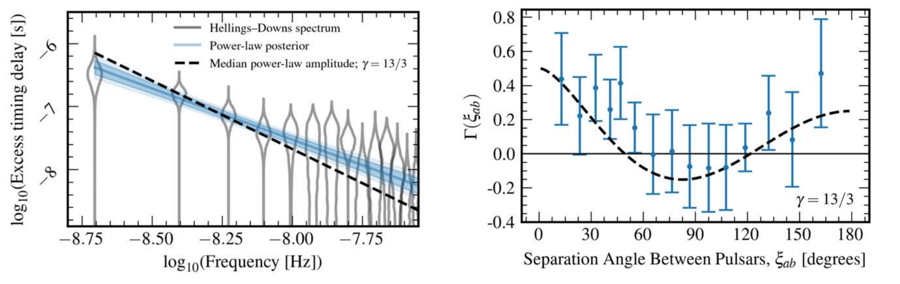

  
A passing wave shifts pulsar timing residuals in a <strong>quadrupolar pattern</strong> on the sky &mdash; spin 2 again.

  
The angular pattern is a parameter-free geometric prediction: the <strong>Hellings–Downs curve.</strong> You see it or you don't.

  
Now reported by <strong>all major PTA collaborations independently</strong> at 3–4σ.

NANOGrav 2023 &nbsp;·&nbsp; the subject of day 4

<!--
A single pulsar's residuals could be caused by a million things. Only the correlation between pulsars, in that specific quadrupolar pattern, is a gravitational-wave signature. We derive the curve on day 4 — and it will be the place where verification really bites, because a plausible wrong derivation of Hellings–Downs is very easy to produce.
-->

---
layout: default
---

  
SECTION V

  <h1 class="!text-white !text-5xl !mb-0 drop-shadow-lg !font-normal">Two open puzzles</h1>

<!--
I want to leave you with two specific open problems, because they recur every day this week and they are what the research in my group is actually about.
-->

---

# Puzzle 1 &mdash; the black holes are *too heavy.*

Above ${\sim}100\,M_{\odot}$ a star's helium core gets hot enough that photons make
$e^{+}e^{-}$ pairs. Pressure support drops, the core contracts, oxygen burning runs away, and
**the entire star is destroyed** &mdash; no remnant at all.

The prediction is a **forbidden zone** in the black-hole mass function, roughly
$45\,M_{\odot} \lesssim M \lesssim 130\,M_{\odot}$.

| Event | $m_1\,[M_{\odot}]$ | $m_2\,[M_{\odot}]$ | Notes |
|---|:---:|:---:|---|
| GW190521 | ${\sim}85$ | ${\sim}66$ | first clearly-in-gap event |
| GW231123 | ${\sim}137$ | ${\sim}101$ | most massive; both spins near extremal |

And a second, quieter problem: to merge within a Hubble time, two $20\,M_{\odot}$ black holes
must orbit within ${\sim}30\,R_{\odot}$ &mdash; but their giant-phase progenitors were
*hundreds* of solar radii across. How did they get so close?

<strong>You can check the first half of that sentence yourself</strong> &mdash; it is the
Peters merger-time formula and nothing else.

<!--
Two connected puzzles: the masses are in a region stellar evolution forbids, and the separations required are much smaller than the progenitors were big. Day 3 is about formation channels. The homework connects directly: the 30 solar radii number is a one-line consequence of Peters.
-->

---

# Puzzle 2 &mdash; the nanohertz background is *too loud.*

  

    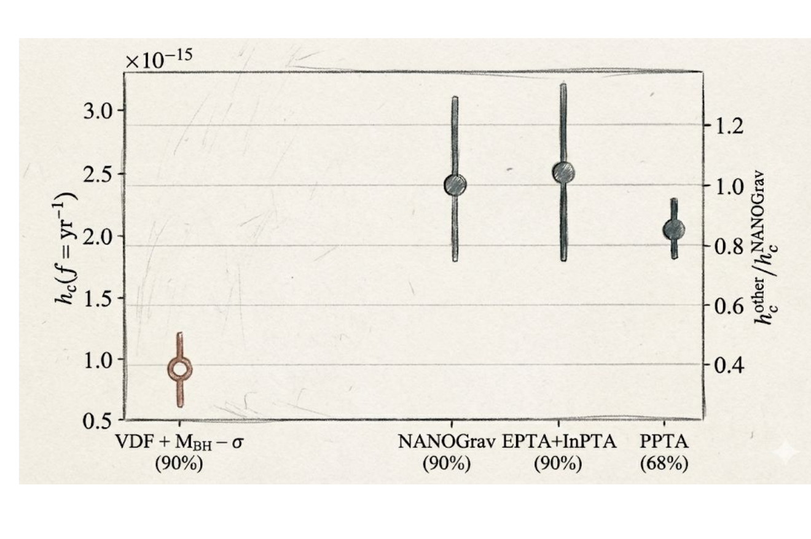
    
Predicted vs. observed amplitude of the nHz background.

  

  

Phinney's argument &mdash; day 4 derives it &mdash; is that the background amplitude depends, to
very good approximation, only on the **local mass density of supermassive black holes**:

$$\frac{d\rho_{\rm GW}}{d\ln f}\bigg|_{0} = \rho_{\rm BH}\,\big\langle \epsilon (1+z)^{-1/3}\big\rangle$$

Not on formation channel. Not on merger timescale. Not on mass ratio.

Fold in the local census from M–σ and the observed amplitude is **high by a factor of 2–3.**

Most natural reading: the local SMBH population has at least doubled its mass through mergers
since accretion ended.

  

<!--
Phinney's theorem is one of the most elegant arguments in astrophysics — an energy budget, nothing more, and it eliminates almost all the astrophysical uncertainty. Which is what makes the discrepancy interesting rather than dismissible. Days 3 and 4.
-->

---

# To *take away.*

- **Gravity is dynamical, so it has waves.** Two polarisations, spin 2, propagating at $c$, detectable only as a tidal effect between two free masses.
- **One formula, many masses.** $h \sim \mathcal{M}_c^{5/3}\Omega^{2/3}/d$ and $P \sim \eta^{2}v^{10}$, with $c^{5}/G$ as the only scale — an important formula, and almost every number today followed from it.
- **Mass sets frequency.** Ten decades of mass become ten decades of frequency; PTAs, LISA and LIGO are one subject.
- **We are ten years in,** and the objects we hear do not match the picture built from light.

Next: you will make an agent reproduce two of the calculations behind these
statements &mdash; and we will find out how well that goes.

<!--
Close, then break. The last line is the hand-off to the AI session.
-->

---
layout: default
---

  <h1 class="!text-white !text-5xl !mb-2 drop-shadow-lg !font-normal">Break.</h1>
  
Then: open your laptop.

<!--
Tell them to have their terminal open and the repository cloned when they come back.
-->
