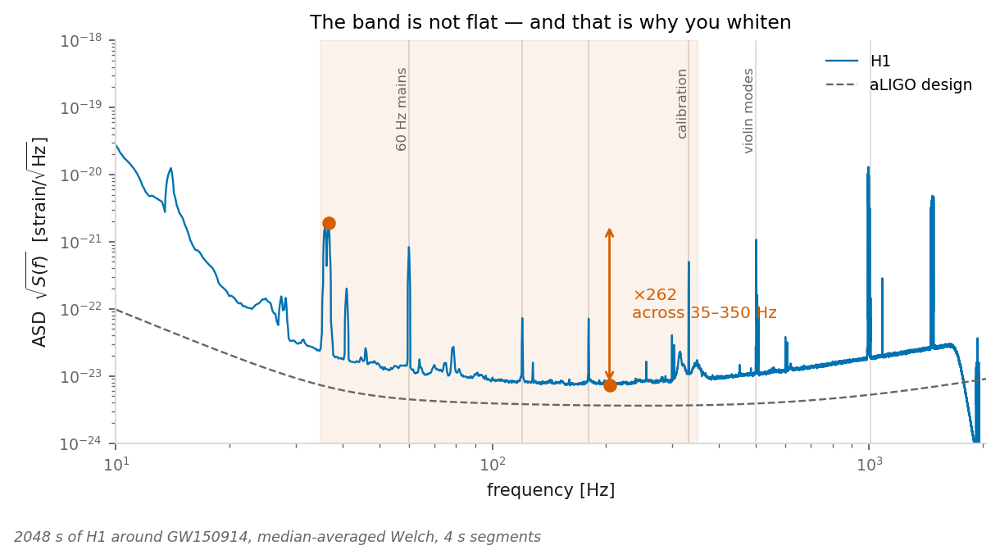
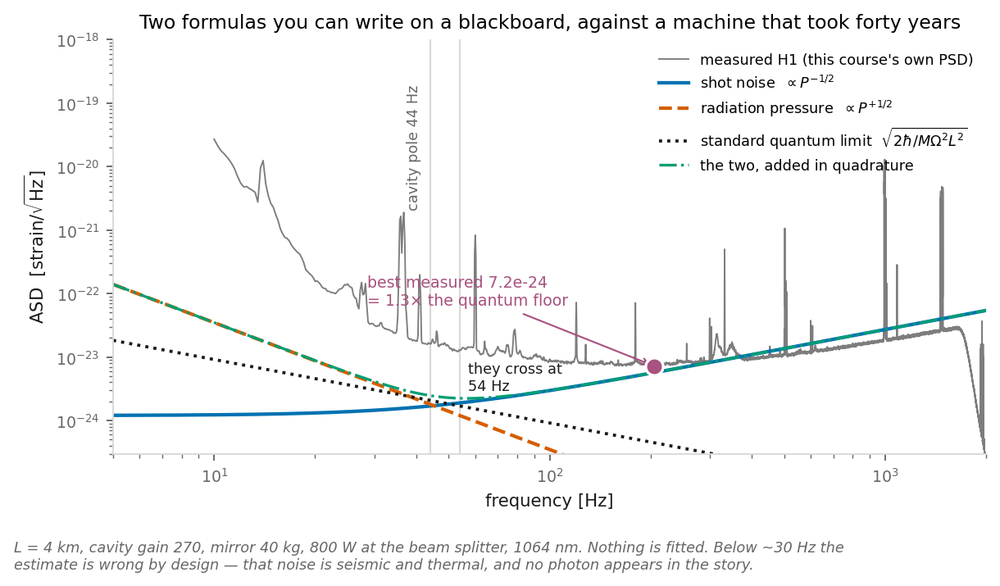
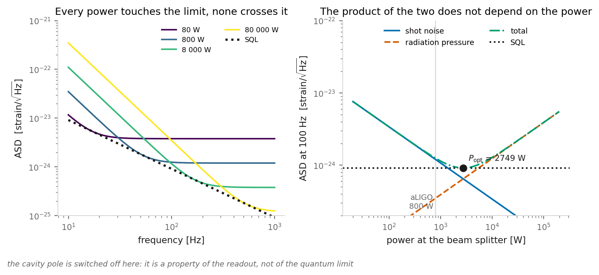
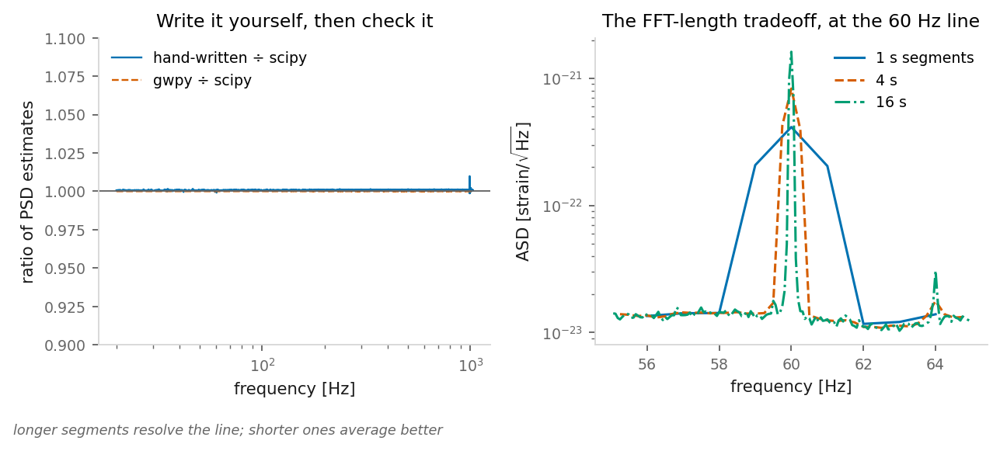
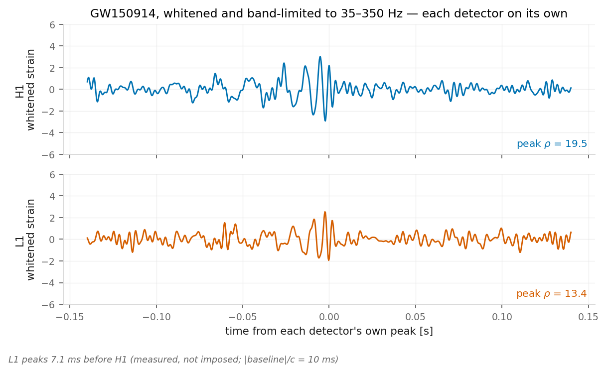
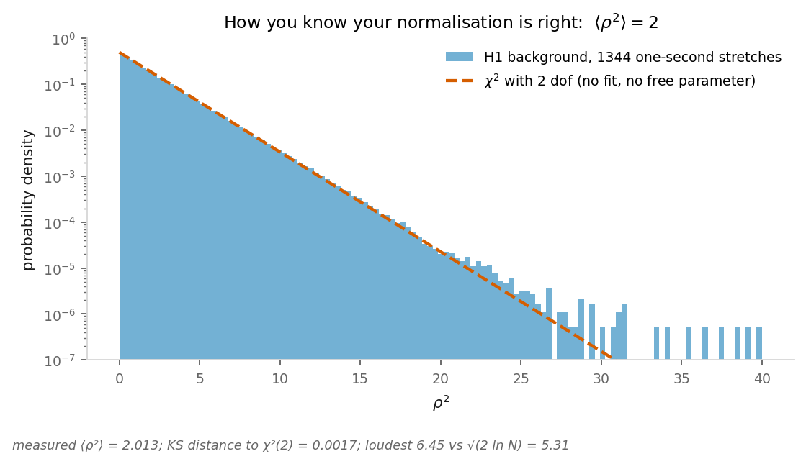
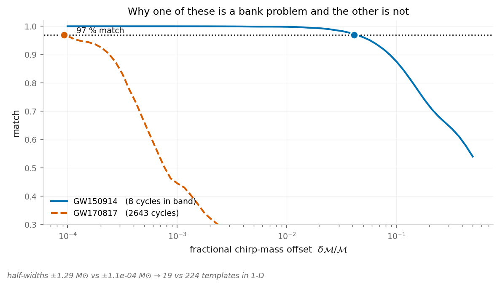
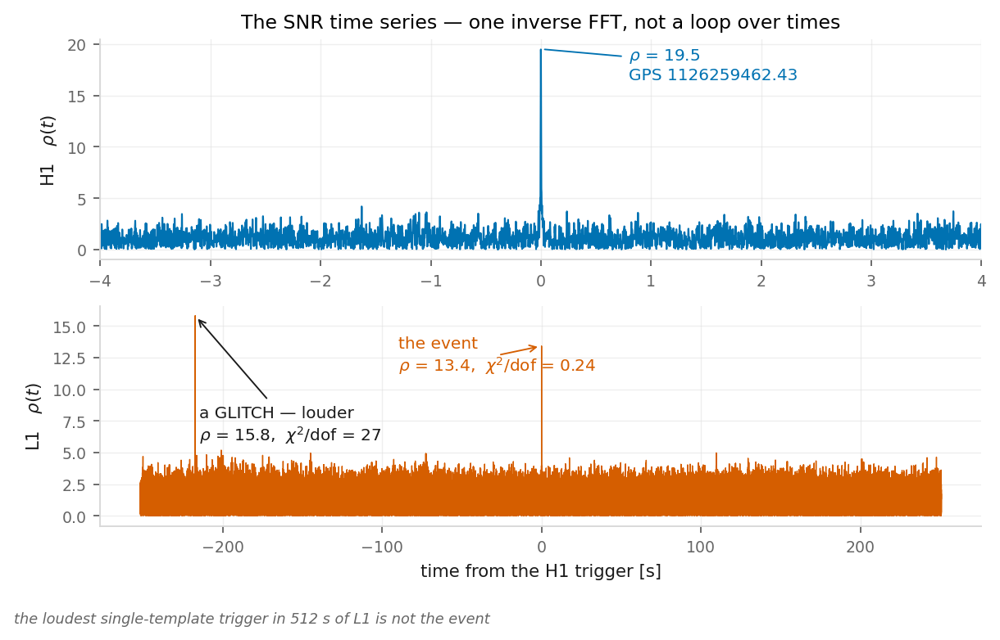
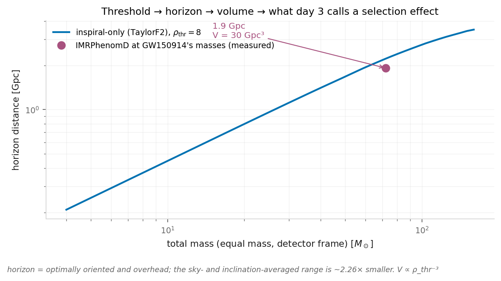

  <h1 class="!text-white !text-5xl !mb-2 drop-shadow-lg !font-normal">Ground-based detection</h1>
  
Day 2 &mdash; how a trigger is made

  

    Matias Zaldarriaga &nbsp;·&nbsp; <em>Ondas Gravitacionales e Investigación Asistida por IA</em>

<!--
Yesterday was "here is what exists". Today is "here is how it is made". By the end of the day you will have gone from a time series to a trigger with a false-alarm rate, and you will have written every step of it yourself.
-->

---

# The question of the *hour.*

How does a strain time series become *"a black-hole merger, with a false-alarm rate"*?
Today we understand the search process in enough detail to play with the data ourselves.

  

    
The worked example

    

GW150914, one detector, one template &mdash; every step rebuilt and checked. This afternoon
you write the filter out of numpy yourself: a hundred lines you can read, instead of one
library call you cannot. It runs as **two separately labelled exercises**: checking your
code against somebody else's implementation of the same model, and comparing two different
models. The first must agree; the second must not.

  

    
The pipeline beside it

    

Where a real search enters, the example is the IAS pipeline &mdash; because I work on it and
know its choices from the inside, not because it is the only one. Independent searches
exist, and they find events the catalogue does not have.

<!--
Open with the question and start. No claims about the day — just what we are doing in it. The IAS point stays factual: it is the example I can speak to from the inside.
-->

---

# Everything today is *one detector.*

No antenna patterns. No sky localisation. We do not do a coherent multi-detector search
&mdash; for simplicity. Every number today is computed from a single interferometer.

Two detectors still enter, the simple way: demand that the trigger appear in **both**,
within the light travel time, and add the answers incoherently,

$$\rho^{2}_{\rm net} \;=\; \rho^{2}_{1} + \rho^{2}_{2}$$

Slightly suboptimal compared with a coherent combination &mdash; and it costs nothing we
care about today.

What the cut buys is a day that is one continuous derivation, with no branches:
<strong>here is a time series</strong> &rarr; <strong>here is a trigger, and how rare it
is.</strong> Single-detector is genuinely hard, which is why GW230814 &mdash; a
single-detector event at SNR 42 &mdash; was in your homework.

<!--
State the scope cut once, without apology. The incoherent sum returns at the end of the day, where the Gaussian coincidence numbers show what demanding both detectors is worth.
-->

---
layout: default
---

  
SECTION I

  <h1 class="!text-white !text-5xl !mb-0 drop-shadow-lg !font-normal">The data</h1>

<!--
Start from the object itself. Most of them have never seen what actually comes out of a detector.
-->

---

# What actually *comes out.*

A single number, sampled at **4096 Hz**, called $h(t)$. Dimensionless &mdash; a fractional
length change. Calibrated, which is itself a research programme we will not open.

Not photon counts. Not an image. Not a spectrum. One continuous, roughly Gaussian, strongly
coloured time series, and everything the field knows is extracted from it.

  

    
Rate

    
4096 samples per second, per detector, forever.

  

    
Amplitude

    
RMS ~$2\times10^{-19}$, dominated by frequencies you will throw away.

  

    
What you want

    
A ${\sim}0.2$ s feature, five orders of magnitude below that RMS.

The whole of today is the answer to: how do you find the third of these inside the second?

<!--
The numbers here are measured on the actual shipped file, not quoted. Emphasise the ratio: the thing you are looking for is not merely small, it is small compared to noise you have to model precisely.
-->

---
layout: default
---

  
SECTION II

  <h1 class="!text-white !text-5xl !mb-0 drop-shadow-lg !font-normal">Noise</h1>

<!--
The assumption everything rests on, and its failure is the second act of the day.
-->

---

# Stationary, Gaussian, *and therefore easy.*

Assume the noise is stationary and Gaussian. Then in the frequency domain

$$\langle \tilde n(f)\, \tilde n^{*}(f')\rangle \;=\; \tfrac{1}{2}\, S(f)\, \delta(f-f')$$

Two consequences, and they are the reason the subject is tractable at all:

- Different frequencies are **independent.** The covariance matrix is diagonal in $f$.
- $S(f)$ is a **complete** description. There is nothing else to know about the noise.

Both halves of that assumption are false. Stationarity fails on timescales of minutes;
Gaussianity fails in the tails, which is exactly where a detection lives. We will build the
whole optimal machinery on the assumption first, and then spend the last third of the day
on what breaks.

<!--
Flag the falseness now, so that when the chi-squared veto arrives it is the answer to a question they have been holding, not a new topic.
-->

---

# The noise *budget.*

  

    
    
Measured H1 amplitude spectral density around GW150914.

  

Broadband

- **Low** &mdash; seismic and Newtonian gravity gradients. A wall below ~20 Hz.
- **Mid** &mdash; thermal noise in the coatings and suspensions.
- **High** &mdash; quantum shot noise: not enough photons.

Narrow

- 60 Hz mains and its harmonics.
- Calibration lines, injected on purpose.
- Violin modes &mdash; the suspension fibres, resonating.

This is the only interferometry we owe today, and we owe it only because it explains the
<em>shape</em> of this curve.

<!--
Figure: figures/asd.png (from the matched-filter reproduction) — measured from the 2048 s of H1 we ship, median-averaged Welch. The dashed curve is the aLIGO design sensitivity for scale. Every line marked on it was verified to stand above the local floor by at least a factor of a few tens.
-->

---

# Two of those you can *derive.*

  

    
    
Shot noise and radiation pressure against the measured H1 curve.

  

**Shot noise.** You read the fringe by counting photons. At 800 W of 1064 nm light that is
$\dot N = P/\hbar\omega_0 = 4.3\times10^{21}$ per second, arriving at random, so the phase
is measured to $1/\sqrt{\dot N}$ per root hertz. A strain $h$ moves the fringe by $2kGLh$:

$$\sqrt{S_h} = \frac{\lambda}{4\pi G L}\frac{1}{\sqrt{\dot N}} = 1.2\times 10^{-24}\ \mathrm{Hz}^{-1/2}$$

**Radiation pressure.** The same fluctuation pushes the mirrors: $\delta F = 2\,\delta P/c$,
and a free mass answers $\delta x = \delta F/M\Omega^2$. That is $3.5\times10^{-23}$ at
10 Hz, falling as $f^{-2}$.

One goes as the inverse square root of the power. The other goes as the square root.

<!--
Figure: figures/quantum_budget.png, from the detector-noise reproduction's quantum_noise.py (20/20 checks). Nothing on this plot is fitted: L = 4 km, cavity gain 270, 40 kg mirrors, 800 W at the beam splitter, 1064 nm — five numbers, hbar and c. The number to say out loud is the one at 1 kHz: measured 2.68e-23, estimated 2.71e-23. Both the level and the slope are right, and the slope is the arm cavity's 44 Hz pole, which is also where the rise at the right of the measured curve comes from. Say clearly where it fails: below ~30 Hz this is not the right physics at all, and the gap you can see is seismic and thermal noise. These parameters are Matias's own from Estimates.ipynb (Buenos Aires 2023) — catalogued in the wiki's past-lectures page.
src: photon_rate  src: asd_rp_10hz
-->

---

# The quantum *trade-off.*

  

Multiply the two together and everything about the machine cancels:

$$S_{\rm shot}\, S_{\rm rp} = \frac{\hbar^2}{\Omega^4 M^2 L^4}$$

No power, no cavity gain, no wavelength. A sum with a fixed product is smallest when the two
terms are equal, so the best any laser can do is

$$\sqrt{S_h^{\rm SQL}} = \sqrt{\frac{2\hbar}{M\Omega^2L^2}} = 1.8\times10^{-24}\ \mathrm{Hz}^{-1/2}$$

at 50 Hz for a 40 kg mirror. Choosing the power only chooses **where** you touch it.

  

  

    
    
The standard quantum limit: the envelope power cannot beat.

aLIGO runs at 800 W; the power that would touch the limit at 100 Hz is 2.7 kW. It is
deliberately on the shot-noise side &mdash; and squeezed light is how the real detectors
now go *below* this line, which is a different lecture.

<!--
Figure: figures/sql_envelope.png (detector-noise reproduction). The cancellation is done in sympy in reproduce_quantum_noise.py §4 and the minimisation in §5, and sql_from_product() asserts the identity numerically to machine precision. This is the one place in the day where a limit comes from quantum mechanics rather than from a choice, and it is worth naming the contrast: everything else today — where to stop a template, how many sub-bands, what threshold — is a convention someone picked. This one is not.
src: optimal_power_100hz_W
-->

---

# The shape of the *band.*

Inside the band where GW150914's signal-to-noise actually lives, the noise amplitude varies
by **a factor of a few hundred.**

That single fact is the entire motivation for what comes next. If you treat every frequency
in the band equally, you are letting the loudest corner of the band decide your answer.

Measured, on our own H1 stretch: filtering GW150914 over the same band with a **flat weight**
instead of $1/S(f)$ retains **4.5 %** of the signal-to-noise. An SNR of 19.5 becomes 0.9.

Nobody would ever have looked at it twice.

<!--
Number from the matched-filter reproduction §7, panel figures/snr_integrand.png. The 4.5% is deterministic — it is the Cauchy-Schwarz gap between the weight 1/S and a flat weight, so there is no noise realisation involved and nothing to average. Deliberately say "a factor of a few hundred" rather than a precise number: it depends on the detector and the epoch and it is conceptually unimportant. The figure has the measured value on it for anyone who asks.
src: snr_fraction_flat_weight  src: h1_peak_snr  src: event_snr_flat_weight_expected
-->

---

# Estimating $S(f)$ &mdash; *Welch.*

  

    
    
Welch estimates — implementations compared, and the FFT-length tradeoff.

  

**Segment, window, average.** Three choices, each with a trap.

- **Segment length.** Long segments resolve the lines; short segments average down the
  continuum. You cannot have both.
- **Window.** Divide by $\sum w^2$, not by $n$. Divide by $n$ and every PSD is low by
  $8/3$ for a Hann window &mdash; a 27 % error in every SNR you ever quote.
- **Median, not mean.** The median is robust to a glitch &mdash; a loud non-Gaussian transient, the day's second act &mdash; or a signal sitting in your
  estimation data.

**Never estimate the PSD from data containing your signal.** Then measure how much it would
have mattered: on GW150914, using the *event's own* data changes the recovered SNR by
${\sim}0.2$ % &mdash; because the average is a median. The rule is still the rule. The median
is why breaking it here is survivable.

<!--
Figure: figures/psd_estimators.png. Left panel is our hand-written Welch divided by scipy's (median 0.07 %) and gwpy's divided by scipy's. Right panel is the FFT-length tradeoff at the 60 Hz line. Mean-averaged, the hand-written version agrees with scipy to 3e-6, which is what actually pins the normalisation.
src: welch_byhand_vs_scipy_median_reldiff  src: h1_peak_snr_psd_allsource  src: h1_peak_snr_psd_offsource

-->

---

# Whitening.

Divide by the amplitude spectral density. Every frequency bin ends up contributing equally,
and the time series becomes unit-variance white noise.

$$\tilde w(f) \;=\; \tilde x(f)\,\sqrt{\frac{2\,\Delta t}{S(f)}}
\qquad\Longrightarrow\qquad \mathrm{var}(w) = 1 \ \text{per sample}$$

  

    
Check it

    

Variance 1 per sample. Autocorrelation a delta. Measured: **0.965** and sidelobes below
**1.7 %**.

  

    
Two ways it lies to you

    

**Window first** &mdash; un-windowed, the variance comes out **1.50**, because the seismic
wall leaks. **Band-limited**, the variance is the *bandwidth fraction*, not 1: a check that
passes there is passing by accident.

<strong>Band-passing is not whitening.</strong> Band-passed, 99 % of the variance in
30&ndash;1024 Hz comes from the violin modes above 400 Hz. Whitened, every region contributes
in proportion to its width.

<!--
This was day-1 failure 1: a figure that band-passed and did not whiten, and looked wrong to anyone who had seen the real one. All four numbers here are asserted in reproduce_search.py §2 and §3.
src: whitened_var_unwindowed  src: whitened_var_fullband  src: whitened_autocorr_max_sidelobe  src: bandpass_400_1024_variance_fraction
-->

---

# GW150914, *by eye.*

  

Whitened, band-limited to 35&ndash;350 Hz. Each detector on its own &mdash; no coherent combination anywhere today.

<!--
Figure: figures/whitened_event.png. This is the payoff of the previous slide: divide by the ASD and the loudest event in the catalogue is visible without any filtering at all. The L1 panel peaks 7.08 ms before H1 — measured by two independent single-detector filters, not imposed. That number is a light-travel time across the baseline, and it is the only thing we will say all day about having two detectors. Day-1 failure 1 was applying a shift like this with the wrong sign; here nothing is shifted at all.
-->

---
layout: default
---

  
SECTION III

  <h1 class="!text-white !text-5xl !mb-0 drop-shadow-lg !font-normal">Matched filtering, derived</h1>

<!--
Yesterday I gave them the SNR formula and said "day 2 does this properly". This is that promise.
-->

---

# One integral, and *everything* is it.

Because the noise is diagonal in frequency with variance $S(f)$, the natural inner product
between two signals is

$$\langle a | b \rangle \;=\; 4\,\mathrm{Re}\!\int_{0}^{\infty}
\frac{\tilde a(f)\, \tilde b^{*}(f)}{S(f)}\, df$$

If you take one formula from today, take this one.

- The **norm** of a template, $\sqrt{\langle h|h\rangle}$, is the SNR it would give.
- The **overlap** of two templates is $\langle a|b\rangle$ normalised.
- The **match** is that, maximised over time and phase.
- The **likelihood** is built from it, and so the **SNR** is too.

It is a weighted dot product. The weight is $1/S(f)$, and that is the only place the
detector enters.

<!--
Slow down here. Every single thing in the rest of the day is this object. If they leave with one equation it should be this one.
-->

---

# From the likelihood to the *filter.*

Gaussian noise, so the likelihood of data $d$ given a signal $h$ is

$$\ln L \;=\; -\tfrac{1}{2}\langle d - h | d - h\rangle
\;=\; \langle d|h\rangle - \tfrac{1}{2}\langle h|h\rangle + \text{const}$$

We do not know the amplitude or the phase, so put $h \to A\,e^{i\varphi} h_0$ and maximise
over both. Both maximisations are analytic:

This is the transferable idea of the whole day. Matched filtering &mdash; correlate the data
against a known shape, weighted by the noise &mdash; is the optimal linear statistic in *any*
stationary-noise problem: radar, pulsar searches, CMB point sources. Learn it here and you
own it everywhere.

$$\hat\varphi = \arg z, \qquad \hat A = \frac{|z|}{\langle h_0|h_0\rangle},
\qquad \ln L_{\max} = \frac{|z|^{2}}{2\,\langle h_0|h_0\rangle} \equiv \tfrac{1}{2}\rho^{2}$$

$$\rho \;=\; \frac{|\langle d | h\rangle|}{\sqrt{\langle h|h\rangle}}$$

The matched filter is not a recipe bolted onto the likelihood. It **is** the maximised
likelihood. That is why it is optimal, and it is optimal by Cauchy&ndash;Schwarz &mdash;
which is the same inequality that says a flat weight costs you 95 % of your SNR.

<!--
All four steps are verified symbolically in sympy in reproduce_search.py §4 — the point being that this is a derivation you can hand an agent and check, not a formula to look up.
-->

---

# Maximising over *arrival time.*

We also do not know **when** the signal arrives. Shifting the template by $t$ multiplies its
transform by $e^{2\pi i f t}$, so

$$z(t) \;=\; 4 \int \frac{\tilde d(f)\,\tilde h^{*}(f)}{S(f)}\, e^{2\pi i f t}\, df$$

which is an **inverse Fourier transform.** Not a loop over trial times: one FFT gives you
every arrival time at once.

This is why a search over 2048 seconds of data costs milliseconds, and it is the step where
implementations go wrong &mdash; one-sided versus two-sided, the factor of 4, whether $N$
belongs in the normalisation. Define the template on $f > 0$ only and $z(t)$ is the analytic
signal, so $|z|$ is already maximised over phase.

Three of today's exercises exist only to catch errors in this line.

<!--
This is the single most error-prone line in the subject, and it is also the one an agent will produce most confidently. The factor-of-2 trap: irfft rebuilds negative frequencies, so a time-domain norm is exactly twice the frequency-domain one. Being exactly 2x wrong makes every SNR sqrt(2) = 1.41 too large and still plausible.
-->

---

# How you know you got it *right.*

  

    
    
Background SNR-squared against the chi-squared (2 dof) prediction.

  

In Gaussian noise, $z$ has two independent quadratures each of variance $\langle h|h\rangle$.
So $\rho^2$ is $\chi^2$ with **two** degrees of freedom, and

$$\langle \rho^{2}\rangle = 2$$

with **no fit and no free parameter.**

Measured on 1344 one-second signal-free stretches of real H1: <strong>2.013</strong>, with a
KS distance to $\chi^2_2$ of 0.0017.

Run your filter over noise. If you do not get 2, your normalisation is wrong &mdash; and
every SNR you have quoted is wrong by the same factor.

<!--
Figure: figures/rho2_histogram.png. This is the check to hand every group this afternoon. It is also exactly the `normalization = 1  # this is wrong` placeholder in the PITP tutorial they will meet in the homework. Note the loudest signal-free trigger is 6.45 against the sqrt(2 ln N) = 5.31 that Gaussian noise predicts — the tail is a bit heavy, which is a preview of section IV.
src: background_mean_rho2
-->

---
layout: default
---

  
SECTION IV

  <h1 class="!text-white !text-5xl !mb-0 drop-shadow-lg !font-normal">From a template to a search</h1>

<!--
The part of today that surprised me most, and the part that changed while it was being built. This section was two — "What is a template worth?" and "Why a filter is not a search" — until review 2 cut three slides out of the first (C1, C4, C5) and one out of the second (C7); one divider announcing two slides is worse than no divider at all (A7, C12), so they are one section and the title covers both halves.
-->

---

# Write the template *yourself.*

The stationary-phase **inspiral**, at leading order &mdash; and *inspiral* is the whole of
its domain. It describes two objects still orbiting each other, and it stops being a
statement about anything at all once they stop. One parameter: the chirp mass.

$$\tilde h(f) \;=\; f^{-7/6}\, \exp\!\left[-\,i\,\frac{3}{128}\,(\pi \mathcal{M} f)^{-5/3}\right]$$

Where that domain ends is not a technicality. GW150914's inspiral ends at
$f_{\rm ISCO} = 61$ Hz, which is the *bottom* of the band, and 74 % of the event's
signal-to-noise lies above it. For a neutron-star binary the same frequency is 1570 Hz,
out of band entirely, and the same template is not an approximation &mdash; it is the
whole signal.

Note the **minus** sign in the exponent. Textbooks write plus, because they define the
Fourier transform with the other sign convention. With <code>numpy.fft.rfft</code>, plus
gives you the *time-reverse* of a chirp.

And because GW150914 has only about eight cycles in band, a chirp and its time-reverse still
overlap at ${\sim}0.4$ &mdash; a number that looks like a result. Hold that thought; it comes back
in twenty minutes and it cost me a design decision.

<!--
Plant this now. The reversal is much more effective if they have already been told the trap exists and then watch it be the explanation. The sign is pinned three ways in the reproduction: conjugation matching lal, the template measurably sweeping upward in time, and agreement with the shipped IMRPhenomD.
The domain-of-validity paragraph is review 2, C3 (the old text listed what the model lacks, which is a feature list, not a statement about where it is valid) and it carries the one sentence worth keeping from the cut slide 'The inspiral ends where the band begins' (C4, now in the backup deck with its figure).
src: f_isco_true  src: snr2_fraction_above_isco
-->

---

# Fitting with the wrong *template.*

What you recover is the **projection** of the true signal onto your template family.
Whatever part of the signal is orthogonal to that family is lost, and no parameter value
brings it back.

So the two ways of being wrong are not the same. A **missing physical effect** is an
orthogonal piece and costs you signal-to-noise permanently. A **wrong parameter inside the
family** costs almost nothing, because the fit lies about the parameter to compensate.

That lie is measurable, and it is the reason detection and measurement are different jobs:
the inspiral-only templates that find this event report a chirp mass **5.9 $M_\odot$
above** the truth, or **8.0 $M_\odot$ below** it, depending which family you used.

And losing signal-to-noise is not an aesthetic loss. In Gaussian noise $\rho^2$ is
$\chi^2$ with two degrees of freedom &mdash; the histogram from twenty minutes ago &mdash;
so at a fixed threshold, giving up a few per cent of $\rho$ slides your trigger down into
the part of that distribution where noise already lives.

<!--
Rewritten for review 2, C2. The table of fitting factors is gone and is NOT in the backup deck: "even if all is correct it is confusing and will open more questions than answer". What survives is the orthogonality lesson, the bias (the one sentence worth keeping from the cut slide 'The chirp mass it gives you is wrong', C5), and the link the deck never made — a fitting factor is a statement about where your trigger lands in the rho-squared background, which they have already plotted. The two biases are measured on real H1 strain by the matched-filter reproduction's §8; the scan behind them is figures/snr_vs_mchirp.png, which is in the backup deck with C5. Bias direction is a property of the family, not a general fact: "inspiral templates read low" is true of only one of the two rows.
src: mchirp_bias_spa0  src: mchirp_bias_taylorf2
-->

---

# How many *templates?*

  

    
    
The 1-D chirp-mass bank at 97 % minimal match.

  

Move the template's chirp mass away from the signal's and the match falls. The distance you
can move before it falls is the spacing of a bank, and you can write it down from the phase
you already have. Ask that a wrong $\mathcal{M}$ not move $\Psi$ by more than a radian:

$$\frac{\partial\Psi}{\partial\ln\mathcal{M}} = -\frac{5}{3}\Psi
\quad\Longrightarrow\quad
\frac{\delta\mathcal{M}}{\mathcal{M}} \lesssim \frac{3}{5\Psi} \approx \frac{1}{4 N_{\rm cyc}}$$

using $\Psi = \tfrac{3}{4}\pi N_{\rm cyc}$ for the 0PN phase. **The tolerance is the
accumulated phase, and nothing else.**

| | cycles in band | this estimate | measured half-width |
|---|---|---|---|
| GW150914 | 8 | $\pm 1.0\,M_\odot$ | $\pm 1.3\,M_\odot$ |
| GW170817 | 2600 | $\pm 1.15\times10^{-4}\,M_\odot$ | $\pm 1.1\times10^{-4}\,M_\odot$ |

The same rule fixes every other parameter: $|\partial\Psi/\partial\lambda|\,\delta\lambda
\sim 1$, and the size of a bank is the product of range over $\delta\lambda$.

<!--
Figure: figures/bank.png. Rebuilt for review 2, C6: the mismatch-metric machinery (expand the phase difference, project out time and phase, keep the quadratic term) is gone from the slide and stays in the reproduction, which still computes it and still agrees. What is left can be written on the board. Eight cycles between 35 and 150 Hz is the number in the GW150914 discovery paper's own abstract, and ~2600 is the "about 3000" of the GW170817 paper, so both are checkable against the literature. The estimate lands within 25 % on eight cycles and within 4 % on 2600 — it is a linear expansion in the phase, so it is best where the phase is largest, and that is worth saying if anyone asks why the agreement is not equally good. The half-width depends on where you stop the template: at f_ISCO it is 4.1 Msun, at 300 Hz 1.2, at 1024 Hz 1.0. 224 x ~37 mass-ratio values is about 8300, which is 2^13 — the bank size in the tutorial they get for homework, falling out of first principles.
src: gw150914_mc_tolerance_1rad  src: gw170817_mc_tolerance_1rad  src: gw150914_mc_halfwidth_097  src: gw170817_mc_halfwidth_097  src: gw150914_cycles_35_150  src: gw170817_cycles_30_isco
-->

---

# Two systems, two *problems.*

  

    
GW150914 &mdash; a heavy black-hole binary

    

Eight cycles. A single hand-built template finds it, because eight cycles forgive a 4 %
chirp-mass error.

This is your launch task, in twenty minutes.

  

    
GW170817 &mdash; a neutron-star binary

    

Twenty-six hundred cycles. You need the chirp mass to about one part in $10^{4}$. There is no
"just try a template".

That is a bank, and it is your homework.

The tutorial you will meet for homework opens with a template at *"arbitrarily selected
masses"*. Its match against a real GW170817 waveform is **0.195**, and it is 59 half-widths
from the truth.

That notebook is not trying to detect GW170817. It builds the machinery, finds a **glitch**
by eye, and calibrates a test against it. The second notebook is the search. Read the first one knowing
that, or you will spend an hour wondering why it does not work.

<!--
Worth saying explicitly — it is exactly the kind of thing that wastes an evening, and noticing it is itself the habit the course is about.
src: pitp_nb1_match
-->

---

# Real noise has *glitches.*

Everything so far assumed stationary Gaussian noise. Real interferometers also produce
**glitches** &mdash; blips, scattered light, non-stationarity &mdash; excursions no Gaussian
model predicts, and there is one in the data I am giving you:

  
  

512 s of L1, one template: the SNR time series, loudest trigger and event marked.

The loudest trigger in L1 is $\rho = 15.8$; GW150914 is $\rho = 13.4$. On single-detector
SNR alone you would publish the wrong thing. One may try to throw glitches away if they do
not look like gravitational waves &mdash; and every such test is calibrated against a
stated error rate rather than by taste.

<!--
Merged from two slides (review M24: the glitch material was too deep — one impression is the job). Real data, not a simulation: the glitch turned up when the reproduction asserted "the loudest L1 trigger is the event" and the assertion failed. In H1 the loudest trigger IS the event, and the glitch is not in both detectors — which is what the coincidence numbers at the end of the day exploit.
The last sentence is all that survives of the chi-squared veto slide (review 2, C7: "one may try to get rid of glitches if they do not look like gravitational waves. Nothing more."). The slide itself, with its veto plane, is in the backup deck; the construction and the calibrated threshold are in its speaker note there.
src: l1_loudest_snr  src: l1_event_snr
-->

---

# From a trigger to a *detection.*

The number that separates them is the **false-alarm rate**: how often would noise alone
produce something this loud? Three statements, kept apart:

1 · what our background says &mdash; run the filter over signal-free
stretches and count. Nothing in our 1344 s reaches $\rho = 19.5$, which **bounds** the rate:
FAR $< 7\times10^{4}$ per year at 95 %. Twenty-two minutes of background can never say more
than "rarer than once per twenty-two minutes" &mdash; this is a bound, not a measurement,
and it is far too weak to detect anything with.

2 · what Gaussian noise would need &mdash; computable in closed
form, once the trials are counted honestly. A trial is **every template, at every arrival
time you looked at**: ${\sim}100$ independent samples per second times the whole bank, and
a real search's bank is $3\times10^{5}$ templates, not the twenty on the earlier slide.
One false alarm per century then needs $\rho = 8.9$ in a single detector &mdash; or
$\rho = 7.3$ **per detector** if you demand a 10 ms coincidence and add $\rho^2$
incoherently. Coincidence is worth about a unit and a half of SNR.

3 · where GW150914 sits &mdash; H1 at $\rho = 19.5$ and L1 at
$\rho = 13.4$, in coincidence: **2.7× and 1.8×** that threshold. A very real event, by
arithmetic. The published search statement &mdash; months of data, the full bank, and
**time slides**, shifting one detector's clock against the other to manufacture
signal-free background &mdash; is FAR $<$ 1 per 203,000 years.

<!--
The three-part structure is the review's correction (M25): our 1344 s gives a BOUND (the 7e4 is the 95% Poisson limit, 3/T — the arithmetic is right once the factor 3 is stated); the Gaussian coincidence calculation is the gaussian-coincidence reproduction (its acceptance spec written first, 8/8 checks); and GW150914 clears it. The old "loudest of 10^10 trials" line had no source in the repo and is gone (M26/A7). Why real backgrounds are still hard in a real search: real noise is not Gaussian — the L1 glitch two slides ago is the demonstration.
The trials factor was wrong until review 2 (C8): it was the toy 20-template 1-D bank, and it is the total number of templates a real search filters with. 316,262 is the total over the eleven banks of Roulet, Dai, Venumadhav, Zackay and Zaldarriaga 2019 (arXiv:1904.01683, Table 1), now in papers/roulet-template-bank/. It only enters inside a logarithm, so the order of magnitude is what matters; correcting it moved the coincidence threshold from 5.8 to 7.3 per detector and L1's margin from 2.3x to 1.8x, and the acceptance spec beside that reproduction carries the amendment. Worth saying if asked: that paper divides the search into eleven independent banks precisely so that the low-mass banks' enormous template count does not tax the high-mass search — the look-elsewhere penalty is a design parameter, not a fact of nature.
src: far_background_seconds  src: far_upper_limit_per_year  src: h1_peak_snr  src: l1_event_snr  src: rho_single_1_per_century  src: rho_coinc_each_1_per_century  src: gw150914_h1_margin  src: gw150914_l1_margin
src: borrowed — the 3e5 template count is Roulet et al. 2019, Table 1 (316,262 over eleven banks), used as the trials factor.
src: borrowed — the "1 per 203,000 years" is the LVK's published GW150914 false-alarm bound (Abbott et al. 2016, PRL 116, 061102), quoted for comparison.
-->

---
layout: default
---

  
SECTION V

  <h1 class="!text-white !text-5xl !mb-0 drop-shadow-lg !font-normal">What it buys you</h1>

<!--
Two payoff slides, then the punchline.
-->

---

# Threshold, horizon, *volume.*

  

    
    
Horizon distance against chirp mass, real H1 PSD.

  

$\rho \propto 1/D$, so a detection threshold is a **distance**, and a distance cubed is a
**volume**.

$$D_{\rm hor} = \frac{d_{\rm ref}\,\sigma}{\rho_{\rm thr}},
\qquad \frac{d\ln V}{d\ln \rho_{\rm thr}} = -3$$

Measured with the real H1 PSD, for a GW150914-like binary at $\rho_{\rm thr} = 8$:
**1.9 Gpc**, and a searched volume of **30 Gpc$^3$**.

Halving the threshold multiplies the volume by eight. That is why a 5 % improvement in a
pipeline is worth having.

Turn it around: GW150914's own SNR bounds its distance from **above** &mdash; $D < 786$ Mpc,
because any orientation other than optimal reproduces the same $\rho$ only from closer in.
The published value is 440 Mpc.

<!--
Figure: figures/horizon.png. This slide hands day 3 its selection effects for free — the fact that you see loud things from further away is the entire origin of the observed mass distribution being different from the true one. Note horizon is optimal orientation and sky position; the averaged range is 2.26x smaller.
src: horizon_distance_mpc_rho8  src: horizon_volume_gpc3  src: event_distance_upper_bound_mpc
src: borrowed — the 440 Mpc is the published GW150914 luminosity distance (Abbott et al. 2016).
-->

---

# The *punchline.*

Everything today had a choice in it. Where to place templates. How to handle non-Gaussian
noise. Which harmonics to include. How to estimate a background. Where to stop a template.

The triggers are in everyone's data. What the choices decide is which of them end up above
a threshold &mdash; so what differs between pipelines is the **catalogue**. Independent
pipelines publish black-hole mergers the collaboration's own catalogue does not contain,
from the *same public data.*

The catalogue is not the sky. It is the output of one set of choices.

Venumadhav, Zackay, Roulet, Dai &amp; Zaldarriaga 2019 &mdash; a new search pipeline, and a
list of events. Wadekar et al.\ 2023 &mdash; more of them, with higher harmonics, with
public data products you can download this afternoon.

<!--
This is the reason the day is shaped this way. Do not oversell it — the collaboration's pipeline is excellent and the extra events are mostly marginal. The point is not that LVK is wrong; it is that "the catalogue" is a choice, and that a small group that can rebuild the pipeline gets to make different choices. That is a career-relevant fact and it is why being able to write the filter matters more than being able to call it.
The claim was tightened in review 2 (C9): "different choices give different events" is not defensible and is not what happens. The triggers are in the data either side of any threshold; what a choice moves is which ones are called detections, and therefore the catalogue.
-->

---

# To *take away.*

  

    
The physics

    

- One integral, $\langle a|b\rangle$, and everything is built from it.
- The matched filter **is** the maximised likelihood.
- $\langle\rho^2\rangle = 2$ is how you know your normalisation is right.
- The band varies by a factor of a few hundred: whitening is not optional.
- A trigger becomes a detection only via a background you measure.

  

    
The surprises

    

- **Where you stop** an inspiral template matters more than which post-Newtonian order you
  kept. Stop at $f_{\rm ISCO}$ and most of this event's signal-to-noise is still above you.
- The recovered chirp mass is **wrong**, in a direction that depends on the template
  family. Detection and measurement are different jobs.
- The loudest trigger in real L1 data is a **glitch**, louder than the event.

Every number on these slides was measured this week, and every one of them has a figure
behind it you can open. Three of them contradict what I believed at the start of the week.

<!--
End on that. It is the honest summary of the build and it is the best possible advertisement for the afternoon: the person who wrote the reproduction found three things wrong with his own plan, and the only reason he found them is that everything was checked against data.
Review 2, C10: the bullet claiming a hand-written 0PN template gets 96 % of the SNR is gone — "I am very suspicious, and even if true, who cares". One uses the best model available; that a crude one occasionally scores well is not a lesson, and the audit of that number is open as T1. The count in the closing line went from four to three with it.
-->
