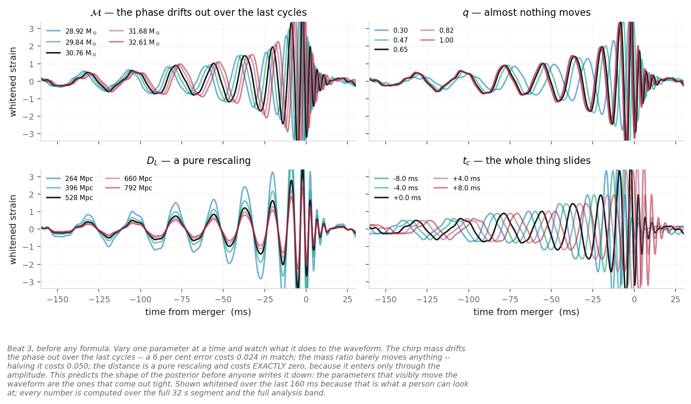
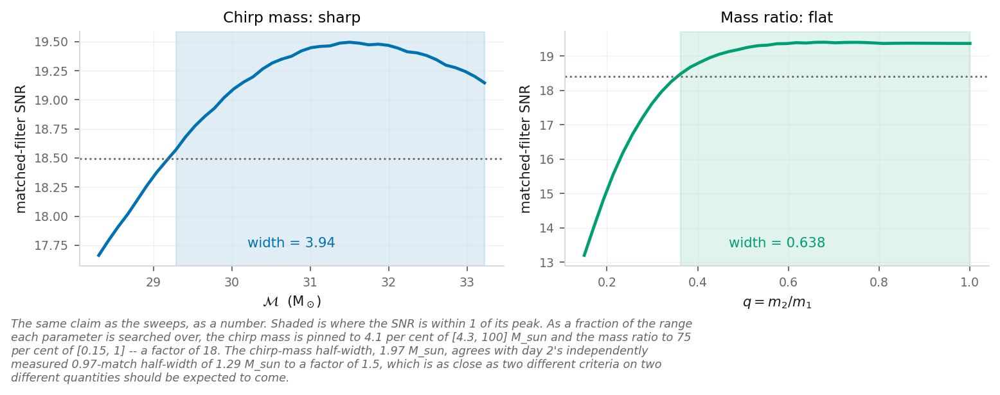
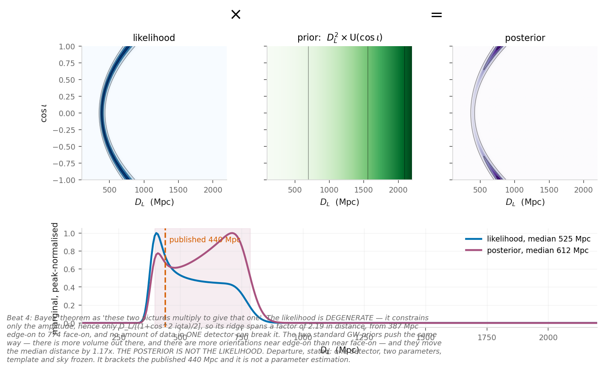
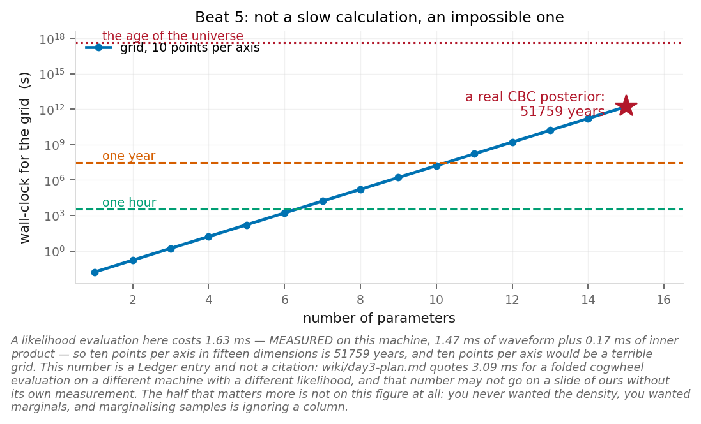
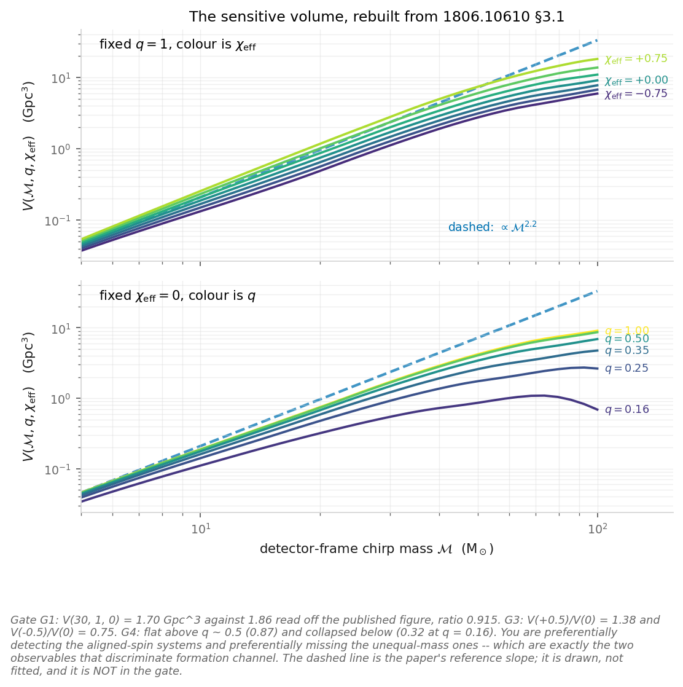
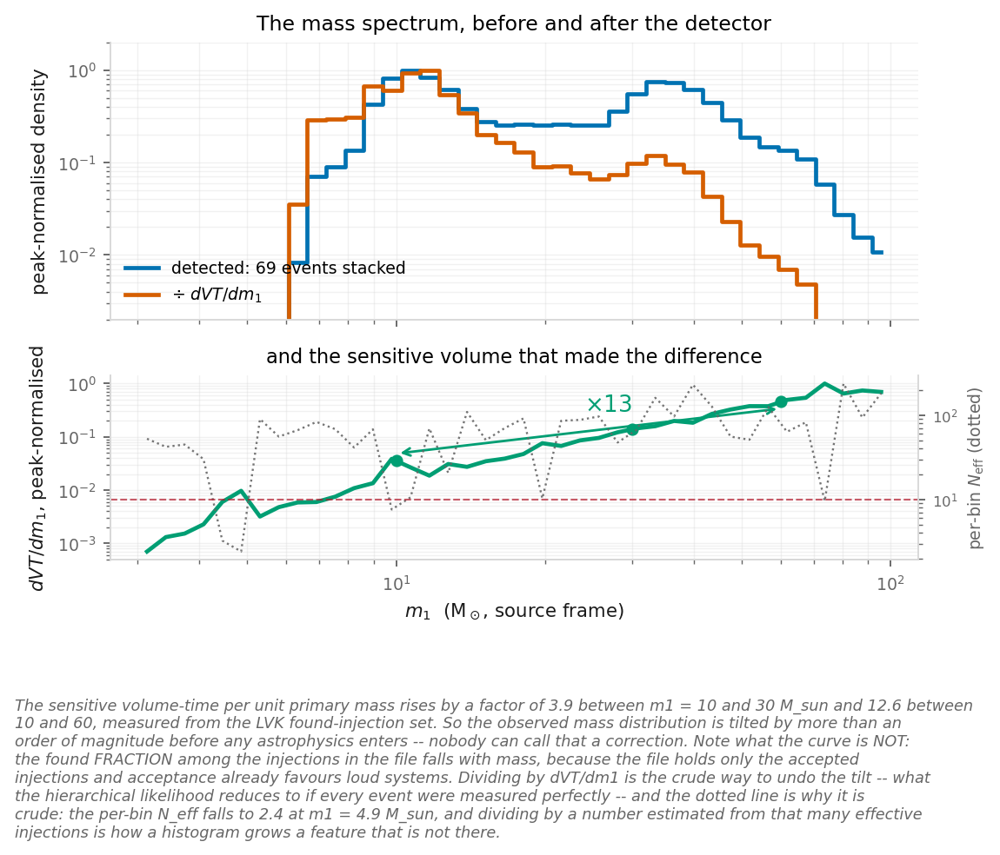
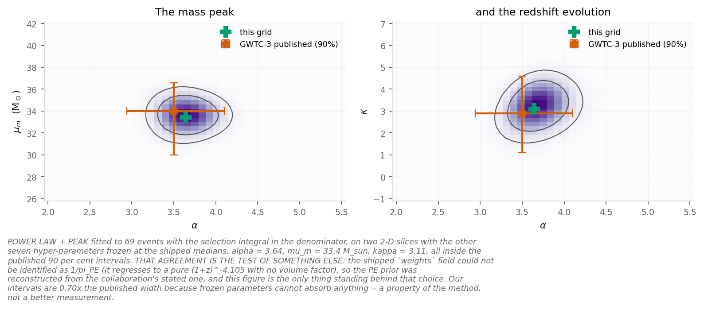
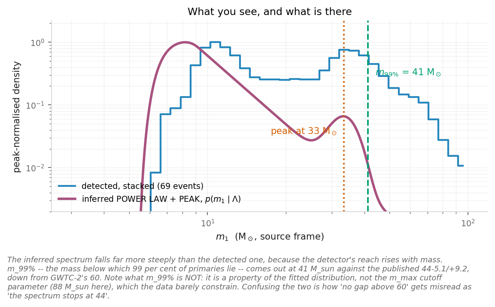
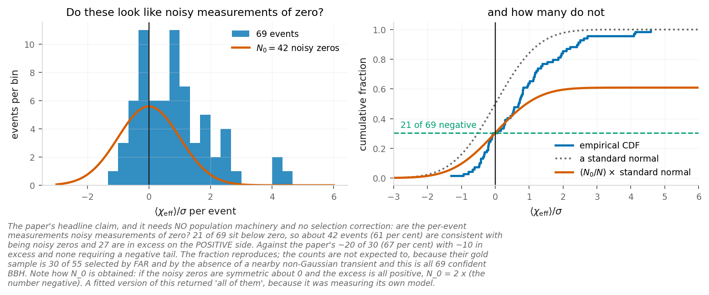

  <h1 class="!text-white !text-5xl !mb-2 drop-shadow-lg !font-normal">From a catalogue to a population</h1>
  
Day 3 &mdash; how LVK black holes form

  

    Matias Zaldarriaga &nbsp;·&nbsp; <em>Ondas Gravitacionales e Investigación Asistida por IA</em>
  

<!--
Day 2 ended at a single trigger with a false-alarm rate. Today starts from the
ninety-odd events that survived that and asks what population produced them:
one posterior per event, a selection function, and a likelihood over the three.
-->

---

# The question of the *day.*

**How do the LVK binaries form?** All we have is the properties of ninety-odd
events, and from theory a prediction for the population. Getting from one to the
other takes **three steps** &mdash; a **posterior** for each event, meaning the
whole distribution its data leave over its parameters rather than one number; a
selection function; and a hierarchical likelihood.

At every step the wrong answer is smooth, plausible, and comes with error bars
&mdash; which is why every step today is built, not quoted.

What you can see and what is there differ by a factor of **tens** across the
observed mass range. That factor is computable from first principles right up to
the point where it isn't &mdash; which is why everybody runs injections.

<!--
Open with the science question (the plan's own arc, Matias verbatim: "Open with some science question, we want to know how the LVK binaries form"). No claim device — the question, then the chain that could answer it.
-->

---
layout: default
---

  
SECTION 1

  <h1 class="!text-white !text-5xl !mb-0 drop-shadow-lg !font-normal">The question, and the options</h1>

---

# How do these binaries form?

Isolated binary evolution

Two massive stars, born together, stay together. Common-envelope phase, then a
tight black-hole binary.

**Predicts:** spins roughly **aligned** with the orbital angular momentum
(tides and accretion torque them into line), mass ratios near **equal**, and a
spectrum that stops where pair-instability supernovae take over.

Dynamical assembly

Black holes sink to the centre of a globular cluster or a nuclear star cluster
and pair up by three-body encounters.

**Predicts:** **isotropic** spin tilts &mdash; the binary has no memory of how
its members were born &mdash; **broad** mass ratios, and hierarchical mergers
that can populate the gap.

Two observables discriminate: **the spin tilts** and **the mass ratios**.

**We will not settle it today.** This lecture is about what *would* settle it,
and about why the two observables that discriminate are exactly the two the
detector distorts most.

<!--
Two channels, two discriminating observables — the same two return on the selection slides.
src: borrowed — the aligned-vs-isotropic and mass-ratio channel expectations are the literature's, as the plan records.
-->

---

# The chain, on one slide

strain &rarr; single-event posterior &rarr; catalogue &rarr; population

| arrow | what it costs | today |
|---|---|---|
| strain &rarr; posterior | a 15-dimensional stochastic sampler, hours per event | beats 3&ndash;5 |
| posterior &rarr; catalogue | a detection statistic, and a threshold you have to justify | beat 7 |
| catalogue &rarr; population | a **selection function** and a hierarchical likelihood | beats 6&ndash;7 |

We will come back to this slide five times. Every failure mode today is an arrow
somebody skipped.

<!--
This is the spine of the spine. If a student remembers one slide it should be
this one.
-->

---
layout: default
---

  
SECTION 2

  <h1 class="!text-white !text-5xl !mb-0 drop-shadow-lg !font-normal">What a likelihood is, before the formula</h1>

---

# Vary one parameter at a time and watch

Whitened templates, last 160 ms before merger, all at the same amplitude and alignment. One parameter moves per panel.

<!--
The animation sequence lives here: the movie frames in the single-event-posterior reproduction are the same panel function frame by frame. Run them live rather than showing the still if there is time.
The strain trace came off this figure in review 2 (C18): showing that the waveform changes with the parameters is all this beat wants, and the data underneath added nothing to it. The movies still carry the data, because walking off something is what a movie is for. T2 of that review records a disagreement between the data and the plot which this does not resolve and was not meant to.
-->

---

# What each parameter did

| parameter | what it does to the model | loss in match |
|---|---|---|
| chirp mass | the phase **drifts out** over the last cycles | 0.024 for 6 % |
| mass ratio | almost nothing moves | 0.050 for a **halving** |
| distance | a pure rescaling &mdash; the shape is untouched | **exactly zero** |
| arrival time | the whole thing slides | &mdash; |

**This predicts the shape of the posterior before anyone writes it down.**

The parameters that visibly destroy the fit are the ones that come out tight.

Distance enters *only* through the amplitude. Hold that thought &mdash; it is
the whole of the next section.

<!--
The table is read off the sweep figure: the measured match losses of the single-event-posterior panels.
src: fig_sep_parameter_sweeps
src: borrowed — the search ranges (4.3-100 Msun, q in 0.15-1) are the analysis choices recorded in that reproduction.
-->

---

# The same claim, as a number

Shaded: where the matched-filter SNR is within 1 of its peak.

As a fraction of the range each is **searched over**: the chirp mass is pinned
to **4.1 %** of 4.3&ndash;100 M&#8857;, the mass ratio to **75 %** of
0.15&ndash;1. A factor of **18**.

<!--
Same claim quantified against the searched ranges; the shaded regions are the figure's own measurement.
src: fig_sep_snr_sensitivity  src: snr_width_mchirp_percent_of_itself
-->

---
layout: default
---

  
SECTION 3

  <h1 class="!text-white !text-5xl !mb-0 drop-shadow-lg !font-normal">Bayes, concretely, on one event</h1>

---

# Bayes' *theorem.*

You have a model with parameters $\theta$ and a stretch of data $d$. What you want is the
distribution of $\theta$ given $d$. What you can write down is the distribution of $d$
given $\theta$ &mdash; that is the likelihood, and day 2 built it. The two are related by
one line of conditional probability:

$$p(\theta \mid d) \;=\; \frac{p(d \mid \theta)\; p(\theta)}{p(d)}$$

  

    
Likelihood

    
$p(d\mid\theta)$ &mdash; what the data say. Day 2's $\ln L = -\tfrac12\langle d-h|d-h\rangle$.

  

    
Prior

    
$p(\theta)$ &mdash; what you assumed before looking.

  

    
Posterior

    
$p(\theta\mid d)$ &mdash; their product, normalised by $p(d)$, which does not depend on $\theta$.

Everything for the rest of the day is that equation, applied twice: once per event, and
then once to the whole catalogue.

<!--
Added in review 2 (C19), and the only addition in that pass: the three words were being defined on the figure of the next slide and the theorem itself never appeared. Write it on the board. The denominator is worth one sentence — it is a normalisation here, and on the last slide of the section it is the thing you compare models with.
-->

---

# Three surfaces on one *grid.*

Likelihood, prior and posterior for GW150914 on the same distance-inclination grid.

Bayes' theorem as three pictures: the **likelihood** (what the data say, day 2's
$\ln L$), the **prior** (what you assumed before looking &mdash; here the volume and
orientation weights), and the **posterior** &mdash; their product, normalised. These two
pictures multiply to give that one.

<!--
Beat 4, and it cannot be compressed away: nothing in days 1-2 introduces Bayes, priors, likelihoods or posteriors (the plan's own prerequisite audit). The three words are defined HERE, on the figure, not in a formula.
src: fig_sep_bayes_triptych
-->

---

# Why the likelihood is degenerate

The data measure the **amplitude**. The amplitude is

$$ a \;\propto\; \frac{1}{D_L}\cdot\frac{1+\cos^2\iota}{2} $$

so one detector constrains that **combination** and nothing else. The ridge runs
from **387 Mpc** edge-on to **774 Mpc** face-on: a factor of 2, and no amount of
data breaks it.

The two priors that act on that ridge push the **same way**:

- $\pi(D_L)\propto D_L^2$ &mdash; there is more volume out there
- $\pi(\cos\iota)$ uniform &mdash; there are more orientations near edge-on than near face-on

Median distance moves **525 &rarr; 612 Mpc**. The posterior is not the
likelihood.

<!--
Ridge endpoints and both medians stamped by the single-event-posterior reproduction — the slide where 'the posterior is not the likelihood' is seen.
src: triptych_ridge_edge_on_mpc  src: triptych_ridge_face_on_mpc  src: triptych_median_distance_likelihood  src: triptych_median_distance_posterior
-->

---

# Why samples, and not grids

The same posterior by grid and by samples.

One likelihood evaluation: **1.63 ms**, measured on the machine that made this
figure. Ten points per axis in fifteen dimensions is **52,000 years** &mdash;
and ten points per axis would be a terrible grid.

<!--
The cost is measured on this machine and stamped; the grid extrapolation is arithmetic on it.
src: cost_likelihood_ms  src: grid_cost_years_d15
-->

---

# The half that matters more

**You never wanted the density.**

You wanted marginals and expectations &mdash; and samples give you those by
counting, at a cost that does not care about dimension.

Marginalising a grid is an integral.

Marginalising samples is ignoring a column.

The triptych two slides ago marginalised a 320 &times; 320 grid. It is the last
time in this course that doing it that way is affordable.

<!--
The deeper half of the samples argument: marginals by counting. No numbers here.
-->

---
layout: default
---

  
SECTION 4

  <h1 class="!text-white !text-5xl !mb-0 drop-shadow-lg !font-normal">Selection effects, and the likelihood they enter</h1>

<!--
This was two sections until review 2. The population-likelihood section lost four of its five slides to the N_eff cuts (C23-C26) and the fifth belongs here anyway: the selection function you have just built is the thing that appears in it (A7, C32).
-->

---

# The scaling you get for free

From day 2's SNR, $\rho\propto\mathcal M^{5/6}/D_L$. So the horizon distance goes
as $\mathcal M^{5/6}$ and the Euclidean sensitive volume as

$$ V \;\propto\; \mathcal M^{5/2}. $$

Ten minutes, no code, and it reuses machinery you built on day 2. The exponent
comes from the amplitude alone &mdash; it is $5/6$ for **any** noise curve, as
long as the band is held fixed.

The measured answer is **not** 2.5. Fig. 3 of Roulet &amp; Zaldarriaga (2019)
draws a reference power law at $\mathcal M^{2.2}$.

Over the observed range 8&ndash;40 M&#8857;, $\mathcal M^{2.2}$ is a
factor of **34**. Nobody can call that a correction.

<!--
The 5/6 exponent is day 2's amplitude scaling cubed; the 2.2 reference is the paper's own figure; the factor 34 is stamped.
src: scaling_volume_exponent  src: tilt_8_to_40_at_2p2
src: borrowed — the M^2.2 reference power law is Fig. 3 of Roulet & Zaldarriaga 2019.
-->

---

# The two other axes, which are the sharper argument

Sensitive volume along the spin and mass-ratio axes.

<!--
The chi_eff and q axes of the sensitive volume — the discriminating observables, distorted directly.
src: fig_selection_volume_fig3
-->

---

# Put those together

You are preferentially detecting the **aligned-spin** systems, and
preferentially missing the **unequal-mass** ones.

At $\mathcal M = 30$ M&#8857;: $V(\chi_{\rm eff}{=}{+}0.5)$ is
**1.38&times;** $V(0)$, and $V(q{=}0.16)$ is **0.32&times;** $V(q{=}1)$.

Those are **exactly the two observables that discriminate formation channel**.

Selection pushes both of them toward the field-binary answer. That is a much
stronger statement than "selection tilts the mass function": the bias sits
directly on the quantity we are trying to measure, not off to one side in a
nuisance parameter.

<!--
The two ratios are stamped: V(chi=+0.5)/V(0) and V(q=0.16)/V(q=1) at Mc=30. The evaluation points (+0.5, q=0.16) are the exercise's chosen slices, recorded with its stated choices.
src: chi_ratio_plus_half  src: q_ratio_sixteenth  src: fig_selection_volume_fig3
-->

---

# Then the retreat &mdash; and the paper does it in its own voice

Whether something enters a catalogue depends on glitch rejection, detector
artifacts, PSD drift, **how much your signal resembles the glitches this
particular detector happens to make**, the fact that the catalogue is built from
multiple detectors so the answer depends on both PSDs and on sky location, and on
duty cycle.

Roulet &amp; Zaldarriaga &sect;2 concedes all of it while doing the calculation:

- the reference PSD is *"the harmonic mean of the combined-channel PSDs of the first six events"* &mdash; one fixed curve for two detectors over two runs
- detection is $\rho>9$ on the **expectation value**, with noise fluctuations *"important only near the boundary of the sensitive volume, and we ignore it for simplicity"*
- and a closing paragraph conceding that template-bank effectualness varies too

**Conclusion: you do injections.**

<!--
The retreat in the paper's own voice — read the quotes off the slide; this is why the day does no injections and says so.
src: borrowed — the three concessions are quoted from Roulet & Zaldarriaga 2019 §2.
-->

---

# The population likelihood, *built.*

Take every merger in the universe to be an independent draw &mdash; a Poisson process whose
rate varies with the parameters. A population model $\Lambda$ says how many and where, and
the sensitive volume from ten minutes ago says which of them you see:

$$\frac{dN}{d\theta} = R\,T\,p(\theta\mid\Lambda),
\qquad
N_{\rm exp}(\Lambda,R) = R\,T\!\int\! d\theta\;p(\theta\mid\Lambda)\,P_{\rm det}(\theta)
\;\equiv\; R\,\langle VT\rangle(\Lambda)$$

A Poisson process with $N$ points contributes $e^{-N_{\rm exp}}$ times one factor per
point. You never see $\theta_i$, only $d_i$, so each factor is **day 2's likelihood**
integrated against the model:

$$\mathcal L(\{d\}\mid\Lambda,R) \;=\; e^{-R\langle VT\rangle(\Lambda)}
\prod_{i=1}^{N} R\,T\!\int\! d\theta\;p(d_i\mid\theta)\,p(\theta\mid\Lambda)$$

Marginalise the overall rate $R$ under a log-uniform prior. That integral is a Gamma
function, the $R^{N}$ and the exponential cancel it, and the selection function comes back
downstairs, once per event:

$$\mathcal L(\{d\}\mid\Lambda) \;\propto\;
\prod_{i=1}^{N}\frac{\int d\theta\;p(d_i\mid\theta)\,p(\theta\mid\Lambda)}
{\langle VT\rangle(\Lambda)}$$

That is the case where every event is real. Roulet et al. (2020) derive the general one,
where each trigger carries a probability of being astrophysical instead of a certainty.

<!--
Rewritten for review 2, C22 — "the formula in the slide is incomprehensible, we need to derive what we are doing and we cannot write a formula filled with symbols no one knows". What was here was LVK GWTC-3 Eqs. (4)-(5) and Roulet et al. 2020 Eq. (12) side by side, in xi, pi_empty, w_i and p_astro, none of which the room has met. Everything on the slide now is a symbol they got this morning: p(d|theta) is day 2's likelihood, written down again on the Bayes slide; P_det and <VT> are the sensitive volume of the previous section; p(theta|Lambda) is the population model.
Board it in this order and it is four lines: rate density, thinning, Poisson, marginalise R. The Gamma integral is the only step with any work in it, and it is done in sympy by the population-likelihood reproduction, which is also where the equivalence with the published forms is established rather than asserted.
src: borrowed — the general p_astro case is Roulet et al. 2020, Eq. (12); this slide derives only its p_astro = 1 limit.
-->

---
layout: default
---

  
SECTION 5

  <h1 class="!text-white !text-5xl !mb-0 drop-shadow-lg !font-normal">What the population looks like</h1>

---

# What you see, and what the detector let you see

The observed masses against the selection-weighted spectrum.

<!--
The observed histogram against the selection-weighted one.
src: fig_mass_naive_vs_weighted
-->

---

# Done properly

POWER LAW + PEAK refit against the published intervals.

POWER LAW + PEAK, 69 confident BBH, with the selection integral in the
**denominator of the likelihood** rather than as a reweighting. Everything lands
inside the published 90 % intervals.

<!--
Our 2-D-slice fit against the published intervals; held-fixed hyper-parameters make our intervals tighter — a property of the method.
src: fit_alpha_median  src: fit_mpp_median  src: fig_mass_plpeak_fit
-->

---

# The spectrum and the rate

The inferred mass spectrum and rate evolution.

$\alpha = 3.5$, a Gaussian peak at **34 M&#8857;**, $m_{99\%}=44$
M&#8857; &mdash; down from 60 in GWTC-2 &mdash; **no gap above 60**,
chirp-mass over-densities at 8.3 and 27.9, and
$\kappa=2.9^{+1.7}_{-1.8}$ for the redshift evolution.

<!--
The PUBLISHED GWTC-3 population features, quoted as the field's answer; our fitted values (alpha 3.64, kappa 3.11) are stamped and on the previous figure.
src: borrowed — alpha=3.5, the 34 Msun peak, m99=44, the 8.3/27.9 chirp-mass over-densities and kappa=2.9+1.7-1.8 are LVK GWTC-3 population results.
src: fit_alpha_median  src: fit_kappa_median  src: m99_at_shipped_medians
-->

---

# Spins &mdash; before any model at all

Per-event effective-spin intervals, no model assumed.

No population machinery, no selection correction. **21 of 69** events sit below
zero, so about **42** are consistent with being noisy measurements of
$\chi_{\rm eff}=0$ and **27 are in excess on the positive side** &mdash; and
none requires a negative tail.

Counting is where the agreement stops. Put a population model on the same events and
what fraction sits below zero becomes a statement about **the model you chose**, not
about the events &mdash; two published analyses agree on the width of the distribution
and disagree on what it means. That argument is written out in the wiki rather than
adjudicated here.

<!--
Model-free first: the per-event chi_eff intervals, counted.
The last paragraph is where parametrisation_dependence lives now (review 2, C33). C27-C29 took the three slides that developed it, and the concept is worth one clause rather than nothing: the LVK Gaussian model puts 29 % of binaries below zero, the three-component mixture of 2105.10580 gets essentially none, both reproduce each other when they adopt each other's model, and both agree that sigma_chi_eff is about 0.11-0.13. Do not adjudicate it in the lecture; the wiki page does the work. NOTE: that review expected check_course to fail on this term — it does not, because parametrisation_dependence is a wiki concept slug and was never a course/terms.yaml row.
src: fig_chieff_model_free  src: n_positive
-->

---

# Beyond this machinery's *reach.*

- **There is no eccentricity population constraint** anywhere in this group's output. The eccentricity work is waveform and surrogate modelling; nobody constrains an eccentric fraction. So eccentricity is not a third vote on formation channel &mdash; it is at most "here is the machinery that would let you ask".
- **There is no population-synthesis paper in the set.** The channel predictions on the options slide are borrowed, each with one line saying where it came from.

Saying which questions the machinery **cannot** answer is part of knowing what it
does.

# Where this leaves us

We did not settle how these binaries form. We built the machinery that could, and
found that:

- the detector distorts **exactly** the two observables that discriminate
- the distortion is computable from first principles right up to the point where it isn't
- and past that point the honest move is an injection campaign, which is why everybody runs one

This afternoon: the training wheels come off.

<!--
The honest boundary: no eccentricity population constraint, no population-synthesis paper in the set.
Two bullets left the closing list in review 2 (C30): "the number you can check is not the number that is sensitive" and the diagnostic-before-you-launch line were the N_eff punchline, and they went with the N_eff slides (C23-C26, A2). What replaced the second is the statement the section actually earns — the analytic selection function runs out and an injection campaign is what you do then.
-->
