

  <h1 class="!text-white !text-5xl !mb-2 drop-shadow-lg !font-normal">Where are the big black holes?</h1>
  
Day 4 &mdash; pulsar timing arrays

  

    Matias Zaldarriaga &nbsp;·&nbsp; <em>Ondas Gravitacionales e Investigación Asistida por IA</em>
  

<!--
The day in outline: pulsars as clocks, the Hellings-Downs curve derived, how the black holes are counted, the predicted background against the measured one, and the ways out of the gap. Pure physics today; the afternoon session is where the workflow material lives.
-->

---

# The prediction, and the *gap.*

From a census of local supermassive black holes you can predict the nanohertz
gravitational-wave background &mdash; with **no free parameters**. The prediction comes out
**a factor of a few low** in black-hole mass density, and no merger history can close the
gap.

- how the clocks work, and why nanohertz;
- the Hellings&ndash;Downs curve, derived;
- how the black holes are actually counted &mdash; the M&ndash;&sigma; relation;
- the prediction against the measurement;
- three ways out, and how the evidence has already narrowed them.

Every step is checkable, and nothing in the chain is fitted to the PTA measurement.

<!--
An outline, not a claim: this is what the two hours contain. Say once that nothing is fitted — it is the fact that makes the ending interesting.
-->

---
layout: default
---

  
SECTION I

  <h1 class="!text-white !text-5xl !mb-0 drop-shadow-lg !font-normal">The nanohertz sky</h1>

<!--
The instrument first: what a pulsar timing array actually measures.
-->

---

# Millisecond pulsars as *clocks.*

A millisecond pulsar spins hundreds of times a second, and its pulse arrival times can be
predicted to hundreds of nanoseconds over decades. You fit a **timing model** &mdash; spin,
spin-down, position, proper motion, binary parameters &mdash; and subtract it. What is left
is the **residual**, and the residual is the observable.

A gravitational wave perturbs the light travel time. The fractional frequency shift is

$$z(\hat p) \;=\; \frac{1}{2}\,\frac{\hat p^i \hat p^j\, h_{ij}}{1 + \hat\Omega\cdot\hat p}
\;\Bigg|_{\rm Earth} \;-\; \frac{1}{2}\,\frac{\hat p^i \hat p^j\, h_{ij}}{1 + \hat\Omega\cdot\hat p}\;\Bigg|_{\rm pulsar}$$

The integral along the pulse's path leaves the metric at its **two endpoints**: the
**Earth term** &mdash; $h_{ij}$ here, now &mdash; and the **pulsar term** &mdash; $h_{ij}$
at the pulsar, one light-travel-time ago. $\hat\Omega$ is the direction the wave
propagates, $\hat p$ the direction **to the pulsar**.

<!--
The formula is the standard one — checked against Hellings & Downs 1983 and the NANOGrav 15 yr methods paper; the two-endpoint structure is the point to make slowly, because the Earth/pulsar split decides everything about what correlates later.
-->

---

# One measurement, two *wavelengths.*

A PTA and LIGO are the **same measurement**: a wave perturbing a light travel time between
two free masses.

  

    
LIGO

    

The wavelength is **long** compared with the 4 km arm: the whole apparatus sits in one
phase of the wave, and the response is the strain itself.

  

  

    
A pulsar pair

    

The "arm" is kiloparsecs and the wavelength is **short** compared with it: the two
endpoints feel uncorrelated phases, which is exactly the Earth-term/pulsar-term split.

  

Same formula, one dimensionless ratio &mdash; wavelength over separation &mdash; deciding
which limit you are in.

<!--
This is the connection the review asked to make explicit (the day-1 landscape slide promised it). One sentence each way and move on.
-->

---

# Why *nanohertz.*

A dataset of length $T$ sampled every $\Delta t$ measures

$$f_{\min} \sim \frac{1}{T}, \qquad f_{\max} \sim \frac{1}{2\Delta t}$$

Fifteen years gives $f_{\min} \approx 2$ nHz; fortnightly cadence gives
$f_{\max} \approx 400$ nHz. The band is set by the experiment, not the physics &mdash;
which is why a PTA is a decades-long project.

At those frequencies a circular binary of ${\sim}10^9 M_\odot$ is about a year of orbits
from merger, and the sources are **supermassive black-hole binaries.**

<!--
T at the low end, cadence at the high end. Both estimates, marked as such.
-->

---

# What one source *looks like.*

The day-1 amplitude formula, at these masses and distances:

$$h_0 \;=\; \frac{2\,(G\mathcal{M}_c)^{5/3}\,\Omega^{2/3}}{c^4\,d}
\;\approx\; 1.3\times10^{-15}
\quad\text{for } \mathcal{M}_c = 10^9\,M_\odot \text{ at } 150\ \mathrm{Mpc}$$

That is the scale everything today sits at &mdash; six orders of magnitude louder than a
LIGO event in strain, and still at the edge of what fifteen years of timing can see,
because you wait years per cycle.

<!--
Same estimate as the day-1 selected-sources table (stamped there as h_smbh); restored to its own beat per the plan. The louder-yet-harder point is the day-1 landscape slide paying off.
(the 1.3e-15 is the same estimate day 1 stamps as h_smbh in envelope-numbers)
-->

---
layout: default
---

  
SECTION II

  <h1 class="!text-white !text-5xl !mb-0 drop-shadow-lg !font-normal">Hellings and Downs</h1>

<!--
The parameter-free geometric prediction: the correlation between two pulsars as a function of their separation on the sky.
-->

---

# Hellings and Downs, *derived.*

Put one source at the pole. The $\sin^2\theta$ of the antenna pattern **cancels** the
$(1-\cos\theta)$ of the propagation denominator:

$$\tilde z = \tfrac{1}{2}(1+\cos\theta)\big(\cos2\phi\,\tilde h_+ - \sin2\phi\,\tilde h_\times\big)$$

The $\phi$ integral kills every $m$ except $\pm2$ &mdash; the spin-2 signature. The
$\theta$ integral is

$$\int_{-1}^{1}(1+\mu)P_\ell^2(\mu)\,d\mu = 4$$

**independent of $\ell$**. Hence

$$C^{z}_\ell = \frac{6\pi}{(\ell+2)(\ell+1)\ell(\ell-1)}$$

and the curve everybody plots is that same set of numbers, summed back up:

$$C(\theta) = \sum_\ell \frac{2\ell+1}{4\pi}\,C_\ell\,P_\ell(\cos\theta)$$

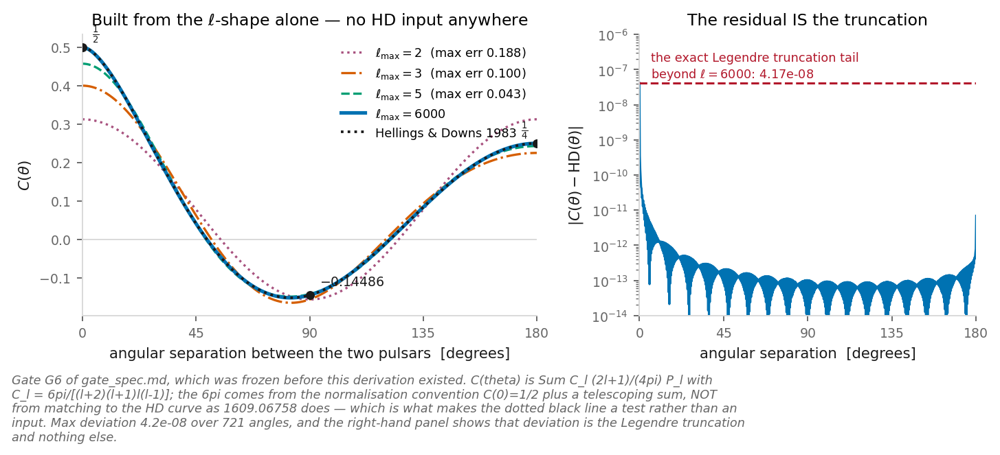

Built from the multipole shape alone. The 1983 curve is a test, not an input.

<!--
The paper we follow (Roebber & Holder, 1609.06758) fixes the 6pi by MATCHING to the known Hellings-Downs curve. We derive it instead, from the normalisation convention plus a telescoping sum, which is what lets us use the 1983 curve as a check.
-->

---

# Many sources, same *curve.*

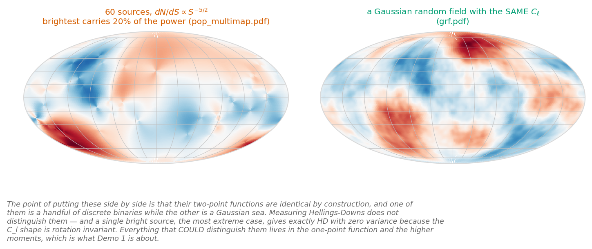

A single bright source and a Gaussian random field: identical normalised correlation.

That was **one** source. The background is millions. Two facts finish the derivation:

- each source arrives with a **random phase**, so in the *power* they add
  **incoherently** &mdash; no cross terms survive the average;
- $C_\ell$ is **rotationally invariant**, so sources at different sky positions simply
  **add their $C_\ell$** &mdash; the sum has the same $\ell$-shape as one source.

One source's spectrum *is* the background's. Verified here across six random source
directions: agreement to $7\times10^{-6}$.

The same fact read backwards: measuring the Hellings&ndash;Downs correlation tells you the
signal is a **spin-2 metric perturbation**. It does not tell you there are many sources.

<!--
The superposition step the review asked for, made explicit — random phases give incoherent addition, rotational invariance adds the C_l's. The argument is Roebber & Holder's (1609.06758: the background as a sum over sources in harmonic space); their contrarian corollary — one maximally non-Gaussian source reproduces HD exactly — is the memorable way to state it.
src: rotation_invariance_scatter
-->

---

# The Earth term is what *correlates.*

The redshift has two endpoint terms. What we just computed is the correlation of the
**Earth terms** of two *distinct* pulsars &mdash; the same $h_{ij}$, here and now,
projected along two different directions.

The **pulsar term** cannot join: each pulsar's distance is unknown to within many
wavelengths, so its phase is effectively **random per pulsar**, and it averages out of any
cross-correlation.

Where it does survive is the **self**-correlation: there the pulsar term adds its own
power, doubling $C(0)$ from $\tfrac12$ (two distinct pulsars at zero separation) to $1$
(one pulsar with itself) &mdash; a diagonal contribution, and nothing else.

<!--
The review's second missing statement, now a slide: what is being computed is the Earth-term cross-pulsar correlation. The 1/2-vs-1 point is the draft-1 correction recorded in the plan.
-->

---

# A very red *spectrum.*

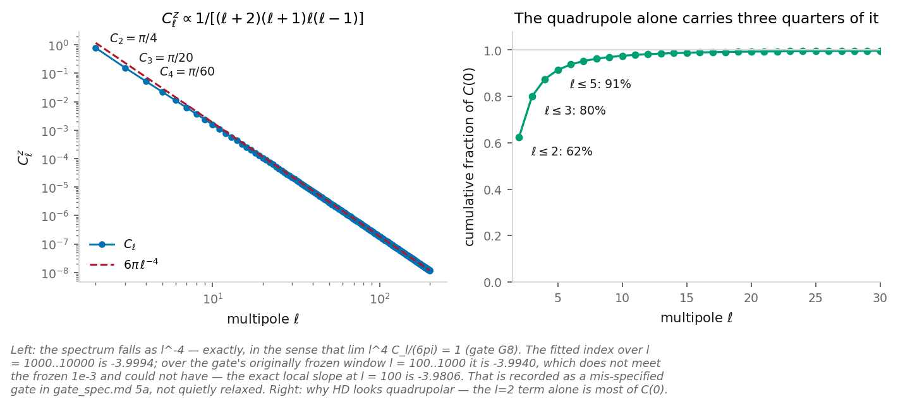

The multipoles of the redshift map, against the exact fractions.

$C_\ell$ falls as $\ell^{-4}$ &mdash; exactly, in the sense that
$\lim_{\ell\to\infty}\ell^4 C_\ell/6\pi = 1$.

So Hellings&ndash;Downs is **a handful of multipoles**. The quadrupole alone carries most
of $C(0)$, and by $\ell_{\max}=5$ the curve is right to a few per cent.

Exact values:

$$C_2 = \frac{\pi}{4}, \quad C_3 = \frac{\pi}{20}, \quad C_4 = \frac{\pi}{60}$$

and the monopole and dipole are **absent**, not subtracted.

<!--
"Absent, not subtracted" matters: nothing in the derivation removes a mean. |m| <= l with m = +-2 only leaves l=0 and l=1 with no surviving coefficient.
src: C_2_over_pi  src: C_3_over_pi  src: C_4_over_pi  src: cl_falloff_limit_slope
-->

---

# Skies, and their *spectra.*

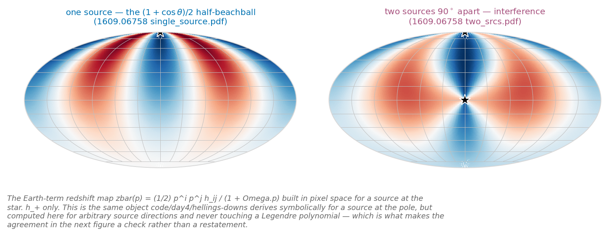

Source skies in pixel space.

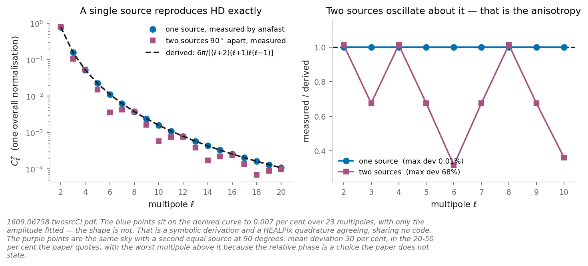

Their measured multipoles against the derived spectrum.

The same physics, computed a second way: build the map in pixel space, transform it,
measure $C_\ell$, and compare with the spectrum derived symbolically.

They agree to $7\times10^{-5}$ over 23 multipoles, with **only the amplitude** fitted
&mdash; the shape is untouched. The two computations share no code: one integrates
Legendre functions, the other transforms a pixelised sky.

Add a second source and the measured spectrum **oscillates** about the smooth curve by
tens of per cent. That oscillation *is* the anisotropy &mdash; hold that thought for the
sky-power slide.

<!--
Two independent routes to the same spectrum, agreeing — that is the sense in which the derivation is checked. The oscillation line seeds the anisotropy beat.
src: single_source_max_rel  src: two_source_mean_oscillation
-->

---
layout: default
---

  
SECTION III

  <h1 class="!text-white !text-5xl !mb-0 drop-shadow-lg !font-normal">Counting the black holes</h1>

<!--
Before predicting a background from the census, say how a census is made at all.
-->

---

# The M&ndash;&sigma; *relation.*

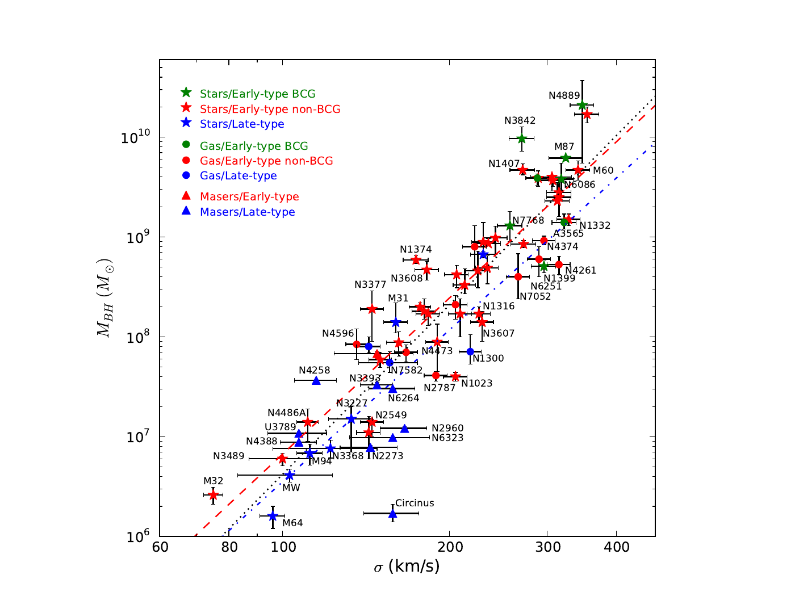

McConnell &amp; Ma 2013, ApJ 764, 184, Fig. 1

A black-hole mass is measured **dynamically**: resolve stars or gas inside the sphere of
influence,

$$r_{\rm infl} = \frac{GM}{\sigma^2} \approx 11\ \mathrm{pc}
\quad (10^8 M_\odot,\ \sigma = 200\ \mathrm{km\,s^{-1}})$$

&mdash; an arcsecond at a couple of Mpc, milliarcseconds further out. So direct masses
exist only **nearby**: seventy-two galaxies, each one named on that plot. They correlate
tightly with the host's velocity dispersion:

$$\log_{10} M = a + b\,\log_{10}\!\frac{\sigma}{200\ \mathrm{km\,s^{-1}}}$$

with $a = 8.32$, $b = 5.64$, and an **intrinsic scatter** of $0.38$ dex &mdash; a dex
being a factor of ten, so the scatter is a factor ${\sim}2.4$ either way. That fit is the
black dotted line, and the spread around it is what the rest of the day inherits.

<!--
New section (the review: "this lecture never showed the M-sigma relation, never discussed how we go about counting BHs"). Their own Figure 1 already carries both the galaxies and our fiducial line, so nothing is overplotted (review 2, C14) — the black dotted line IS a = 8.32, b = 5.64. The three fits on the plot are all-galaxy, early-type and late-type; only the first is used here. a, b and eps0 are first-hand from the paper's abstract and its Table 2 (alpha = 8.32 +- 0.05, beta = 5.64 +- 0.32, eps0 = 0.38), not second-hand through 2312.06756. The r_infl arithmetic is stamped in the m-sigma reproduction.
src: r_infl_pc_1e8_at200  src: a_bh  src: b_bh  src: eps0_dex
src: borrowed — the figure and the 72-galaxy sample are McConnell & Ma 2013, Fig. 1, credited on the slide.
-->

---

# How the census is *assembled.*

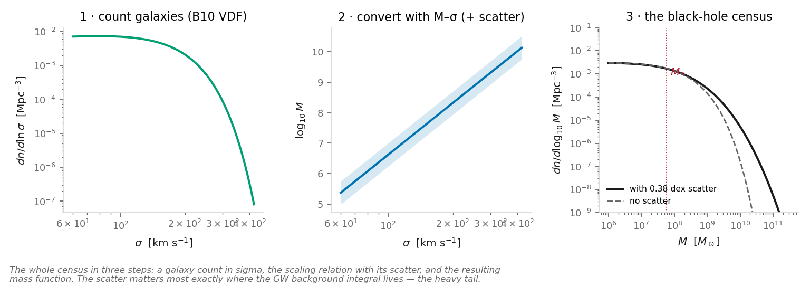

Count galaxies in &sigma;, convert through M&ndash;&sigma; with its scatter, read off the black-hole mass function.

Nobody counts black holes directly. You count **galaxies** &mdash; the velocity-dispersion
function &mdash; and push it through the relation. The knee lands at
$M_* = 5.85\times10^{7} M_\odot$, and the **scatter matters most in the heavy tail**,
exactly where the gravitational-wave integral will live.

<!--
The three-step pipeline is the whole answer to "how do we count black holes". Stress that every later slide inherits this construction — and its uncertainties, which is what route 2 of the ending is about.
src: m_at_sigma_star  src: sigma_star_kms  src: phi_star_mpc3
-->

---
layout: default
---

  
SECTION IV

  <h1 class="!text-white !text-5xl !mb-0 drop-shadow-lg !font-normal">From a mass function to a background</h1>

<!--
The spine: Phinney's theorem turns the census into a prediction.
-->

---

# Phinney's *theorem.*

The energy density per logarithmic frequency equals the comoving density of event
**remnants** times the redshifted energy each event radiated:

$$\rho_c c^2\,\Omega_{\rm gw}(f)=\int_0^\infty N(z)\,\frac{1}{1+z}\left.\left(f_r\frac{dE_{\rm gw}}{df_r}\right)\right|_{f_r=f(1+z)}dz$$

The identification that makes it powerful: the **remnant** mass function is the merger
mass function integrated over $z$ and $q$. So the prediction does not depend on the merger
history &mdash; and it is an **upper limit** if black holes merged more than once.

Phinney's own remark: *"to derive this one need know nothing about gravitational radiation
except that it has twice the orbital frequency, and that the orbital binding energy is
removed by the gravitational radiation."* Kepler plus binding energy indeed gives
$dE/d\ln f_r = \frac{1}{3G}(G\mathcal{M})^{5/3}(\pi f_r)^{2/3}$, checked symbolically in
the day's reproduction.

<!--
The quote is Phinney 2001 (astro-ph/0108028); the sympy check is reproduce_gwb.py §1 — no quadrupole formula appears anywhere in it.
-->

---

# $h_c \propto f^{-2/3}$ is *kinematic.*

For an energy spectrum $dE/d\ln f \propto f^{p}$,

$$h_c \propto f^{(p-2)/2}$$

for **any** mass function &mdash; the whole population drops out of the exponent. Circular
GW-driven inspiral has $p=2/3$, hence $-2/3$.

So a measured departure from $-2/3$ is evidence about **environments or eccentricity**. It
says nothing about the population's mass &mdash; the most common misreading of the PTA
spectral index.

<!--
Derived symbolically in reproduce_gwb.py §8. Worth one beat of emphasis: people read slope shifts as mass information constantly.
src: hc_slope_circular
-->

---

# Which black holes *carry it?*

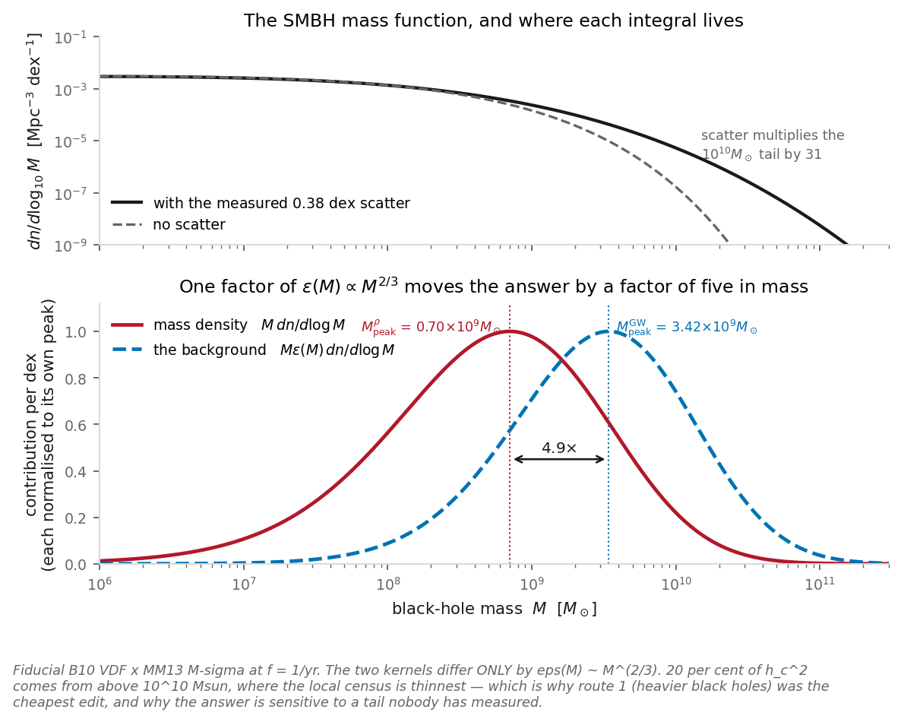

The mass-density and background kernels, and the gap between their peaks.

<!--
This one figure carries the ending. The two kernels differ ONLY by eps(M) ~ M^(2/3), and that single factor puts the background about five times higher in mass than the mass density — out where the census is thinnest. That is why "heavier black holes" was the cheapest edit to propose.
src: M_peak_ratio
-->

---

# The typical sky sits *below the mean.*

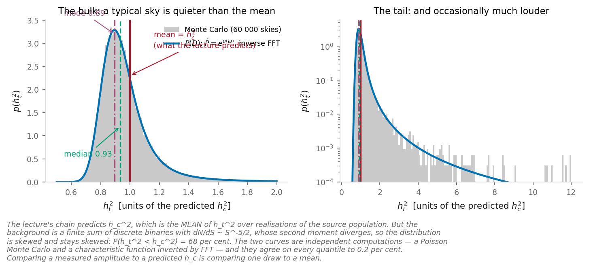

The distribution of the squared strain over source realisations, two independent constructions.

$h_c^2$ is the **mean** of $h_t^2$ over realisations of the source population. A PTA
measures **one draw** &mdash; and when rare heavy sources dominate, the draw is usually
below the mean:

$$\text{mode } 0.89\,h_c^2,\quad \text{median } 0.93,\quad P(h_t^2 < h_c^2) = 68\%$$

With $dN/dS\propto S^{-5/2}$ the second moment diverges, so no amount of averaging
Gaussianises it &mdash; and the shortfall can be **large enough to rule out** scenarios
dominated by the very heaviest sources.

This is Sato-Polito &amp; Zaldarriaga's point, and it returns in the ending: the free
spectrum's fluctuations carry information the mean does not.

<!--
Stated as the physics result it is, with its owners (the review's correction). Two independent constructions — a Poisson Monte Carlo and the P(D) characteristic function — agree to 0.2% on every quantile.
src: pdf_mode  src: pdf_median  src: prob_below_mean  src: mc_vs_fft_max_rel
-->

---

# And the real *thing.*

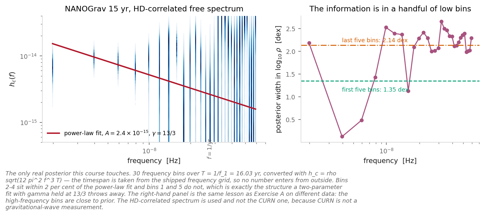

NANOGrav 15 yr, HD-correlated free spectrum — the per-bin amplitudes fitted with no spectral model assumed. One posterior per frequency bin, of the kind day 3 built, and the only one in this course that was measured rather than simulated.

<!--
Bins 2-4 reproduce the collaboration's own power-law fit to 2 per cent. Bins 1 and 5 do not. That structure is exactly what a two-parameter fit with gamma held at 13/3 throws away.
-->

---

# What the measurement *establishes.*

evidence, not detection &mdash; all major PTA collaborations
independently report the Hellings&ndash;Downs correlation at the 3&ndash;4&sigma; level.
Strong, consistent &mdash; and not yet the five-sigma standard the field calls a
detection.

the spectral index &mdash; the fits are broadly consistent with
the kinematic $-2/3$ (in timing-residual power, $\gamma = 13/3$), but the free spectrum
carries structure a two-parameter power law does not represent.

red noise, and confusion &mdash; each pulsar also carries
**intrinsic red noise** with the same steep character as the signal. In a single pulsar
the two are indistinguishable; only the **cross-pulsar correlation** &mdash; the curve we
derived &mdash; separates a background from a sky of noisy clocks. That is why the
correlation, not the spectrum, is the discovery statistic.

<!--
The beat the original build dropped, restored: what the measurement does and does not establish. The sigma levels are the collaborations' published characterisations, quoted as such.
src: borrowed — the 3-4 sigma evidence levels and the gamma = 13/3 convention are the published PTA results (NANOGrav 15 yr and companions), quoted for context.
-->

---

# The power of the *sky.*

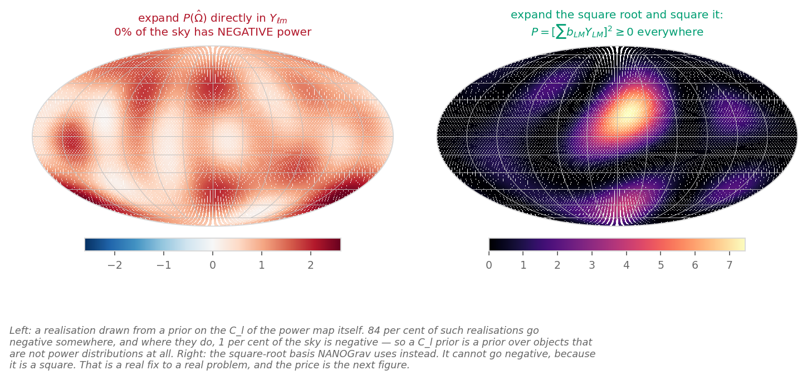

Source skies are positive; a Gaussian expansion of the power is not.

The anisotropy observable is the **source-power sky** and its spectrum:

$$P(\hat\Omega)=\sum_a q_a\,\delta^{(2)}(\hat\Omega,\hat n_a),
\qquad C^{(P)}_\ell$$

For isotropically placed sources,

$$\mathbb{E}\!\left[\frac{C^{(P)}_\ell}{C^{(P)}_0}\right] = \frac{1}{N_{\rm eff}}
\quad\text{independent of }\ell$$

&mdash; one dominant source gives a **flat** spectrum, and $P(\hat\Omega)\ge0$ constrains
any expansion you might try.

**This $C^{(P)}_\ell$ is not the derivation's $C^{z}_\ell$** &mdash; one is the power on
the sky, the other the coherent redshift map. This afternoon's exercise builds such skies
and measures what a published anisotropy limit is actually a statement about.

<!--
Kept to the minimum the exercise needs (the plan's own instruction): the definition, the 1/N_eff flatness, the positivity constraint, and the do-not-conflate line. The prior machinery and the published limit live in the exercise, where they can be run rather than asserted.
-->

---
layout: default
---

  
SECTION V

  <h1 class="!text-white !text-5xl !mb-0 drop-shadow-lg !font-normal">The gap, and the ways out</h1>

<!--
The ending: the prediction against the measurement, and the three escape routes.
-->

---

# The *gap.*

| | value |
|---|---|
| $M_*$ | $5.85\times10^{7}M_\odot$ |
| $\rho_\bullet$ | $4.54\times10^{5}\,M_\odot\,\mathrm{Mpc^{-3}}$ |
| predicted $h_c(1/\mathrm{yr})$ | $1.0\times10^{-15}$ |
| measured | $2.4^{+0.7}_{-0.6}\times10^{-15}$ |
| **the gap** | **2.4$\times$ in strain, 5.8$\times$ in mass density** |

Nothing in the prediction is fitted to the measurement.

Both rows are quoted at $1/\mathrm{yr}$ because that is **how the measurement gets
reported**, not because it is the frequency anybody measures. The band a timing array is
actually sensitive to sits below it, and getting to $1/\mathrm{yr}$ is a power-law
extrapolation.

The mass density is independently consistent with the Soltan argument &mdash; the accreted
mass counted from the quasar luminosity function &mdash; which is what makes this
interesting rather than a calibration problem.

<!--
The figure that used to sit here plotted a full curve in frequency against a single measured point at 1/yr, and added nothing the table does not have (review 2, C16) — so it went and the reporting-convention sentence took its place, which is the thing worth saying out loud. Every number in the table is stamped by the population reproduction; the measured row is NANOGrav's, borrowed for comparison. (rho was displayed 4.55e5 before; the stamped value 4.5445e5 rounds to 4.54.)
src: M_star  src: rho_bh_numeric  src: hc_predicted  src: gap_in_hc  src: gap_in_hc2
src: borrowed — the measured amplitude 2.4 +0.7/-0.6 e-15 is the NANOGrav 15 yr value, the right-hand side of the comparison.
-->

---

# The merger *ceiling.*

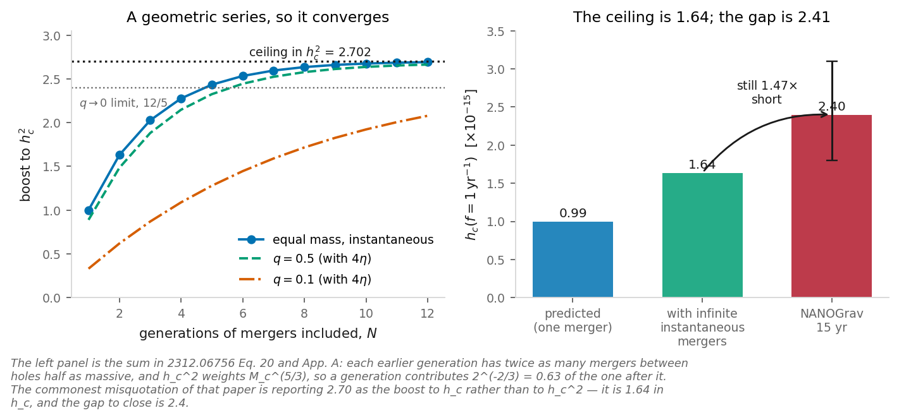

The geometric series of generations, and where every relaxation moves it.

Could past mergers hide the mass? Go back one generation in an equal-mass tree: twice as
many events, between holes half as massive. $h_c^2$ weights $\mathcal{M}_c^{5/3}$, so a
generation contributes $2\times2^{-5/3}=2^{-2/3}$ of the next. Geometric, hence
convergent:

$$\sum_{N=1}^{\infty}2^{-2(N-1)/3}=\frac{1}{1-2^{-2/3}}=2.702
\;\Rightarrow\; h_c \text{ ceiling} = \sqrt{2.702}=1.644$$

The commonest misquotation reports 2.70 as the boost to $h_c$ rather than to $h_c^2$.

Unequal masses give less ($12/5$ as $q\to0$); accretion between mergers gives less still
($\kappa=\tfrac12 \Rightarrow 1.25$). **Every relaxation moves the ceiling down** &mdash;
and the ceiling is 1.64 against a gap of 2.4.

<!--
This afternoon's exercise B is to derive this, having been told it exists. Every number is printed in 2312.06756 to check against.
src: merger_ceiling_hc2  src: merger_ceiling_hc  src: merger_ceiling_q0_with_4eta  src: merger_ceiling_kappa_half  src: gap_in_hc
-->

---

# 1 &mdash; Heavier black holes than the census *shows.*

Proposed first, and proposed **because it is the cheapest edit**: the high-mass tail is
where there are fewest observations, so a modest change there does the most work.

It makes a falsifiable prediction: $M_{\rm peak}\sim3\times10^{10}M_\odot$ means about
**60 black holes above $10^{10}M_\odot$**, and a couple above $10^{11}M_\odot$, within
100 Mpc &mdash; which **MASSIVE**, the dedicated survey of the most massive nearby
galaxies, can go and count.

**Now less likely.** Heavy means few, few means large Poisson fluctuations in the
spectrum, and the NANOGrav free spectrum disfavours that:
$M_{\rm peak}\lesssim10^{10}M_\odot$ at 2$\sigma$.

Same data, one extra piece of information, opposite conclusion &mdash; a hypothesis
proposed on grounds of economy, then narrowed by evidence. That is how inference is
supposed to work.

<!--
MASSIVE now defined in one clause on the slide (the review: "no one knows what we are talking about"). The counts and the 2-sigma narrowing are the published statements of 2312.06756 and 2406.17010.
src: borrowed — the 60-above-1e10 count, M_peak ~ 3e10 and the 2-sigma disfavouring are the papers' own numbers (2312.06756; 2406.17010), quoted as the route's prediction and its status.
-->

---

# 2 &mdash; A census more *uncertain.*

The prediction is exquisitely sensitive to a **relative** systematic offset between the
small black-hole catalogue and the large galaxy catalogue:

$$\frac{h_{c,\delta}}{h_c}=10^{\frac{5}{6}\, b_\bullet\,\delta}$$

Every symbol is one you have met: $b_\bullet$ is the **M&ndash;&sigma; slope** ($b = 5.64$,
two sections ago), and $\delta$ is a relative offset in $\log_{10}\sigma$ between the two
catalogues, in dex. An offset of only **0.03 dex** moves $h_c$ by ${\times}1.38$ &mdash;
the scale of the NANOGrav 90% interval.

And the one correction that *is* well understood &mdash; aperture, $\sigma$ at $R_e$
versus $R_e/8$ &mdash; goes the **wrong way**, reducing $h_c$ by ${\times}0.68$.

<!--
The symbols defined on the slide (the review: "none will understand what the symbols are") — b_bullet IS the relation's slope, which is why the census section had to come first. The 1.38 is stamped in the m-sigma reproduction; the aperture factor is 2509.08041's.
src: b_bh  src: hc_shift_003dex
src: borrowed — the 0.03 dex framing and the x0.68 aperture correction are 2509.08041's numbers.
-->

---

# 3 &mdash; The measurement is a bit *off.*

A live possibility, stated as one.

The evidence at fifteen years is *evidence*, not a detection, and the free spectrum
carries real structure that a two-parameter power-law fit does not represent.

<!--
Keep it short: route 3 is not an accusation, it is the honest width of the error bar on the right-hand side of the comparison.
-->

---

# To take *away.*

- **A pulsar pair is an interferometer with a kiloparsec arm.** Same measurement as LIGO;
  the wavelength-to-arm ratio decides the limit.
- **Hellings&ndash;Downs is geometry.** A handful of multipoles, $C_\ell \propto \ell^{-4}$,
  derived &mdash; and it certifies spin 2, not a source count. What correlates between
  pulsars is the Earth term.
- **The census is a galaxy count pushed through M&ndash;&sigma;.** The knee is
  $M_* \approx 6\times10^7 M_\odot$, and the heavy tail &mdash; where the background lives
  &mdash; is where the scatter and the systematics bite.
- **The parameter-free prediction falls short of the measurement** by about 2.4 in strain,
  and the merger ceiling of 1.64 means no merger history closes it.
- **Three ways out, already narrowed**: heavier holes (disfavoured by the spectrum's own
  fluctuations), a shiftier census (a few hundredths of a dex is enough), or a measurement that settles as
  it lengthens.

<!--
The physics summary the day earns. All numbers repeat stamped values from earlier slides.
src: M_star  src: gap_in_hc  src: merger_ceiling_hc  src: hc_shift_003dex
-->
