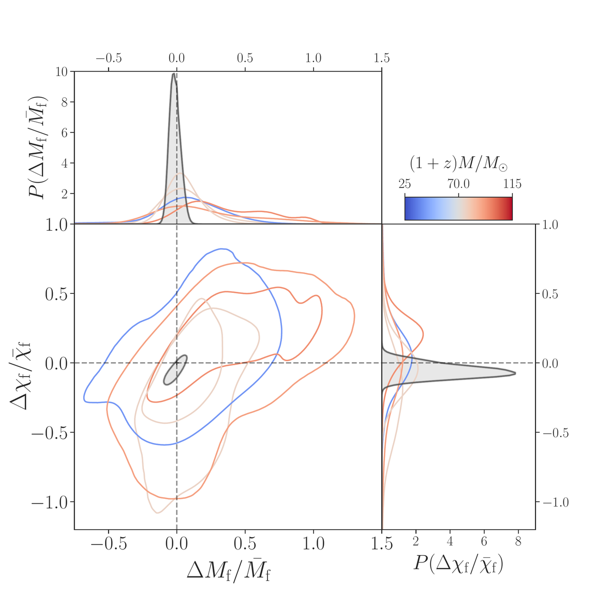
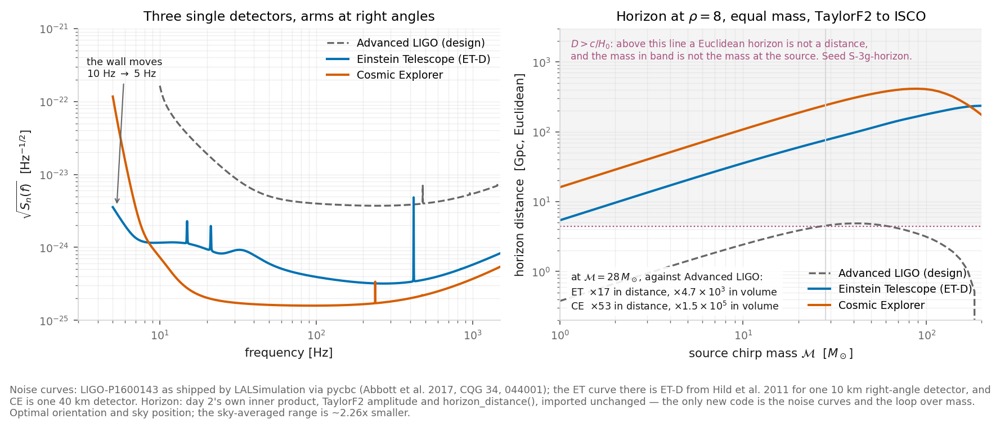
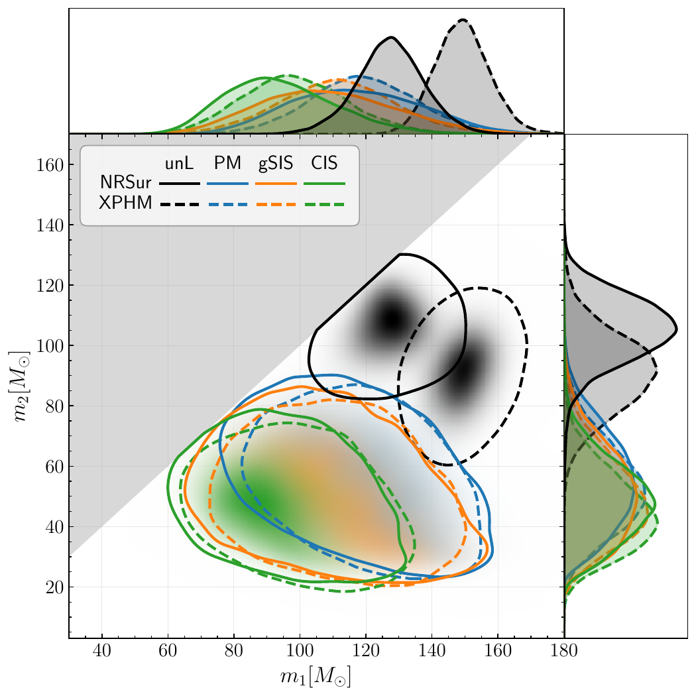

  <h1 class="!text-white !text-5xl !mb-2 drop-shadow-lg !font-normal">Open problems</h1>
  
Day 5 &mdash; the frontier

  

    Matias Zaldarriaga &nbsp;·&nbsp; <em>Ondas Gravitacionales e Investigación Asistida por IA</em>
  

<!--
Today is shallower than the other four days on purpose. Four topics, each stated rather than derived, and each one ending on a problem that is written down somewhere you can open. Nothing today is derived that is not already derived earlier in the week.
-->

---

# Four things the week *opened.*

Days 1 to 4 each ran one confrontation between theory and data to the end. Today does not
run one. It says where the ends are.

1. **The merger.** Day 2 said out loud that an inspiral template cannot reach it. What
   happens instead, and what it tests.
2. **GW170817.** One event, several sciences &mdash; and the tightest connection in this
   course between gravitational waves and cosmology.
3. **Louder and lower.** What a factor of ten in sensitivity buys, and what the millihertz
   band has that this one does not.
4. **What is unsettled in our own work.** The heaviest event, the nanohertz amplitude,
   lensing.

Each of the four ends on a problem, by name. The problems are collected in one place and
you leave with it.

<!--
Set the register at the start: this is a map, not a survey. Every beat is independently droppable, so if the morning ran long, drop from the front rather than rushing.
-->

---
layout: default
---

  
SECTION I

  <h1 class="!text-white !text-5xl !mb-0 drop-shadow-lg !font-normal">The merger, and what it tests</h1>

<!--
What happens after the part we can compute, and why it is the sharpest test of general relativity we have.
-->

---

# After the *inspiral.*

The post-Newtonian expansion is an expansion in $v/c$, and at the last stable orbit
$v/c$ is already about a third. Day 2 measured what that costs: a template that stops at
the last stable orbit collects less than half the available signal-to-noise for a heavy
binary.

What happens instead is not a small correction to the inspiral. Two horizons merge into
one, and what is left is a single distorted black hole that has to shed its distortion
before it can be stationary.

Three regimes, one signal

**Inspiral** &mdash; two bodies, post-Newtonian, analytic.

**Merger** &mdash; strong field, no expansion parameter, numerical relativity only.

**Ringdown** &mdash; one body, perturbed, analytic again.

The middle one is the reason waveform models are fitted to simulations rather than written
down.

<!--
This pays off the day-2 slide that said "you cannot get the merger out of an inspiral" and then did not say what you get instead. The point is that the two ends are both analytic and the middle is not, which is why the models are hybrid.
-->

---

# Quasi-normal *modes.*

The perturbed remnant rings like a struck bell, and the ringing is a sum of damped
sinusoids:

$$h(t) \;\sim\; \sum_{\ell m n} A_{\ell m n}\,
e^{-t/\tau_{\ell m n}}\cos\!\left(2\pi f_{\ell m n} t + \phi_{\ell m n}\right)$$

The amplitudes $A$ and phases $\phi$ depend on how the hole was made. The frequencies and
damping times do **not**. Each $f_{\ell m n}$ and $\tau_{\ell m n}$ is fixed by the
remnant's mass and spin, and by nothing else &mdash; which is the no-hair statement in a
form you can measure.

Dimensionally there is only one time in the problem, $GM/c^3$, so $f \propto 1/M$ and
$\tau$ is a few of those. For a sixty-solar-mass remnant that is a couple of hundred hertz
and a few milliseconds &mdash; a handful of cycles. The whole test lives in those cycles.

<!--
The scaling is the day-1 move: one timescale in the problem, so read everything off it. The spin dependence is a dimensionless function of chi that I am not writing down; it is tabulated in Berti's fits and every ringdown code uses them.
-->

---

# The remnant, measured *twice.*

The inspiral fixes the two component masses and spins. Feed those through a
numerical-relativity fit and you have a **prediction** for the remnant's mass and spin.

The part after the merger **measures** the same two numbers, from the frequencies and
damping times directly.

Two routes to one pair of numbers. Plot the fractional difference of each, and general
relativity says the contours contain the origin. They do.

The sharper version of the same idea uses two ringdown modes and no inspiral at all: two
modes are four numbers, and the remnant has two. Everything past the second is a test.
That needs signal-to-noise we mostly do not have yet.

Borrowed: LIGO&ndash;Virgo&ndash;KAGRA, <em>Tests of general relativity with GWTC-3</em> (arXiv:2112.06861), Fig. 6. Grey: all events combined.

<!--
The figure is theirs, not ours; the credit is on the slide. The open question to leave them with: fit GW150914's post-peak strain with one mode and then with two, and say whether the data prefer the second. How much does the answer move with the start time you choose?
-->

---
layout: default
---

  
SECTION II

  <h1 class="!text-white !text-5xl !mb-0 drop-shadow-lg !font-normal">GW170817</h1>

<!--
One event that paid for itself several times over. The headline here is the speed of propagation; the rest is real but secondary.
-->

---

# One event, several *sciences.*

Two neutron stars at about 40 Mpc. The inspiral was in band for roughly a minute, because
the masses are small and the chirp is slow.

The sequence

- the merger, in the ground-based band;
- a short gamma-ray burst, 1.74 s later;
- an optical counterpart, located within a day;
- a kilonova, reddening over a fortnight.

What came out of it

- the speed of gravitational waves;
- how much the stars deform, and so what matter does above nuclear density;
- $H_0$, with no distance ladder;
- where the heavy elements are made.

Four unrelated measurements from one event. Nothing else in this field has that property,
and the reason is the counterpart.

<!--
src: observed_lag_s
The 1.74 s is the lag between the GW peak and the GRB trigger, and it is the number the next slide is entirely about. Everything else on this slide is context.
-->

---

# The speed of *propagation.*

Gravitational waves and photons left the same place at very nearly the same time and
arrived 1.74 s apart, over a light travel time of about $10^{8}$ years. The only quantity
not measured is when the gamma rays were emitted; assume zero to ten seconds after the
merger.

$$\frac{\Delta v}{v} \;\simeq\; \frac{c\,\Delta t}{D}
\qquad\Longrightarrow\qquad
-3\times10^{-15} \;<\; \frac{\Delta v}{v} \;<\; +7\times10^{-16},
\qquad \Delta v \equiv v_{\rm GW} - v_{\rm EM}$$

That window is the whole of the assumption, and the paper says so: under exotic emission
scenarios it widens to $(-100, 1000)$ s, and the bound loosens with it by the same factor.
The measurement is a lag and a distance; everything else in the number is what you were
willing to assume about the burst.

Even so, fifteen orders of magnitude is enough to kill whole classes of modified gravity
in one line of division.

<!--
src: observed_lag_s  src: bound_upper  src: bound_lower  src: light_travel_time_26mpc_yr  src: distance_used_mpc
26 Mpc, not the 40 that gets quoted: the paper uses the lower end of the 90 per cent interval on purpose, because a shorter distance gives a WEAKER bound. If someone in the room does the arithmetic with 40 they will get a tighter answer than the published one and they will be wrong about the paper, not about the division.
The figure went in review 2 (C34): the formula and the bound are the slide, and the picture was two bars. What its right-hand panel carried — the paper's own (-100, 1000) s caveat — had to survive as text, or the bound reads tighter than the paper claims it is. It is the paragraph above. The figure itself is in the backup deck.
-->

---

# What that number *removes.*

A great many attempts to explain the accelerated expansion without a cosmological constant
add a scalar field coupled to curvature. In most of them the extra field changes the
propagation of tensor modes, and gravitational waves travel at a speed that differs from
$c$ by something of order the departure from general relativity today.

Those models were being compared against cosmological data at the per-cent level. This
measurement holds the same quantity to about one part in $10^{15}$.

Ezquiaga and Zumalacárregui went through the surviving Horndeski classes one at a time
after this result and removed most of them (PRL **119**, 251304). This is the one place in
this course where a gravitational-wave measurement lands directly on the cosmology.

<!--
src: borrowed — the dark-energy consequence is Ezquiaga & Zumalacarregui 2017 (arXiv:1710.05901), quoted as theirs; the paper is in the day's papers directory. The per-cent-level framing is theirs too.
Worth saying out loud that this is not the sort of thing anybody designed the detector for.
-->

---

# Tides in the last *orbits.*

Each star is deformed by its companion's tidal field, the deformation carries energy, and
the energy shows up in the phase &mdash; at fifth post-Newtonian order, so it only matters
in the last orbits, which is exactly where a neutron-star binary spends its cycles.

The measurable combination is a mass-weighted average of the two deformabilities. A
stiffer equation of state gives larger stars, larger deformability and a phase that runs
away from the point-particle prediction sooner. The data bound it from above, which bounds
the radius from above, which excludes the stiffest candidates.

What is being constrained is matter at several times nuclear density. No laboratory
reaches it, and the constraint arrived from an object 40 Mpc away. Which equations of
state does that bound actually exclude, and at what confidence?

<!--
Stated, not derived. The 5PN counting is worth one sentence because it explains why this is a neutron-star measurement and not a black-hole one: a black hole has zero deformability, so the term is a clean null for BBH.
-->

---

# A distance without a *ladder.*

Day 1: the amplitude goes like $1/d$, and the chirp fixes the mass, so the amplitude
measures the **luminosity distance** on its own. No rungs, no calibration, nothing
borrowed from another distance indicator.

The counterpart gives the host galaxy, the host gives the redshift, and distance against
redshift is $H_0$.

Where the width comes from

Amplitude and inclination are degenerate: a nearer binary seen edge-on looks like a
farther one seen face-on. That degeneracy, not the noise, sets the error on a single
siren.

The host's peculiar velocity is the second term, and at 40 Mpc it is not negligible.

An amplitude is a distance and the counterpart is a redshift, so this is $H_0$ with no
distance ladder under it. How much of the width is the distance&ndash;inclination
degeneracy, and how much is the host's peculiar velocity?

<!--
The inclination degeneracy is the same one day 3's single-event work ran into with distance priors. Worth connecting explicitly if there is time.
-->

---
layout: default
---

  
SECTION III

  <h1 class="!text-white !text-5xl !mb-0 drop-shadow-lg !font-normal">Louder and lower</h1>

<!--
Two axes of improvement: quieter at the frequencies we have, and access to frequencies we do not.
-->

---

# A factor of ten in *sensitivity.*

Day 2 gave the whole argument: at fixed source $\rho \propto 1/D$, so a threshold defines a
distance, and Euclidean volume goes as the cube of it &mdash;
$d\ln V / d\ln \rho_{\rm thr} = -3$. Ten times quieter is ten times further and a thousand
times the volume. Against Advanced LIGO at design, the Einstein Telescope is a factor of 17
in distance and Cosmic Explorer a factor of 53. Both also move the low-frequency wall from
10 Hz to 5 Hz, which alone doubles the heaviest binary in band at all &mdash; from 440 to
879 solar masses.

Day 2's horizon machinery, unchanged, against published design curves. Above the shaded line a Euclidean horizon is no longer a distance, because the mass in band is not the mass at the source.

<!--
src: horizon_ratio_et_over_aligo  src: horizon_ratio_ce_over_aligo  src: max_total_mass_aligo_msun  src: max_total_mass_et_msun  src: elasticity_volume_vs_threshold
The figure is ours and it is deliberately Euclidean, which stops being sensible past c/H0. That is not a defect to apologise for; it is the seed. Putting redshift in, so the mass in band is not the mass at the source, is the exercise.
-->

---

# The millihertz *band.*

Arm length sets the band. Kilometres put you at hundreds of hertz; millions of kilometres
put you at millihertz, and that is a different sky.

What lives there

- massive black-hole binaries, at the masses day 4 was counting;
- galactic white-dwarf binaries, so many that they are a foreground;
- small bodies spiralling into massive ones, hundreds of thousands of cycles deep in the
  strong field.

The same binary, twice

A stellar-mass binary passes through the millihertz band years before it enters this one.
Measure the phase there and you know when and where the merger will happen, long in
advance.

Which is a rare thing in astronomy: a prediction with a date on it. How well is the
merger time pinned by the millihertz phase alone?

<!--
Do not oversell multiband. The population of systems loud enough in both bands is small and depends on the merger rate at the heavy end. The point is the structure of the measurement, not the yield.
-->

---

# A background from the early *universe.*

Assume some process made gravitational waves in the early universe, when the temperature
was $T$. Nothing has scattered them since &mdash; that is the whole reason to want them,
and it is also why they are hard.

The frequency today follows from the horizon size then and the expansion since, so a band
is a temperature. Ground-based frequencies correspond to the electroweak scale and above;
the nanohertz band of day 4 sits far lower. A detection at any of them is a measurement of
physics no accelerator will reach.

Day 1 named four classes of source and this week followed two of them. The other two
&mdash; continuous waves and stochastic backgrounds &mdash; are still open to you, and
the estimates you need are the ones you already made.

<!--
This is the beat to cut first if the morning ran long. If it survives, the sentence worth making is that a background is the only way to see the universe before it was transparent to anything else.
-->

---
layout: default
---

  
SECTION IV

  <h1 class="!text-white !text-5xl !mb-0 drop-shadow-lg !font-normal">What is unsettled in our own work</h1>

<!--
Four problems from our own work, each with a paper and a public repository behind it. That is what makes them projects rather than topics.
-->

---

# The gap above the *heaviest.*

Stars in a window of helium-core mass become unstable to electron-positron pair
production, blow themselves apart, and leave nothing behind. So the black-hole mass
function should have a hole in it, somewhere above sixty solar masses and below about a
hundred and thirty.

GW231123's components sit in that hole, or above it, depending on which waveform model and
which interpretation you use.

Two ways out, and they are testable against each other. Either the components are
themselves the products of earlier mergers, or the event is lensed and the true masses are
lower.

Borrowed: Cheung et al., the GW231123 lensing release (Zenodo 16279016). Black: unlensed. Colours: three lens models, all of which move the masses down.

<!--
The pair-instability window edges are theory numbers with real spread — different codes give different edges, and the reaction rates are the reason. Say "roughly" and mean it. The figure carries the lensing alternative, which is the next slide but one.
-->

---

# The nanohertz *amplitude.*

Day 4 ended here, and it is worth restating as a problem rather than a conclusion. From a
census of local supermassive black holes you predict the nanohertz background with no free
parameters, and the prediction comes out a factor of a few low in black-hole mass density.
No merger history closes that, because merging conserves mass.

1. **A heavier bright end** &mdash; the black holes carrying the signal are heavier than the
   census says, and there should be holes in nearby galaxies where they sit.
2. **A systematic in the census** &mdash; the relation, its scatter, or the aperture
   correction &mdash; and how far can the census move before the gap closes?
3. **Something that is not black-hole binaries** &mdash; and then the spectral shape has to
   match.

Each route predicts a different spectrum, and the measurement already has spectral
information. And the question under all three: what is a single measured amplitude a
statement about, when the median of the distribution sits below its mean?

<!--
This is a restatement, not new material. If day 4 was delivered in full, two minutes here is plenty; the value is turning it from "where the field is" into "here is the project".
-->

---

# Lensing, and the *Morse* phase.

A wave passing a mass can reach us along more than one path. In optics you see several
images and compare their brightness. Here the signal is coherent, so the images add as
amplitudes, and each one arrives with an extra phase that depends only on the type of
stationary point it came through &mdash; not on frequency.

Those phases take discrete values, which makes them a signature rather than a nuisance
parameter. When the images are not resolved in time they superpose into one distorted
waveform, and the distortion is what you fit.

The GW231123 release is a complete public example: paper source, code, a locked
environment and a map from every figure to the script that made it. It was published after
any current model's training data ends, which makes it the hardest possible thing to hand
an agent.

<!--
Coherence is the physical point and it is the one people miss: with light you cannot add the images, with gravitational waves you must. That is why the Morse phase is measurable here and not in optics.
-->

---

# What is *open.*

Five days, and the honest summary is that the course opened more than it closed. These are
the ones I would take, and none of them is settled.

Where the physics runs out

**Two modes, or one?** The remnant is over-determined by any two, and a disagreement is a
no-hair violation. Nobody has the second mode cleanly yet.

**What the tidal bound excludes.** It constrains a combination, not either star, and the
translation to a radius is where the argument is.

**The gap above the heaviest.** Pair instability should empty a band, and GW231123 sits in
or above it &mdash; unless it is lensed.

Where ours does

**The PTA amplitude.** The measurement is above what the local census predicts. Heavier
holes, a systematic in the census, or something that is not black-hole binaries &mdash;
and the spectrum has to come out right either way.

**What an anisotropy limit is a statement about.** We showed one that reproduces its own
prior. There will be others.

**The timing array nobody here simulated.** N pulsars, a common red process, and the
question of how many years before a quadrupole is distinguishable from a monopole.

Every one of these is a week's work with what you now have on your machine, and for most of
them nobody knows the answer. That is the point of ending here rather than on a summary.

<!--
End here. Do not summarise the week; the open questions are the ending. The afternoon takes over.
-->
